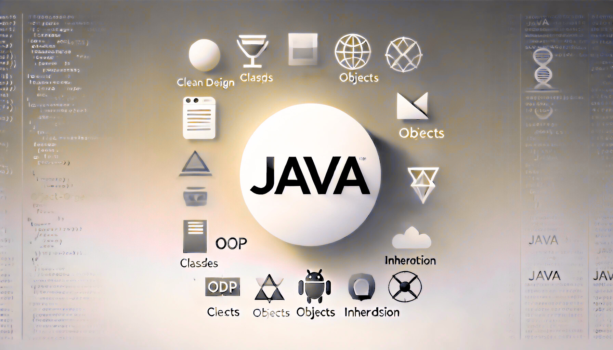

# OOP: Chapter 2

composed by [_Bimo Ade Budiman Fikri_](https://www.linkedin.com/in/bimoadee/)



<!-- [TOC] -->

## **Table of Contents**

<!-- - [Hi, I'm Java!](#hi-im-java)
  - [Java Architecture](#java-architecture)
  - [How _Java_ Works?](#how-java-works)
- [Fundamental OOP](#fundamental-oop)
  - [Class vs Object](#class-vs-object)
  - [Constructor & Methods](#constructor--methods)
  - [Access Modifier](#access-modifier)
  - [Class Diagram](#class-diagram)
- [Four Pillars of OOP](#four-pillars-of-oop)
  - [Encapsulation](#encapsulation)
  - [Inheritance](#inheritance)
  - [Polymorphism](#polymorphism)
  - [Abstraction](#abstraction) -->

---

# Four Pillars of OOP (Continue)

Sejauh ini kita sudah belajar tentang konsep-konsep dalam OOP yaitu [encapsulation](https://github.com/kkokonatsu/OOP-Java/blob/main/oop-meet-1.md#encapsulation), [inheritance](https://github.com/kkokonatsu/OOP-Java/blob/main/oop-meet-1.md#inheritance), dan [polymorphism](https://github.com/kkokonatsu/OOP-Java/blob/main/oop-meet-1.md#polymorphism). Berbekal hal tersebut ternyata masih belum cukup untuk bisa mengakomodasi kebutuhan di dunia nyata. Pemanfaatan _inheritance_ sebagai hubungan antar*class* justru menimbulkan berbagai kompleksitas dalam praktiknya karena keeratan hubungan yang kuat antara _superclass_ dan _subclass_. Maka, dari itu kondsep abstraction hadir untuk bisa memberikan fleksibilitas dalam mendefinisikan hubungan antar*class*.

## Concept of Abstraction

Abstraksi adalah konsep OOP dengan menyembunyikan sebagian atau keseluruhan detail implementasi dari suatu hal (_attribute_ atau _method_) dari suatu objek agar memudahkan pengembangan. Dengan abstraksi, kita akan fokus pada **_apa yang dilakukan oleh suatu objek, bukan bagaimana cara kerjanya_**.

> <br> Bayangkan jika Anda memiliki sebuah mobil Toyota (bensin). Sebagai pengemudi awam, Anda pastinya tahu bagaimana cara menyalakan mobil atau mengerem tanpa harus tahu secara mendalam tentang bagaimana mesin bekerja atau bagaimana sistem transmisi mengubah gigi. Apabila, suatu ketika Anda diharuskan mengendarai mobil Hyundai (listrik) yang memiliki teknologi berbeda. Meskipun berbeda, Anda tentu tetap mengetahui bagaimana cara menghidupkan mesin padahal mobil bensin menggunakan pembakaran internal, mobil listrik menggunakan motor listrik. Bagaimana cara mobil hidup di belakang layar tentunya tidak akan berefek apapun ke bagaimana pengemudi menghidupkan mobil. _Nah_, hal tersebut merupakan konsep dari **_abstraction_**. Dengan abstraksi, pengemudi hanya berfokus pada bagaimana mengoperasikan mobil entah bagaimana pun caranya, sementara detail teknis di balik sistem kendaraan disembunyikan sehingga memberikan pengalaman pengguna yang lebih sederhana dan efektif. <br><br>

Di _Java_, konsep _abstraction_ diwujudkan dengan menggunakan dua buah _keyword_ yaitu `abstract` dan `interface`. Bagaimana perbedaannya?! Simak _section_ berikut.

## Abstract

Sejalan dengan konsep di atas bahwa _abstraction_ fokus pada **_apa yang dilakukan oleh suatu objek, bukan bagaimana cara kerjanya_**. Maka, Kita bisa membuat sebuah `abstract class` yang menyediakan kebutuhan dasar dari suatu mobil seperti atribut dasar (mesin, transmisi, dst) ataupun perilaku dasar (menghidupkan mesin, berhenti, dst). Perilaku dasar tersebut kemudian akan disebut sebagai `abstract method`. Jika kita rangkum maka:

- **`abstract class`** akan menjadi cetakan (_blueprint_) untuk kelas-kelas turunannya. Mirip seperti class pada umumnya (_concrete class_), cetakan tersebut bisa berupa _attribute_, _constructor_, hingga _method_. Namun, perbedaannya adalah `abstract class` tidak dapat di-instansiasi (dibuat objeknya) seperti pada _concrete class_.
- **`abstract method`** merupakan method spesial yang hanya ada pada `abstract class` yang mana tidak memiliki detail implementasi. Artinya, method ini hanya mendefinisikan nama method tanpa memberikan detail implementasinya (kode). Kelas turunannya lah yang harus merinci kode yang sesuai dengan kebutuhan mereka.

Terlihat serupa dengan _inheritance_ bukan? namun, dengan tambahan keyword `abstract` kita bisa menyembunyikan beberapa detail kode agar bisa ditulis di subclass-nya. Biar lebih paham mari simak kode berikut.

Pertama, kita akan membuat `abstract class Mobil`

```java
abstract class Mobil {

    // abstract method
    abstract void hidupkanMesin();

    // concrete method
    void rem() {
        System.out.println("Mobil berhenti...");
    }
}
```

Kedua, kita akan membuat subclass `MobilBensin` dan `MobilListrik` yang meng-extend `abstract class Mobil` seperti _inheritance_ pada umumnya. Asumsikan bahwa mobil bensin dihidupkan dengan kunci (tradisional) dan mobil listrik dengan tombol _engine start_ (modern).

```java
class MobilBensin extends Mobil {
    @Override
    void hidupkanMesin() {
        masukkanKunci();
        System.out.println("Mobil hidup.");
    }

    void masukkanKunci(){
        System.out.println("Kunci dimasukkan.");
    }
}

class MobilListrik extends Mobil {
    @Override
    void hidupkanMesin() {
        pencetTombol();
        System.out.println("Mobil hidup.");
    }

    void pencetTombol(){
        System.out.println("Tombol dipencet.");
    }
}
```

Kode di atas mirip bukan dengan inheritance? Meskipun sama, sebenarnya dengan memanfaatkan `abstract` kita tidak perlu membuat detail kode di superclass (`class Mobil`) sehingga ketika ada perubahan kode kita cukup mengubahnya di _subclass_ (`MobilBesin` atau `MobilListrik`) bukan di _superclass_. Selain itu, karena kita hampir tidak pernah meng-instansiasi `Mobil` sehingga lebih tepat jika Mobil kita buat sebagai **abstract class**.

Maka, jika kita coba di `Main.java` akan seperti berikut.

```java
public class Main {
    public static void main(String[] args) {

        Mobil mobil1 = new MobilBensin();
        mobil1.hidupkanMesin();
        mobil1.rem();

        /*
        * Output:
        * Kunci dimasukkan.
        * Mobil hidup.
        * Mobil berhenti...
        * */

        Mobil mobil2 = new MobilListrik();
        mobil2.hidupkanMesin();
        mobil2.rem();

        /*
        * Output:
        * Tombol dipencet.
        * Mobil hidup.
        * Mobil berhenti...
        * */
    }
}
```

<br>

## Interface

Selanjutnya adalah `interface`. _Interface_ merupakan versi lebih sederhana dari `abstract class` yang mana file ini hanya menyimpan **_abstract method_** tanpa atribut apapun. Konsep `interface` ini lahir sebagai solusi karena _Java_ tidak mendukung adanya konsep _multiple inheritance_ atau suatu subclass meng-_extend_ dua superclass sekaligus. Dengan `interface`, suatu class bisa mengimplementasikan banyak _method_ dari berbagai _interface_ yang mana hal ini tidak bisa dilakukan oleh `abstract class` (karena adanya hubungan _inheritance_). Dalam mendefinisikan hubungannya, interface akan menggunakan keyword **`implements`**.

> <br> Bayangkan kini Anda sudah memiliki mobil listrik. Suatu ketika Anda ingin menambahkan fitur-fitur tambahan yang bersifat opsional seperti kamera belakang atau peningkatan audio. Jika Anda menggunakan _multiple inheritance_ langsung untuk menambahkan fitur-fitur ini, akan ada beberapa masalah yang muncul yaitu **Tidak fleksibel**—Anda harus mengubah struktur kelas mobil yang sudah ada untuk menambahkan fitur-fitur baru, yang membuat desain lebih kaku. **Kompleksitas**—Jika Anda memiliki banyak fitur yang ingin ditambahkan, Anda akan kesulitan untuk memelihara atau memperluas kode karena terikat pada pewarisan kelas yang kompleks .<br><br>

Menggunakan `interface` sebagai cara untuk menambahkan fitur opsional sebagai dekorasi akan sangat efektif karena `interface` berfungsi sebagai kontrak untuk fitur tertentu yang dapat diimplementasikan oleh mobil jenis apapun tanpa memodifikasi desain dasar mobil tersebut.

Misalkan kita ingin memasang 2 fitur tambahan yaitu `SistemAudioTambahan` dan `KameraBelakang`.

```java
// Interface untuk fitur audio tambahan
interface SistemAudioTambahan {
    void naikkanVolume();
    void turunkanVolume();
}

// Interface untuk fitur kamera belakang
interface KameraBelakang {
    void aktifkanKamera();
}
```

Kemudian, fitur tambahan tersebut kita tambahkan ke `MobilListrik` kita dengan _keyword_ `implements`.

```java
class MobilListrik extends Mobil
    implements SistemAudioTambahan, KameraBelakang {

    @Override
    void hidupkanMesin() {
        pencetTombol();
        System.out.println("Mobil hidup.");
    }

    void pencetTombol(){
        System.out.println("Tombol dipencet.");
    }
}
```

Lalu, kita akan mencoba fitur yang baru ditambahkan di `Main.java` seperti berikut.

```java
public class Main {
    public static void main(String[] args) {

        MobilBensin mobil1 = new MobilBensin();
        mobil1.hidupkanMesin();
        mobil1.rem();

        /*
        * Output:
        * Kunci dimasukkan.
        * Mobil hidup.
        * Mobil berhenti...
        * */

        MobilListrik mobil2 = new MobilListrik();
        mobil2.info();
        mobil2.hidupkanMesin();
        mobil2.aktifkanKamera();
        mobil2.naikkanVolume();
        mobil2.turunkanVolume();
        mobil2.rem();

        /*
        * Output:
        * Tombol dipencet.
        * Mobil hidup.
        * kamera hidup...
        * Volume audio naik++
        * Volume audio turun--
        * Mobil berhenti...
        * */
    }
}
```

## `abstract` vs `interface`

|     **Poin**      | **Abstract**                                                 | **Interface**                                                                                                                                                    |
| :---------------: | ------------------------------------------------------------ | ---------------------------------------------------------------------------------------------------------------------------------------------------------------- |
| **Tipe _method_** | Bisa memiliki _abstrak method_ dan _concrete method_         | Hanya dapat memiliki metode abstrak (hingga Java 7), dan mulai Java 8, dapat memiliki metode default dan statis, dan mulai Java 9, dapat memiliki metode privat. |
|    **Atribut**    | Bisa punya atribut final, non-final, static, dan non-static. | Hanya atribut `static` dan `final`                                                                                                                               |
|  **Inheritance**  | Hanya bisa meng-_extend_ 1 class saja                        | Mendukung _multiple inheritance_                                                                                                                                 |
|  **Constructor**  | Punya constructor                                            | Tidak punya constructor                                                                                                                                          |

<br>

---

# Generic Type

_Generic Type_ adalah salah satu fitur di Java yang memungkinkan Anda untuk mendefinisikan _class_ atau _method_ yang dapat bekerja dengan berbagai tipe data secara fleksibel dan aman tanpa harus menggunakan _casting_ serta tidak perlu menulis kode yang berulang.

Generic memungkinkan penulisan kode yang lebih umum sehingga Anda bisa mendefinisikan struktur data atau fungsi yang dapat beroperasi dengan tipe data apapun yang ditentukan saat pemanggilan objek.

> <br> Bayangkan Anda bekerja di sebuah toko hadiah. Toko ini memiliki kotak hadiah khusus yang dirancang untuk membungkus berbagai jenis hadiah seperti buku, boneka, atau peralatan elektronik. Namun, kotak hadiah ini hanya bisa menampung satu jenis hadiah. Jika Anda ingin memberikan boneka atau peralatan elektronik, Anda harus mencari kotak hadiah yang lain yang sesuai dengan jenis hadiah tersebut <br>.
> **Masalah:**
>
> - Anda harus selalu mencari kotak hadiah yang sesuai dengan jenis barang yang akan dibungkus.
> - Jika ada banyak jenis barang yang berbeda, Anda akan memiliki banyak kotak dengan ukuran dan desain yang berbeda yang membuat pengelolaannya menjadi sulit dan tidak efisien.
> - Jika Anda mencoba menggunakan kotak hadiah yang salah (misalnya kotak buku untuk boneka), Anda akan menghadapi masalah besar, seperti boneka yang tidak muat atau kotak yang rusak. <br><br>

Masalah di atas bisa terselesaikan jika toko hadiah tersebut memiliki **kotak hadiah universal** yang dapat disesuaikan untuk berbagai jenis hadiah. Kotak ini memiliki mekanisme yang memungkinkan Anda untuk memilih ukuran dan bentuknya saat Anda ingin menggunakannya.

## Tanpa Generic Type

Pertama, kita akan mencoba tanpa menggunakan _Generic Type_ dan kita akan melihat apa masalah yang ditimbulkan. Java mengakomodasi pengelolaan class tanpa tipe data spesifik dengan memanfaatkan **_Mega-Superclass Object_** seperti berikut.

```java
// Kelas Kotak Hadiah tanpa menggunakan Generic (menggunakan Object)
class GiftBox {
    private Object gift;  // Menggunakan Object sebagai tipe umum untuk hadiah

    // Metode untuk menambahkan hadiah ke dalam kotak
    public void setGift(Object gift) {
        this.gift = gift;
    }

    // Metode untuk mengambil hadiah dari kotak
    public Object getGift() {
        return gift;
    }

    // Metode untuk menampilkan informasi hadiah
    public void displayGiftInfo() {
        System.out.println("Hadiah yang ada di dalam kotak: " + gift.toString());
    }
}
```

**Penjelasan:**

- `class GiftBox` menggunakan `Object` untuk menyimpan hadiah. Dengan cara ini, kotak hadiah dapat menyimpan berbagai jenis tipe data.
- Method `setGift(Object gift)` digunakan untuk menambahkan hadiah apapun ke dalam kotak.
- Method `getGift()` mengembalikan tipe `Object` yang berarti kita harus melakukan `casting` secara manual ke tipe yang benar saat mengambil hadiah.

Kemudian, kita akan mencoba menggunakan _class_ tersebut di `Main.java` berikut.

```java
public class Main {
    public static void main(String[] args) {

        GiftBox box = new GiftBox();

        // Menambahkan hadiah berupa String (misalnya buku)
        box.setGift("Buku Harry Potter and The Prisoner of Azkaban");
        box.displayGiftInfo();
        // Output:
        // Hadiah yang ada di dalam kotak: Buku Harry Potter and The Prisoner of Azkaban


        // Menambahkan hadiah berupa Double (misalnya uang/THR)
        box.setGift(50000.0);
        box.displayGiftInfo();
        // Output:
        // Hadiah yang ada di dalam kotak: 50000


        // Mengambil hadiah dan melakukan casting ke tipe yang sesuai
        String gift1 = (String) box.getGift();  // Harus melakukan casting
        System.out.println("Hadiah pertama adalah: " + gift1);

        // Output: (gagal -> jika casting salah)
        // Exception in thread "main" java.lang.ClassCastException: ...

        // Output: (berhasil  -> jika casting benar)
        // Hadiah pertama adalah: 5
    }
}
```

**Penjelasan:**

- Kita memasukkan berbagai jenis hadiah (seperti `String` atau `Double`) ke dalam kotak hadiah yang sama. Hal ini dimungkinkan karena kita menggunakan tipe Object.
- Namun, ketika kita mengambil hadiah dari kotak, kita harus melakukan _casting_ ke tipe yang sesuai, yang berisiko menyebabkan kesalahan _runtime_ jika _casting_ dilakukan dengan salah.
- Pada contoh ini, kita mencoba mengambil hadiah dan melakukan _casting_ yang benar dan salah. ClassCastException akan terjadi ketika kita mencoba _casting_ String menjadi Integer.

_Java_ sebenarnya sudah mendukung untuk membuat class yang umum (tanpa definisi tipe data)menggunakan tipe Object sebagai tipe umum. Namun, hal tersebut memiliki beberapa kelemahan, terutama terkait dengan keamanan tipe dan perlunya melakukan _casting_ secara eksplisit ketika mengambil nilai yang rawan akan kesalahan.

## Dengan Generic Type

Dengan menggunakan Generic Type (seperti yang telah dijelaskan sebelumnya), kita dapat mendefinisikan tipe yang lebih spesifik, yang memungkinkan kita untuk menghindari kesalahan _casting_ dan meningkatkan keamanan. Dengan Generic Type:

- Tidak perlu melakukan _casting_ secara manual.
- Semua pengecekan tipe dilakukan pada saat kompilasi, sehingga kesalahan tipe dapat dideteksi lebih awal.
- Lebih fleksibel, aman, dan efisien.

Kita dapat membuat Generic class dengan menggunakan sintaks `<>` sebagai parameter formal, berikut contoh class `GiftBox` menggunakan Generic Type.

```java
// Kelas Generic untuk Kotak Hadiah
class GiftBox<T> {
    private T gift;

    // Metode untuk menempatkan hadiah di dalam kotak
    public void setGift(T gift) {
        this.gift = gift;
    }

    // Metode untuk mengambil hadiah dari kotak
    public T getGift() {
        return gift;
    }

    // Menampilkan informasi hadiah yang ada dalam kotak
    public void displayGiftInfo() {
        System.out.println("Hadiah di dalam kotak: " + gift.toString());
    }
}
```

Jika kita eksperimen di `Main.java` akan seperti berikut.

```java
public class Main {
    public static void main(String[] args) {

        // Menggunakan GiftBox untuk Buku (tipe String)
        GiftBox<String> bookBox = new GiftBox<>();
        bookBox.setGift("Buku Harry Potter and The Prisoner of Azkaban");
        bookBox.displayGiftInfo();
        // Output:
        // Hadiah di dalam kotak: Buku Harry Potter and The Prisoner of Azkaban


        // Menggunakan GiftBox untuk Boneka (tipe Integer, sebagai contoh)
        GiftBox<Double> amplopTHR = new GiftBox<>();
        amplopTHR.setGift(50000.0);
        amplopTHR.displayGiftInfo();
        // Output:
        // Hadiah di dalam kotak: 50000
    }
}
```

## Multiple Type Parameter

Selain itu, _Java_ mendukung definisi 2 jenis Type Parameter. Misalkan, kita akan membuat class `GiftBox` yang memiliki dua parameter tipe, yaitu `T` untuk jenis hadiah dan `U` untuk ukuran kotak hadiah.

```java
class GiftBox<T, U> {
    private T gift; // Tipe hadiah
    private U size; // Tipe ukuran kotak

    // Konstruktor untuk menginisialisasi hadiah dan ukuran kotak
    public GiftBox(T gift, U size) {
        this.gift = gift;
        this.size = size;
    }

    // Metode untuk menampilkan informasi hadiah dan ukuran kotak
    public void displayGiftInfo() {
        System.out.println("Hadiah: " + gift.toString() + ", Ukuran Kotak: " + size.toString());
    }
}
```

Jika kita eksperimen di `Main.java` akan seperti berikut.

```java
// Kelas utama untuk menguji kotak hadiah dengan dua parameter tipe
public class Main {
    public static void main(String[] args) {

        GiftBox<String, Integer> bookBox = new GiftBox<>("Buku Harry Potter", 10);
        bookBox.displayGiftInfo();
        // Output:
        // Hadiah: Buku Harry Potter, Ukuran Kotak: 10
    }
}
```

Dengan menggunakan _Multiple Type Parameter_, kita dapat mengkombinasikan berbagai jenis data dalam satu kelas atau metode. Hal ini memungkinkan kita untuk menulis kode yang lebih fleksibel dan dapat digunakan dengan banyak tipe data yang berbeda.

<br>

## Generic Method

Sekarang, kita akan membuat _generic method_ yang dapat bekerja dengan berbagai jenis tipe data tanpa harus mendefinisikan tipe data sebelumnya. Misalkan kita membuat class `GiftUtility` seperti berikut.

```java
public class GiftUtility {

    // Metode generic untuk menampilkan hadiah yang ada dalam kotak
    public static <T> void displayGiftInfo(T gift) {
        System.out.println("Hadiah yang ada di dalam kotak: " + gift.toString());
    }

    // Metode generic untuk menambahkan dua hadiah dan menampilkan hasilnya
    public static <T> void addAndDisplayGift(T gift1, T gift2) {
        System.out.println("Hadiah pertama: " + gift1.toString());
        System.out.println("Hadiah kedua: " + gift2.toString());
    }
}
```

Penggunaan Metode Generic di `Main.java`.

```java
// Kelas utama untuk menguji metode generic
public class Main {
    public static void main(String[] args) {

        GiftUtility.displayGiftInfo("Harry Potter Book");
        // Output:
        // Hadiah yang ada di dalam kotak: Harry Potter Book

        GiftUtility.displayGiftInfo(499.99);
        // Output:
        // Hadiah yang ada di dalam kotak: 499.99

        GiftUtility.displayGiftInfo(true);
        // Output:
        // Hadiah yang ada di dalam kotak: true

        // Menggunakan metode addAndDisplayGift untuk menambahkan dua hadiah
        GiftUtility.addAndDisplayGift("Buku Fiksi", "Buku Non-Fiksi");
        // Output:
        // Hadiah pertama: Buku Fiksi
        // Hadiah kedua: Buku Non-Fiksi

        GiftUtility.addAndDisplayGift(30, 50);
        // Output:
        // Hadiah pertama: 30
        // Hadiah kedua: 50
    }
}
```

Dengan menggunakan _Generic Method_, kita dapat mendefinisikan _method_ yang dapat bekerja dengan tipe data apa pun tanpa perlu mendefinisikan tipe sebelumnya, yang memungkinkan kita untuk menulis kode yang lebih efisien dan dapat dipakai ulang (_reusable_).

## Type Parameter Conventions

Dalam pemrograman _Java_, penamaan type parameter pada _generic_ penting untuk menjaga keterbacaan dan konsistensi kode. Meskipun _Java_ memungkinkan kita menggunakan sembarang nama untuk type parameter, ada konvensi umum yang digunakan oleh banyak pengembang untuk memudahkan pemahaman dan pemeliharaan kode.

| **Type Parameter** |  **Nama Konvensi**  | **Keterangan**                                                       |
| :----------------: | :-----------------: | -------------------------------------------------------------------- |
|        `T`         |     Type (umum)     | Digunakan untuk tipe data umum.                                      |
|        `E`         |       Element       | Umum digunakan dalam koleksi seperti `List<E>`                       |
|        `K`         |         Key         | Digunakan dalam konteks map (key-value pairs)                        |
|        `V`         |        Value        | Digunakan dalam konteks map (key-value pairs)                        |
|        `N`         |       Number        | Digunakan jika tipe terikat pada `Number`                            |
|   `A`, `B`, `C`    | Tipe Parameter Lain | Digunakan untuk parameter ganda atau lebih pada kelas/metode generic |

---

# Exception Handling

Dalam dunia pemrograman, aplikasi yang berjalan juga bisa mengalami masalah atau kesalahan yang tak terduga, seperti mencoba mengakses data yang tidak ada atau pembagian dengan nol. Kesalahan ini disebut **Exception**.

Sehingga, _Exception Handling_ adalah cara untuk menangani kesalahan dalam program secara terstruktur sehingga program tetap berjalan dengan lancar, meskipun ada masalah yang terjadi. Tanpa _exception handling_, kesalahan yang terjadi bisa menyebabkan program crash (berhenti paksa) dan tidak melanjutkan baris kode yang belum tereksekusi.

Ada dua jenis utama _Exception_:

- **_Checked Exceptions_**: Kesalahan yang **dapat diprediksi** dan harus ditangani oleh programmer. Misalnya, jika Anda membuka file, Anda harus memeriksa apakah file tersebut ada terlebih dahulu. Dalam Java, checked exception biasanya ditandai dengan kelas turunan dari `Exception`.
  | **Exception** | **Keterangan** |
  | :---------------------------------: | --------------------------------------------------------------------------|
  | `ClassNotFoundException` | Kelas tidak ditemukan. |
  | `CloneNotSupportedException` | Mencoba untuk mengkloning objek yang tidak mengimplementasikan antarmuka `Cloneable`. |
  | `IllegalAccessException` | Akses ke kelas ditolak. |
  | `InstantiationException` | Mencoba membuat objek dari kelas abstrak atau antarmuka. |
  | `InterruptedException` | Satu thread telah dihentikan oleh thread lain. |
  | `NoSuchFieldException` | Field yang diminta tidak ada. |
  | `NoSuchMethodException` | Metode yang diminta tidak ada. |

- **_Unchecked Exceptions_**: Kesalahan yang **tidak terprediksi** dan bisa terjadi selama eksekusi program, seperti membagi angka dengan nol. Dalam Java, unchecked exception adalah turunan dari class `RuntimeException`.
  | **Exception** | **Arti** |
  |:----------------------------------------:|--------------------------------------------------------------------------|
  | `ArithmeticException` | Kesalahan aritmatika, seperti pembagian dengan nol. |
  | `ArrayIndexOutOfBoundsException` | Indeks array di luar batas. |
  | `ArrayStoreException` | Penugasan elemen array dengan tipe yang tidak kompatibel. |
  | `ClassCastException` | Cast yang tidak valid. |
  | `IllegalArgumentException` | Argumen ilegal yang digunakan untuk memanggil metode. |
  | `IllegalMonitorStateException` | Operasi monitor ilegal, seperti menunggu pada thread yang tidak terkunci.|
  | `IllegalStateException` | Lingkungan atau aplikasi dalam keadaan yang salah. |
  | `IllegalThreadStateException` | Operasi yang diminta tidak kompatibel dengan keadaan thread saat ini. |
  | `IndexOutOfBoundsException` | Beberapa jenis indeks berada di luar batas. |
  | `NegativeArraySizeException` | Array dibuat dengan ukuran negatif. |
  | `NullPointerException` | Penggunaan referensi null yang tidak valid. |
  | `NumberFormatException` | Konversi string ke format numerik yang tidak valid. |
  | `SecurityException` | Percobaan untuk melanggar keamanan. |
  | `StringIndexOutOfBoundsException` | Percobaan untuk mengindeks di luar batas string. |
  | `UnsupportedOperationException` | Operasi yang tidak didukung ditemukan. |

## Struktur Exception Handling

Java menyediakan struktur khusus untuk menangani exception dengan menggunakan blok kode berikut:

- `try`: Tempat di mana kode yang berpotensi menyebabkan _exception_ ditempatkan.
- `catch`: Menangkap dan menangani _exception_ yang terjadi dalam blok try.
- `finally`: Digunakan untuk mengeksekusi kode yang harus dijalankan baik _exception_ terjadi atau tidak. (opsional)

Contoh struktur dasar:

```java
try {
    // kode yang mungkin menyebabkan exception
} catch (ExceptionType e) {
    // menangani exception
} finally {
    // kode yang selalu dijalankan
}
```

### Contoh Kasus: Pembagian Angka

Mari kita lihat contoh sederhana yang menjelaskan pembagian angka, di mana kita mungkin mengalami _exception_ jika pembaginya adalah nol (seperti mobil mogok karena kehabisan bahan bakar).

```java
import java.util.Scanner;

public class DivisionExample {
    public static void main(String[] args) {
        Scanner scanner = new Scanner(System.in);

        try {
            System.out.print("Masukkan angka pembilang: ");
            int numerator = scanner.nextInt();

            System.out.print("Masukkan angka penyebut: ");
            int denominator = scanner.nextInt();

            // mencoba membagi angka
            int result = numerator / denominator;
            System.out.println("Hasil pembagian: " + result);
        } catch (ArithmeticException e) {
            // Menangani pembagian dengan nol
            System.out.println("Kesalahan: Pembagian dengan nol tidak diperbolehkan!");
        } catch (Exception e) {
            // Menangani kesalahan lainnya
            System.out.println("Terjadi kesalahan: " + e.getMessage());
        } finally {
            System.out.println("Operasi selesai.");
            scanner.close();
        }
    }
}
```

<br>

## Throwing Exception

Kadang-kadang, Anda ingin melempar _exception_ secara eksplisit dalam kode Anda. Ini bisa diibaratkan seperti mengaktifkan sistem darurat mobil saat ada masalah yang lebih besar.

### `throw` – Melempar Exception secara Eksplisit

`throw` digunakan untuk melempar _exception_ secara eksplisit dalam kode. Ini berarti bahwa kita dapat membuat kondisi tertentu di mana _exception_ akan dilemparkan, misalnya jika data yang dimasukkan tidak sesuai dengan kriteria.

Contoh: Misalnya, Anda ingin memastikan bahwa usia yang dimasukkan oleh pengguna harus lebih dari 18 tahun. Jika kurang dari itu, Anda ingin melemparkan _exception_.

```java
public class Main {
    public static void main(String[] args) {
        try {
            checkAge(15);  // Mencoba memasukkan usia 15
        } catch (IllegalArgumentException e) {
            System.out.println("Kesalahan: " + e.getMessage());
        }
    }

    public static void checkAge(int age) {
        if (age < 18) {
            throw new IllegalArgumentException("Usia harus lebih dari 18!");
        }
        System.out.println("Usia valid: " + age);
    }
}
```

**Penjelasan:**

- Fungsi `checkAge()` menerima parameter age dan memeriksa apakah usia kurang dari 18.
- Jika usia kurang dari 18, `throw new IllegalArgumentException("Usia harus lebih dari 18!")` akan melempar exception dengan pesan tertentu.
- Di dalam `main()`, kita menangkap exception dengan blok catch.

### `throws` – Menyatakan bahwa Metode Bisa Melemparkan Exception

`throws` digunakan pada deklarasi _method_ untuk memberitahukan bahwa _method_ tersebut bisa melemparkan _exception_ tertentu yang perlu ditangani oleh pemanggilnya. Ini berguna ketika Anda tidak ingin menangani _exception_ di dalam _method_ itu, tetapi ingin memberitahukan kepada pemanggil bahwa _exception_ tersebut mungkin terjadi.

Contoh: Misalnya, Anda memiliki _method_ yang membaca file, yang dapat menyebabkan _exception_ IOException. Anda bisa menggunakan `throws` untuk mendeklarasikan bahwa _method_ tersebut bisa melemparkan _exception_ tersebut.

```java
import java.io.*;

public class Main {
    public static void main(String[] args) {
        try {
            readFile("file.txt");  // Mencoba membaca file
        } catch (IOException e) {
            System.out.println("Kesalahan: " + e.getMessage());
        }
    }

    // Metode ini bisa melempar IOException
    public static void readFile(String filename) throws IOException {
        FileReader file = new FileReader(filename);
        BufferedReader reader = new BufferedReader(file);
        String line;
        while ((line = reader.readLine()) != null) {
            System.out.println(line);
        }
        reader.close();
    }
}
```

**Penjelasan:**

- Pada metode `readFile()` kita menggunakan `throws IOException` untuk memberitahukan bahwa metode ini dapat melemparkan `IOException` yang harus ditangani oleh pemanggilnya.
- Di dalam `main()` kita menangkap _exception_ `IOException` yang bisa terjadi jika file tidak ditemukan atau ada masalah lain saat membaca file.

---

# End

```

```
