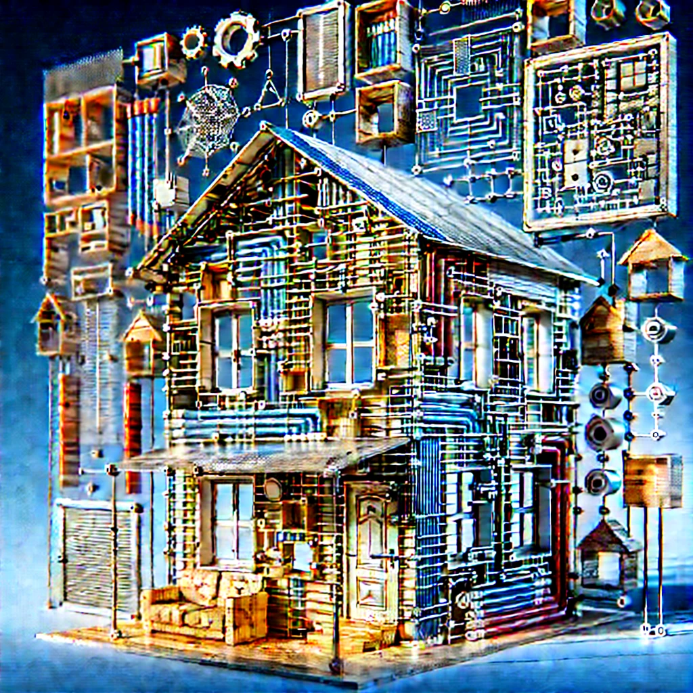

# OOP: Chapter 3

composed by [_Bimo Ade Budiman Fikri_](https://www.linkedin.com/in/bimoadee/)


<!-- [TOC] -->

## **Table of Contents**

- [What is a Design Pattern?](#what-is-a-design-pattern)
- [Types of Design Patterns in Java](#types-of-design-patterns-in-java)
  - [Creational Patterns](#creational-patterns)
    - [Singleton Pattern](#singleton-pattern)
    - [Factory Pattern](#factory-pattern)
    - [Abstract Factory Pattern](#abstract-factory-pattern)
    - [Builder Pattern](#builder-pattern)
    - [Prototype Pattern](#prototype-pattern)
  - [Structural Patterns](#structural-patterns)
    - [Adapter Pattern](#adapter-pattern)
    - [Bridge Pattern](#bridge-pattern)
    - [Composite Pattern](#composite-pattern)
    - [Decorator Pattern](#decorator-pattern)
    - [Facade Pattern](#facade-pattern)
    - [Flyweight Pattern](#flyweight-pattern)
    - [Proxy Pattern](#proxy-pattern)
  - [Behavioral Patterns](#behavioral-patterns)
    - [Chain of Responsibility Pattern](#chain-of-responsibility-pattern)
    - [Command Pattern](#command-pattern)
    - [Iterator Pattern](#iterator-pattern)
    - [Mediator Pattern](#mediator-pattern)
    - [Memento Pattern](#memento-pattern)
    - [Observer Pattern](#observer-pattern)
    - [State Pattern](#state-pattern)
    - [Strategy Pattern](#strategy-pattern)
    - [Template Method Pattern](#template-method-pattern)
    - [Visitor Pattern](#visitor-pattern)

---

# Apa itu _Design Patterns_ ?

_Design pattern_ merupakan solusi umum yang sudah **terbukti efektif** untuk masalah-masalah yang sering muncul dalam pengembangan perangkat lunak. Hal ini seperti resep yang bisa digunakan kembali untuk membangun aplikasi yang lebih mudah, lebih terstruktur, dan lebih mudah dipahami.

> <br>Bayangkan kamu ingin membuat kue, tentunya daripada Anda memulai kue tanpa angan-angan pasti Anda lebih memilih untuk mencari resep di Google, bukan? Sama seperti itu, dalam dunia pemrograman, _design pattern_ adalah resep untuk menyelesaikan masalah secara lebih efisien.<br><br>

# Apa saja jenis _design patterns_ di Java?


<sub>_source: [medium.com/@saygiligozde/design-patterns-in-java-5251032ca244](https://medium.com/@saygiligozde/design-patterns-in-java-5251032ca244)_</sub>

_Design pattern_ dibagi menjadi tiga kategori utama: Creational, Structural, dan Behavioral. Berikut penjelasannya:

## Creational Patterns


_Creational patterns_ berfokus pada cara membuat objek dalam program. Tujuan utamanya adalah untuk memisahkan logika pembuatan objek dari kode yang menggunakan objek tersebut, sehingga membuat kode lebih fleksibel dan mudah dimodifikasi.

> <br>Bayangkan kamu sedang membangun rumah. Sebelum kamu mulai membangun, kamu harus memilih apakah kamu ingin membeli rumah siap pakai atau membangun rumah dari awal. Proses memilih metode yang tepat untuk membangun rumah itu sangat mirip dengan _Creational Patterns_ yang bertujuan untuk memilih dan mengelola cara kita membuat objek dalam program.<br><br>

_Creational pattern_ di Java terdiri dari beberapa _pattern_ yaitu _singleton_, _factory_, _abstract factory_, _builder_, dan _prototype_.

### Singleton

_Singleton pattern_ adalah salah satu _creational pattern_ yang memastikan sebuah _class_ hanya memiliki satu _instance_ selama aplikasi berjalan (1) dan memberikan akses global ke instance tersebut (2).

> <br>Bayangkan seperti seorang CEO di perusahaan. Hanya ada satu CEO, dan seluruh organisasi berinteraksi dengan CEO yang sama. Anda tidak bisa memiliki banyak CEO dalam sebuah perusahaan.<br><br>

**Masalah:**
Ketika kita ingin memastikan bahwa hanya ada satu objek dari kelas tertentu, misalnya untuk mengelola konfigurasi aplikasi atau resource yang sangat terbatas, kita perlu mengontrol pembuatan instance.

**Solusi:**
Dengan menggunakan Singleton Pattern, kita memastikan bahwa objek tersebut hanya dibuat satu kali dan memberikan akses kepada objek itu tanpa menciptakan instance baru.

**Contoh:**

```java
public class Singleton {
    private static Singleton instance;

    private Singleton() { }

    public static Singleton getInstance() {
        if (instance == null) {
            instance = new Singleton();
        }
        return instance;
    }
}
```

Maka, ketika kita coba di **Main.java**

```java
public class Main {
    public static void main(String[] args) {
        Singleton singleton = Singleton.getInstance();
        System.out.println(singleton);
    }
}
```

- Konstruktor kelas _Singleton_ dibuat `private` yang artinya tidak ada instansi dari kelas ini yang bisa dibuat dari luar kelas itu sendiri.
- Variabel `instance` adalah `static` dan di-_set_ `null` pada awalnya. Saat pertama kali diakses melalui metode `getInstance()`, instance tersebut akan diinisialisasi
- Pada implementasi ini, akses _instance_ dilakukan dengan cara yang sederhana namun jika ingin lebih aman di lingkungan _multithreading_, kita harus menggunakan kunci (_lock_) atau menggunakan _double-checked locking_ untuk memastikan hanya satu instance yang dibuat.

<br>

### Factory

_Factory Pattern_ bekerja dengan membuat objek tanpa menentukan kelas objek yang tepat yang harus dibuat. Pattern ini menyediakan cara untuk menyembunyikan logika pembuatan objek sehingga klien dapat meminta objek tanpa mengetahui bagaimana objek tersebut dibuat atau implementasinya. Pattern ini sangat berguna dalam situasi di mana kita memiliki kelas atau objek yang serupa tetapi memiliki berbagai implementasi dan kita ingin memisahkan logika pembuatan objek dari penggunaan objek itu sendiri. _Factory Pattern_ memperkenalkan konsep **_Factory Method_**, yang bertanggung jawab untuk pembuatan objek.

> <br>Seperti pabrik mobil yang membuat berbagai jenis mobil (sedan, SUV, dll), meskipun pelanggan tidak perlu tahu mobil seperti apa yang akan dibuat, mereka hanya memesan jenis mobil yang diinginkan.<br><br>

**Masalah:**
Ketika kita memiliki banyak jenis objek yang serupa, tetapi ingin menghindari penggunaan `new` secara langsung dan meningkatkan fleksibilitas dalam pembuatan objek.

**Solusi:**
Dengan _Factory Pattern_ kita memisahkan logika pembuatan objek dari penggunaan objek itu sendiri.

**Contoh:**

```java
interface Car {
    void drive();
}

class Sedan implements Car {
    public void drive() {
        System.out.println("Driving Sedan");
    }
}

class SUV implements Car {
    public void drive() {
        System.out.println("Driving SUV");
    }
}

class CarFactory {
    public Car getCar(String carType) {
        if (carType == null) {
            return null;
        }
        if (carType.equalsIgnoreCase("SEDAN")) {
            return new Sedan();
        } else if (carType.equalsIgnoreCase("SUV")) {
            return new SUV();
        }
        return null;
    }
}
```

Pengguna kode ini (_client_) ingin membuat objek `Car`, tetapi tidak tahu apakah objek yang harus dibuat adalah `Sedan` atau `SUV`. Mereka tidak perlu mengetahui detail implementasi masing-masing kelas `Sedan` atau `SUV`. _Client_ cukup memanggil metode `getCar()` dari `CarFactory`, memberikan informasi tipe mobil yang diinginkan, dan menerima objek Car yang sesuai.

Jika kita coba di **Main.java**

```java
public class Main {
    public static void main(String[] args) {
        CarFactory carFactory = new CarFactory();

        Car sedan = carFactory.getCar("SEDAN");  // Mendapatkan objek Sedan
        sedan.drive();  // Output: Driving Sedan

        Car suv = carFactory.getCar("SUV");  // Mendapatkan objek SUV
        suv.drive();  // Output: Driving SUV
    }
}
```

<br>

### Abstract Factory

_Abstract Factory Pattern_ memungkinkan pembuatan keluarga objek terkait tanpa menentukan kelas-kelas konkret yang digunakan. Ini digunakan ketika kita memiliki berbagai produk terkait yang perlu dibuat, tetapi kita tidak ingin mengikatkan kode kita dengan implementasi kelas-kelas tersebut secara langsung. Dalam _Abstract Factory Pattern_, kita mendefinisikan antarmuka (_interface_) untuk pembuatan objek, tetapi implementasi spesifik untuk objek tersebut dikelola oleh _factory_ yang berbeda. Pola ini memberikan fleksibilitas untuk mengubah pabrik tanpa memengaruhi kode klien.

> <br>Bayangkan Anda memiliki berbagai jenis peralatan dapur (blender, pemanggang, dll) dari dua merek yang berbeda. Abstract Factory menyediakan cara untuk memilih satu pabrik yang akan menghasilkan peralatan dapur tersebut berdasarkan merek.<br><br>

**Masalah:**
Ketika kita perlu membuat beberapa jenis objek yang terkait satu sama lain dan memiliki dependensi yang kuat antara objek-objek tersebut.

**Solusi:**
Dengan menggunakan Abstract Factory, kita dapat membuat objek-objek terkait tanpa mengikatkan kode kita ke implementasi kelas yang spesifik.

**Contoh:**

```java
interface Chair {
    void create();
}

interface Sofa {
    void create();
}
```

Interface `Chair` dan `Sofa` adalah _interface_ yang mendefinisikan produk yang akan dibuat oleh setiap _factory_. Masing-masing memiliki metode `create()` yang perlu diimplementasikan oleh kelas-kelas konkret untuk membuat produk yang sesuai.

```java
// Produk Konkrit - Chair Modern
class ModernChair implements Chair {
    public void create() {
        System.out.println("Creating Modern Chair");
    }
}

// Produk Konkrit - Sofa Modern
class ModernSofa implements Sofa {
    public void create() {
        System.out.println("Creating Modern Sofa");
    }
}

// Produk Konkrit - Chair Victorian
class VictorianChair implements Chair {
    public void create() {
        System.out.println("Creating Victorian Chair");
    }
}

// Produk Konkrit - Sofa Victorian
class VictorianSofa implements Sofa {
    public void create() {
        System.out.println("Creating Victorian Sofa");
    }
}
```

`ModernChair`, `ModernSofa`, `VictorianChair`, dan `VictorianSofa` adalah implementasi konkret dari produk yang disebutkan sebelumnya. Setiap kelas ini mengimplementasikan interface `Chair` dan `Sofa` dan memberikan implementasi untuk metode `create()` yang menampilkan pesan berbeda sesuai dengan jenis produk yang sedang dibuat.

```java
// Abstract Factory
interface FurnitureFactory {
    Chair createChair();
    Sofa createSofa();
}
```

`FurnitureFactory` adalah antarmuka yang mendefinisikan metode untuk membuat produk terkait, dalam hal ini `Chair` dan `Sofa`. Metode `createChair()` dan `createSofa()` memberikan kontrak untuk factory untuk membuat produk-produk yang terkait.

```java
class ModernFurnitureFactory implements FurnitureFactory {
    public Chair createChair() {
        return new ModernChair();
    }

    public Sofa createSofa() {
        return new ModernSofa();
    }
}

class VictorianFurnitureFactory implements FurnitureFactory {
    public Chair createChair() {
        return new VictorianChair();
    }

    public Sofa createSofa() {
        return new VictorianSofa();
    }
}
```

`ModernFurnitureFactory` dan `VictorianFurnitureFactory` adalah implementasi konkret dari `FurnitureFactory`. Mereka bertanggung jawab untuk membuat produk-produk yang sesuai dengan gaya yang ditentukan (Modern atau Victorian).

Jika kita coba di **Main.java** maka,

```java
public class Main {
    public static void main(String[] args) {
        // Pemilihan pabrik berdasarkan kebutuhan
        FurnitureFactory modernFactory = new ModernFurnitureFactory();
        Chair modernChair = modernFactory.createChair();
        Sofa modernSofa = modernFactory.createSofa();

        modernChair.create();  // Output: Creating Modern Chair
        modernSofa.create();   // Output: Creating Modern Sofa

        FurnitureFactory victorianFactory = new VictorianFurnitureFactory();
        Chair victorianChair = victorianFactory.createChair();
        Sofa victorianSofa = victorianFactory.createSofa();

        victorianChair.create(); // Output: Creating Victorian Chair
        victorianSofa.create();  // Output: Creating Victorian Sofa
    }
}
```

<br>

### Builder

Pattern ini digunakan untuk membangun objek yang kompleks secara bertahap, memungkinkan proses pembuatan objek dilakukan secara terpisah dari representasinya.

> <br>Membuat sebuah rumah. Anda memulai dengan struktur dasar, kemudian menambahkan komponen satu per satu seperti pintu, jendela, dan atap. Setiap pembuat rumah memiliki cara yang berbeda, tetapi hasil akhirnya adalah rumah yang siap ditempati.<br><br>

**Masalah:**

- Ketika sebuah objek memiliki banyak atribut atau properti, sebuah konstruktor dengan banyak parameter bisa menjadi sulit dikelola, terutama jika ada banyak variasi kombinasi atribut.
- Menggunakan banyak konstruktor atau metode `set` dapat membuat kode tidak jelas dan tidak terstruktur dengan baik.

**Solusi:**

- Dengan _Builder Pattern_, kita bisa mendefinisikan langkah-langkah yang diperlukan untuk membangun objek tanpa memaksa pengguna untuk mengonfigurasi objek tersebut secara langsung dalam satu langkah.
- Pembuat objek (_builder_) menangani proses pembuatan objek dengan metode-metode yang jelas dan terpisah untuk setiap bagian objek, dan akhirnya objek tersebut dibangun melalui metode `build()`.

**Contoh:**

```java
public class Computer {
    private String CPU;
    private String RAM;
    private String storage;
    private String graphicsCard;
    private boolean hasBluetooth;

    // Constructor yang diakses melalui Builder
    private Computer(Builder builder) {
        this.CPU = builder.CPU;
        this.RAM = builder.RAM;
        this.storage = builder.storage;
        this.graphicsCard = builder.graphicsCard;
        this.hasBluetooth = builder.hasBluetooth;
    }

    @Override
    public String toString() {
        return "Computer [CPU=" + CPU + ", RAM=" + RAM + ", Storage=" + storage +
                ", Graphics Card=" + graphicsCard + ", Bluetooth=" + (hasBluetooth ? "Yes" : "No") + "]";
    }

    // Builder Class (Inner Class)
    public static class Builder {
        private String CPU;
        private String RAM;
        private String storage;
        private String graphicsCard;
        private boolean hasBluetooth;

        // Setter methods untuk mengonfigurasi objek
        public Builder setCPU(String CPU) {
            this.CPU = CPU;
            return this;
        }

        public Builder setRAM(String RAM) {
            this.RAM = RAM;
            return this;
        }

        public Builder setStorage(String storage) {
            this.storage = storage;
            return this;
        }

        public Builder setGraphicsCard(String graphicsCard) {
            this.graphicsCard = graphicsCard;
            return this;
        }

        public Builder setBluetooth(boolean hasBluetooth) {
            this.hasBluetooth = hasBluetooth;
            return this;
        }

        // Metode untuk membangun objek Computer
        public Computer build() {
            return new Computer(this);
        }
    }
}
```

_Inner-class_ `Builder` memiliki atribut yang sama dengan kelas Computer. Hal ini memungkinkan method _chaining_ yaitu memanggil metode secara berantai dalam satu baris kode. Metode `build()` digunakan untuk membuat objek `Computer` menggunakan konstruktor `Computer(Builder builder)`.

```java
public class Main {
    public static void main(String[] args) {
        // Membuat objek Computer dengan konfigurasi tertentu
        Computer myComputer = new Computer.Builder()
                .setCPU("Intel Core i7")
                .setRAM("16GB")
                .setStorage("512GB SSD")
                .setGraphicsCard("NVIDIA GTX 1650")
                .setBluetooth(true)
                .build();

        // Menampilkan hasil konfigurasi komputer
        System.out.println(myComputer);

        // Membuat objek lain dengan konfigurasi berbeda
        Computer anotherComputer = new Computer.Builder()
                .setCPU("AMD Ryzen 5")
                .setRAM("8GB")
                .setStorage("1TB HDD")
                .setBluetooth(false)
                .build();

        // Menampilkan hasil konfigurasi komputer lainnya
        System.out.println(anotherComputer);
    }
}
```

Untuk membuat objek `Computer`, kita menggunakan builder (`new Computer.Builder()`), lalu mengonfigurasi objek tersebut dengan memanggil _setter methods_ secara berantai. Akhirnya, kita memanggil `build()` untuk menghasilkan objek `Computer` yang sudah diinisialisasi.

<br>

### Prototype

_Prototype Pattern_ bekerja dengan membuat objek baru dengan menyalin objek yang sudah ada. Ini berguna ketika pembuatan objek baru memakan banyak waktu atau sumber daya, dan kita ingin menghindari pembuatan objek dari awal yang memakan banyak _overhead_. Sebagai gantinya, kita cukup membuat salinan objek yang sudah ada. Dengan menggunakan _Prototype Pattern_, kita dapat membuat objek dengan _clone_ objek yang sudah ada, daripada membuatnya dari awal. Ini sangat berguna ketika objek tersebut memiliki banyak state atau konfigurasi yang perlu dipertahankan.

> <br>Misalkan Anda memiliki sebuah gambar yang sangat kompleks. Daripada menggambar ulang dari awal, Anda bisa menduplikasi gambar yang sudah ada.<br><br>

**Masalah:**

- Jika objek yang sama harus dibuat berulang kali dengan sedikit perubahan, Prototype Pattern memungkinkan kita untuk menduplikasi objek tersebut daripada membuat objek baru setiap kali.
- Ketika proses pembuatan objek sangat mahal atau kompleks, kita bisa menduplikasi objek untuk menghemat waktu dan sumber daya.

**Solusi:**
Dengan Prototype, kita dapat menduplikasi objek yang ada untuk membuat objek baru.

**Contoh:**

```java
public interface Prototype {
    Prototype clone() throws CloneNotSupportedException;
}
```

Prototype Interface adalah antarmuka yang mendeklarasikan metode `clone()`. Ini memastikan bahwa kelas-kelas yang mengimplementasikan interface ini dapat di-_clone_, yang merupakan ciri khas dari Prototype Pattern. Metode `clone()` yang dideklarasikan di sini memungkinkan objek untuk membuat salinan dirinya sendiri. Metode ini dapat mengembalikan objek baru yang merupakan salinan dari objek yang ada.

```java
class ConcretePrototype implements Prototype, Cloneable {
    private String name;
    private int age;

    // Constructor
    public ConcretePrototype(String name, int age) {
        this.name = name;
        this.age = age;
    }

    // Getters
    public String getName() {
        return name;
    }

    public int getAge() {
        return age;
    }

    // Implement clone() method
    @Override
    public Prototype clone() throws CloneNotSupportedException {
        // Cloning the object using Object's clone method
        return (ConcretePrototype) super.clone();
    }

    // To represent the object in string form
    @Override
    public String toString() {
        return "ConcretePrototype{name='" + name + "', age=" + age + "}";
    }
}
```

- `ConcretePrototype` adalah kelas konkret yang mengimplementasikan interface Prototype. Kelas ini memiliki dua atribut name dan age, yang akan menjadi state dari objek.
- Method `clone()` adalah implementasi dari metode yang dideklarasikan dalam Prototype interface. Di sini, kita menggunakan metode `super.clone()` yang disediakan oleh `Object` untuk melakukan proses _cloning_. Perlu dicatat bahwa `super.clone()` menerapkan _shallow copy_ untuk objek. Jika objek memiliki referensi ke objek lain, hanya referensi yang disalin, bukan objek yang dirujuk.

```java
public class PrototypePatternDemo {
    public static void main(String[] args) {
        try {
            // Creating an original ConcretePrototype object
            ConcretePrototype original = new ConcretePrototype("John", 30);

            // Cloning the original object
            ConcretePrototype cloned = (ConcretePrototype) original.clone();

            // Printing the original and cloned objects
            System.out.println("Original: " + original);
            System.out.println("Cloned: " + cloned);

            // Modifying the cloned object
            cloned = new ConcretePrototype("Jane", 25);

            // Printing after modification
            System.out.println("After modification:");
            System.out.println("Original: " + original); // Should remain unchanged
            System.out.println("Cloned: " + cloned);    // Should reflect the new data

        } catch (CloneNotSupportedException e) {
            e.printStackTrace();
        }
    }
}
```

## Structural Patterns



_Structural patterns_ berfokus pada cara objek disusun atau dihubungkan bersama untuk membentuk struktur yang lebih besar. Tujuannya adalah untuk membuat hubungan antar objek lebih mudah dikelola dan lebih efisien.

> <br>Sekarang, setelah kamu memiliki bahan bangunan, kamu perlu menyusun mereka dengan cara yang efisien. Misalnya, bagaimana cara menghubungkan dinding dengan atap, bagaimana cara menambah jendela tanpa merusak struktur, atau bagaimana membuat ruang yang nyaman tanpa terlalu banyak sekat. Ini mirip dengan _Structural Patterns_ yang membantu kita menyusun dan menghubungkan objek-objek yang berbeda agar membentuk sistem yang lebih besar.<br><br>

_Structural pattern_ di Java terdiri dari beberapa _pattern_ yaitu _adapter_, _bridge_, _composite_, _decorator_, _facade_, _flyweigth_ dan _proxy_.

### Adapter

_Adapter Pattern_ mengubah antarmuka dari sebuah kelas yang ada agar sesuai dengan antarmuka yang diinginkan oleh klien. Dengan kata lain, Adapter bertindak sebagai jembatan antara dua antarmuka yang tidak kompatibel.

**Masalah:**
Seringkali, kita bekerja dengan _package_ eksternal yang memiliki antarmuka yang tidak sesuai dengan sistem kita. Namun, kita tidak bisa mengubah _package_ tersebut. Dalam hal ini, kita bisa menggunakan _Adapter Pattern_ untuk membuat sistem kita bekerja dengan pustaka atau komponen tersebut.

**Solusi:**
Dengan **Adapter Pattern**, kita dapat mengubah _interface_ yang ada sehingga sesuai dengan yang dibutuhkan tanpa harus mengubah kode kelas yang ada. Adapter bertindak sebagai penerjemah antara dua antarmuka yang tidak kompatibel.

> <br>Bayangkan Anda berada di sebuah negara yang memiliki soket listrik berbeda. Anda memiliki perangkat elektronik yang menggunakan soket standar internasional, tetapi soket di negara tersebut berbeda. Anda membutuhkan adaptor yang bisa menghubungkan soket tersebut dengan perangkat Anda. Adapter ini tidak mengubah perangkat Anda, hanya mengubah bentuk soket agar perangkat Anda bisa dipasang dan berfungsi.<br><br>

**Struktur Adapter Pattern:**

- _Target_: Menyediakan antarmuka yang diinginkan oleh klien.
- _Adaptee_: Kelas yang ada, dengan antarmuka yang tidak kompatibel.
- _Adapter_: Menghubungkan antara Target dan Adaptee dengan mengubah antarmuka Adaptee agar sesuai dengan Target.

**Contoh:**

```java
// Target (Interface)
interface Lamp {
    void turnOn();
}
```

**Target** adalah antarmuka yang diinginkan oleh klien. Dalam contoh ini, kita akan membuat antarmuka Lamp yang menyarankan method `turnOn()` untuk menyalakan lampu.

```java
// Adaptee (class yang tidak kompatibel)
class OldLamp {
    public void lightUp() {
        System.out.println("Lamp is lit up!");
    }
}
```

**Adaptee** adalah kelas yang ada, yang memiliki antarmuka yang tidak kompatibel. Dalam contoh ini, kita memiliki kelas `OldLamp` yang hanya bisa menyalakan lampu dengan metode `lightUp()`. Namun, klien kita hanya tahu cara bekerja dengan metode `turnOn()`.

```java
// Adapter (class yang menghubungkan Target dan Adaptee)
class LampAdapter implements Lamp {
    private OldLamp oldLamp;

    public LampAdapter(OldLamp oldLamp) {
        this.oldLamp = oldLamp;
    }

    @Override
    public void turnOn() {
        oldLamp.lightUp();  // Menggunakan metode lightUp() dari OldLamp
    }
}
```

**Adapter** akan mengimplementasikan `interface Lamp` dan menggunakan method `lightUp()` dari `OldLamp` untuk menyesuaikan antarmuka sehingga sesuai dengan yang diinginkan oleh klien.

Sehingga jika kita coba di **Main.java**

```java
public class Main {
    public static void main(String[] args) {
        // Menggunakan adaptor untuk menyambungkan dengan oldLamp
        OldLamp oldLamp = new OldLamp();
        Lamp lamp = new LampAdapter(oldLamp);  // Adapter akan membuat OldLamp kompatibel dengan Lamp
        lamp.turnOn();  // Output: Lamp is lit up!
    }
}
```

<br>

### Bridge

_Bridge Pattern_ memisahkan abstraksi dari implementasi sehingga keduanya dapat berkembang secara independen. Dengan kata lain, _Bridge Pattern_ memungkinkan kita untuk memisahkan hierarki abstraksi dari hierarki implementasi, sehingga keduanya dapat berkembang secara terpisah tanpa saling memengaruhi.

**Masalah:**
Saat kita bekerja dengan banyak variasi objek dan fungsionalitasnya yang saling bergantung, kita mungkin akan memiliki banyak kelas dengan beberapa variasi. Jika kita mencoba menggabungkan keduanya dalam satu hierarki, kita akan menghadapi masalah peningkatan kompleksitas, karena setiap perubahan pada satu kelas akan mempengaruhi banyak kelas lain yang terhubung.

**Solusi:**
_Bridge Pattern_ memisahkan abstraksi dari implementasi dengan cara mendefinisikan dua hierarki terpisah:

- _Abstraction_: Kelas yang menyediakan antarmuka atau metode untuk klien.
- _Implementor_: Kelas yang menyediakan implementasi yang lebih mendalam dari fungsionalitas yang ditawarkan oleh Abstraction.

Dengan cara ini, perubahan pada implementasi tidak mempengaruhi antarmuka atau metode yang digunakan oleh klien.

> <br>Pikirkan tentang _remote control_ yang digunakan untuk mengendalikan berbagai perangkat elektronik di rumah, seperti televisi, lampu, atau AC. _Remote control_ ini adalah abstraksi (_abstraction_) yang memungkinkan Anda mengendalikan perangkat tanpa mengetahui cara kerja internal perangkat tersebut. Di sisi lain, perangkat elektronik (seperti televisi atau AC) adalah implementasi yang memiliki cara kerja sendiri. Anda bisa mengubah perangkat elektronik atau menambah perangkat baru tanpa perlu mengubah _remote control_.<br><br>

**Struktur:**

- _Abstraction_: Menyediakan antarmuka yang ingin digunakan oleh klien.
- _RefinedAbstraction_: Kelas turunan dari Abstraction yang mengimplementasikan fungsionalitas lebih lanjut.
- _Implementor_: Menyediakan antarmuka untuk implementasi yang digunakan oleh Abstraction.
- _ConcreteImplementor_: Implementasi konkrit dari antarmuka Implementor.

**Contoh:**

```java
// Implementor: Interface Device
interface Device {
    void turnOn();
    void turnOff();
    void setVolume(int volume);
}
```

`interface Device` menyediakan tiga metode: `turnOn()`, `turnOff()`, dan `setVolume()`. Metode-metode ini harus diimplementasikan oleh kelas yang mewakili perangkat yang berbeda, seperti TV dan AC.

```java
// ConcreteImplementor 1: TV
class TV implements Device {
    private int volume;

    @Override
    public void turnOn() {
        System.out.println("Turning on the TV");
    }

    @Override
    public void turnOff() {
        System.out.println("Turning off the TV");
    }

    @Override
    public void setVolume(int volume) {
        this.volume = volume;
        System.out.println("Setting TV volume to " + volume);
    }
}

// ConcreteImplementor 2: AC
class AC implements Device {
    private int volume;

    @Override
    public void turnOn() {
        System.out.println("Turning on the AC");
    }

    @Override
    public void turnOff() {
        System.out.println("Turning off the AC");
    }

    @Override
    public void setVolume(int volume) {
        this.volume = volume;
        System.out.println("Setting AC volume to " + volume);
    }
}
```

Kelas TV dan AC adalah implementasi konkret dari `interface Device`. Setiap kelas memiliki implementasi spesifik untuk metode-metode yang ada, seperti menyalakan atau mematikan perangkat serta mengatur volume.

```java
// Abstraction: RemoteControl
abstract class RemoteControl {
    protected Device device;  // Bridge to device

    public RemoteControl(Device device) {
        this.device = device;
    }

    public abstract void turnOn();
    public abstract void turnOff();
    public abstract void setVolume(int volume);
}
```

`class RemoteControl` adalah abstraksi dari _remote control_. _Remote control_ ini tidak mengetahui implementasi dari perangkat yang dikendalikan (apakah itu TV, AC, atau perangkat lainnya). Ia hanya berinteraksi dengan antarmuka Device yang disediakan oleh implementasi konkret.

```java
// RefinedAbstraction: AdvancedRemoteControl
class AdvancedRemoteControl extends RemoteControl {

    public AdvancedRemoteControl(Device device) {
        super(device);
    }

    @Override
    public void turnOn() {
        device.turnOn();
    }

    @Override
    public void turnOff() {
        device.turnOff();
    }

    @Override
    public void setVolume(int volume) {
        device.setVolume(volume);
    }

    public void mute() {
        System.out.println("Muting the device");
    }
}
```

`AdvancedRemoteControl` adalah kelas turunan dari `RemoteControl` yang memberikan fungsionalitas tambahan, seperti kemampuan untuk mematikan suara (_mute_) perangkat. Remote ini tetap bisa bekerja dengan perangkat apapun yang implementasikan `interface Device` (baik itu TV atau AC).

Jika kita coba di **Main.java**

```java
public class Main {
    public static void main(String[] args) {
        // Client using TV
        Device tv = new TV();
        RemoteControl remoteTV = new AdvancedRemoteControl(tv);

        remoteTV.turnOn();      // Output: Turning on the TV
        remoteTV.setVolume(15); // Output: Setting TV volume to 15
        ((AdvancedRemoteControl) remoteTV).mute();  // Output: Muting the device
        remoteTV.turnOff();     // Output: Turning off the TV

        // Client using AC
        Device ac = new AC();
        RemoteControl remoteAC = new AdvancedRemoteControl(ac);

        remoteAC.turnOn();      // Output: Turning on the AC
        remoteAC.setVolume(5);  // Output: Setting AC volume to 5
        ((AdvancedRemoteControl) remoteAC).mute();  // Output: Muting the device
        remoteAC.turnOff();     // Output: Turning off the AC
    }
}
```

Dalam _Main_, kita membuat dua objek perangkat yang berbeda, yaitu TV dan AC, dan mengendalikan keduanya menggunakan `AdvancedRemoteControl`. Dengan menggunakan _Bridge Pattern_, kita dapat menambahkan perangkat baru seperti `SmartLight` atau `Heater` tanpa mengubah class `AdvancedRemoteControl` atau membuat perubahan besar dalam kode.

<br>

### Composite

_Composite Pattern_ bekerja dengan mengelompokkan objek-objek menjadi struktur pohon untuk mewakili hierarki bagian-bagian dan keseluruhan. Dengan kata lain, _Composite Pattern_ memungkinkan kita untuk bekerja dengan objek individu dan grup objek dengan cara yang seragam. Ini sangat berguna ketika kita ingin membuat struktur yang memiliki bagian-bagian yang lebih kecil yang juga bisa memiliki bagian-bagian kecil lainnya (seperti pohon, folder, dan file).

**Masalah:**
Ketika kita memiliki objek yang terdiri dari bagian-bagian yang lebih kecil, terkadang bagian-bagian tersebut juga dapat mengandung bagian lainnya. Misalnya, kita ingin memiliki sistem file yang berisi file dan folder, dan folder dapat berisi file atau folder lainnya. Jika kita tidak menggunakan pola desain yang tepat, pengelolaan objek-objek ini akan menjadi rumit.

**Solusi:**
_Composite Pattern_ memungkinkan kita untuk menangani objek individu dan koleksi objek secara seragam, sehingga memudahkan manajemen dan pengoperasian objek-objek dalam hierarki yang kompleks.

> <br>Pikirkan tentang struktur sistem file di komputer Anda. Sebuah file adalah objek sederhana, sementara folder adalah objek yang lebih kompleks yang dapat berisi file dan folder lainnya. Dengan menggunakan Composite Pattern, kita bisa berinteraksi dengan file dan folder dengan cara yang sama tanpa perlu mengetahui apakah itu file atau folder. File adalah leaf node (simpul daun), yang tidak mengandung objek lain. Folder adalah composite node (simpul komposit), yang dapat mengandung file dan folder lainnya.<br><br>

**Struktur:**

- _Component_: Interface atau kelas abstrak yang mendefinisikan operasi yang dapat dilakukan pada objek. Semua objek, baik itu leaf maupun composite, akan mengimplementasikan interface ini.
- _Leaf_: Kelas konkret yang mewakili objek individu (misalnya, file).
- _Composite_: Kelas konkret yang mewakili objek yang dapat mengandung objek lainnya (misalnya, folder).

**Contoh:**

```java
import java.util.ArrayList;
import java.util.List;

// Component
interface FileSystemComponent {
    void showDetails();
}
```

`interface FileSystemComponent` merupakan antarmuka umum untuk objek yang ada dalam sistem file, baik itu file maupun folder. Semua objek dalam sistem file akan mengimplementasikan antarmuka ini dan menyediakan implementasi untuk method `showDetails()`.

```java
// Leaf: File
class File implements FileSystemComponent {
    private String name;
    private int size;

    public File(String name, int size) {
        this.name = name;
        this.size = size;
    }

    @Override
    public void showDetails() {
        System.out.println("File: " + name + " (Size: " + size + " KB)");
    }
}
```

`File` adalah objek _leaf_ yang hanya menyimpan nama file dan ukuran file. Kelas ini mengimplementasikan method `showDetails()`, yang menampilkan detail tentang file (nama dan ukuran).

```java
// Composite: Folder
class Folder implements FileSystemComponent {
    private String name;
    private List<FileSystemComponent> components;

    public Folder(String name) {
        this.name = name;
        this.components = new ArrayList<>();
    }

    public void addComponent(FileSystemComponent component) {
        components.add(component);
    }

    public void removeComponent(FileSystemComponent component) {
        components.remove(component);
    }

    @Override
    public void showDetails() {
        System.out.println("Folder: " + name);
        for (FileSystemComponent component : components) {
            component.showDetails();  // Recursive call to show details of files and folders inside
        }
    }
}
```

`Folder` adalah objek komposit yang bisa menyimpan file dan folder lainnya. Kelas ini mengimplementasikan metode `showDetails()`, yang akan menampilkan nama folder dan kemudian memanggil metode `showDetails()` pada semua komponen yang ada di dalamnya (baik file atau folder). Ini memungkinkan kita untuk menangani folder yang berisi file dan folder lain dengan cara yang seragam.

```java
public class Main {
    public static void main(String[] args) {
        // Membuat file-file individual
        File file1 = new File("file1.txt", 10);
        File file2 = new File("file2.txt", 20);
        File file3 = new File("file3.jpg", 50);

        // Membuat folder dan menambahkan file-file ke dalamnya
        Folder folder1 = new Folder("Folder 1");
        folder1.addComponent(file1);
        folder1.addComponent(file2);

        // Membuat folder lain dengan file dan folder di dalamnya
        Folder folder2 = new Folder("Folder 2");
        folder2.addComponent(file3);
        folder2.addComponent(folder1);  // Folder 1 ditambahkan ke Folder 2

        // Menampilkan struktur folder dan file
        folder2.showDetails();  // Output: Folder 2 -> File 3 -> Folder 1 -> File 1 & File 2
    }
}
```

Di kelas _Main_, kita membuat objek-objek file dan folder dan menyusunnya dalam hierarki. `Folder folder2` berisi file dan folder lainnya (`folder1`) yang juga berisi file. Kita kemudian memanggil `showDetails()` untuk menampilkan semua file dan folder di dalam struktur tersebut.

<br>

### Decorator

_Decorator Pattern_ adalah salah satu structural design pattern yang memungkinkan kita untuk menambahkan fungsionalitas tambahan pada objek secara dinamis tanpa mengubah kode objek itu sendiri. Ini sangat berguna ketika kita ingin menambahkan perilaku atau fitur baru pada objek yang ada tanpa merusak struktur atau memodifikasi kelas aslinya.

**Masalah:**
Ketika kita memiliki objek yang sudah ada dan ingin menambahkan fungsionalitas baru, terkadang kita harus membuat subclass yang besar atau memodifikasi kode kelas aslinya. Hal ini dapat menyebabkan pengelolaan kode menjadi sulit, terutama jika kita ingin menambahkan banyak fitur secara dinamis.

**Solusi:**
_Decorator Pattern_ menyarankan untuk "mendekorasi" objek dengan cara menambah lapisan-lapisan fungsionalitas baru yang bisa saling menambah dan berfungsi bersama. Dengan menggunakan pattern ini, kita dapat menambahkan fungsionalitas baru ke objek tanpa mengubah kode asli objek tersebut.

> <br>Bayangkan Anda memiliki sebuah kopi dasar, dan Anda ingin menambahkan beberapa bahan tambahan seperti gula, susu, atau krim untuk meningkatkan rasa kopi. Setiap bahan tambahan adalah decorator yang menambah fungsionalitas ke kopi dasar tanpa merusak objek kopi itu sendiri. Anda bisa terus menambah bahan-bahan lain sesuai kebutuhan tanpa memodifikasi kopi dasar itu sendiri.<br><br>

**Struktur:**

- _Component_: Interface atau kelas abstrak yang mendefinisikan operasi yang dapat dilakukan pada objek. Semua objek, baik yang dihias maupun yang dihias (decorator), mengimplementasikan interface ini.
- _ConcreteComponent_: Kelas konkret yang mewakili objek asli yang ingin dihias.
- _Decorator_: Kelas abstrak yang juga mengimplementasikan interface Component, namun menambahkan fungsionalitas baru pada objek yang dihias.
- _ConcreteDecorator_: Kelas konkret yang menambahkan perilaku atau fungsionalitas tambahan ke objek yang dihias.

**Contoh:**

```java
// Component: Interface untuk Coffee
interface Coffee {
    double cost();  // Menghitung harga kopi
    String description();  // Mendapatkan deskripsi kopi
}
```

`interface Coffee` sebagai _component_ yang mendefinisikan metode yang harus dimiliki oleh semua objek kopi, yaitu `cost()` untuk menghitung harga kopi dan `description()` untuk mendapatkan deskripsi kopi.

```java
// ConcreteComponent: SimpleCoffee
class SimpleCoffee implements Coffee {
    @Override
    public double cost() {
        return 5;  // Harga kopi dasar
    }

    @Override
    public String description() {
        return "Simple Coffee";
    }
}
```

`class SimpleCoffee` sebagai _ConcreteComponent_ merupakan implementasi dari `interface Coffee` yang mewakili kopi dasar tanpa dekorasi. Metode `cost()` mengembalikan harga kopi dasar dan `description()` mengembalikan deskripsi "Simple Coffee".

```java
// Decorator: CoffeeDecorator
abstract class CoffeeDecorator implements Coffee {
    protected Coffee decoratedCoffee;  // Objek kopi yang dihias

    public CoffeeDecorator(Coffee decoratedCoffee) {
        this.decoratedCoffee = decoratedCoffee;
    }

    public double cost() {
        return decoratedCoffee.cost();  // Mengambil biaya dari objek yang dihias
    }

    public String description() {
        return decoratedCoffee.description();  // Mengambil deskripsi dari objek yang dihias
    }
}
```

`abstract class CoffeeDecorator` sebagai _Decorator_ akan mengimplementasikan `Coffee`. Kelas ini menyimpan referensi ke objek `Coffee` yang dihias dan mendefinisikan metode `cost()` dan `description()`. Kelas ini memungkinkan kita untuk menambah fungsionalitas tanpa mengubah objek `Coffee` yang ada.

```java
// ConcreteDecorator: SugarDecorator
class SugarDecorator extends CoffeeDecorator {
    public SugarDecorator(Coffee decoratedCoffee) {
        super(decoratedCoffee);
    }

    @Override
    public double cost() {
        return decoratedCoffee.cost() + 1;  // Menambah biaya untuk gula
    }

    @Override
    public String description() {
        return decoratedCoffee.description() + ", with Sugar";  // Menambahkan deskripsi gula
    }
}

// ConcreteDecorator: MilkDecorator
class MilkDecorator extends CoffeeDecorator {
    public MilkDecorator(Coffee decoratedCoffee) {
        super(decoratedCoffee);
    }

    @Override
    public double cost() {
        return decoratedCoffee.cost() + 2;  // Menambah biaya untuk susu
    }

    @Override
    public String description() {
        return decoratedCoffee.description() + ", with Milk";  // Menambahkan deskripsi susu
    }
}
```

class `SugarDecorator` and `MilkDecorator` merupakan kelas _decorator_ konkret yang menambah fungsionalitas pada kopi. `SugarDecorator` menambah biaya dan deskripsi untuk gula, sementara MilkDecorator menambah biaya dan deskripsi untuk susu.

```java
public class Main {
    public static void main(String[] args) {
        Coffee simpleCoffee = new SimpleCoffee();
        System.out.println("Cost of Simple Coffee: " + simpleCoffee.cost());  // Output: 5
        System.out.println("Description: " + simpleCoffee.description());    // Output: Simple Coffee

        // Menambahkan gula pada kopi
        Coffee coffeeWithSugar = new SugarDecorator(simpleCoffee);
        System.out.println("Cost of Coffee with Sugar: " + coffeeWithSugar.cost());  // Output: 6
        System.out.println("Description: " + coffeeWithSugar.description());    // Output: Simple Coffee, with Sugar

        // Menambahkan susu pada kopi yang sudah ada gula
        Coffee coffeeWithMilkAndSugar = new MilkDecorator(coffeeWithSugar);
        System.out.println("Cost of Coffee with Milk and Sugar: " + coffeeWithMilkAndSugar.cost());  // Output: 8
        System.out.println("Description: " + coffeeWithMilkAndSugar.description());    // Output: Simple Coffee, with Sugar, with Milk
    }
}
```

Di kelas _Main_, kita membuat objek kopi sederhana (`SimpleCoffee`). Kemudian, kita mendekorasi kopi tersebut dengan gula menggunakan `SugarDecorator`, dan setelah itu kita menambah susu dengan `MilkDecorator`. Setiap kali kita menambah dekorator, harga kopi dan deskripsi diperbarui sesuai dengan dekorator yang diterapkan.

<br>

### Facade

_Facade Pattern_ adalah salah satu structural design pattern yang menyediakan antarmuka yang lebih sederhana untuk sistem yang kompleks, memungkinkan klien untuk berinteraksi dengan subsistem tanpa harus mengetahui detail implementasinya. Facade bertindak sebagai "pelindung" antara klien dan subsistem yang lebih rumit. Ini sangat berguna untuk menyembunyikan kompleksitas sistem dan memberikan cara yang lebih mudah untuk mengakses fungsionalitas yang ada.

**Masalah:**
Ketika kita bekerja dengan sistem yang memiliki banyak subsistem atau komponen yang saling bergantung, interaksi dengan subsistem tersebut bisa menjadi sangat rumit dan memakan waktu. Klien yang perlu berinteraksi dengan subsistem ini mungkin harus mengetahui terlalu banyak detail yang tidak perlu, yang meningkatkan kompleksitas dan kesalahan dalam implementasi.

**Solusi:**
Dengan _Facade Pattern_, kita dapat menyembunyikan kompleksitas ini di balik antarmuka yang lebih sederhana. Facade menyediakan metode yang mudah digunakan yang mengarah ke beberapa subsistem, tanpa klien perlu mengetahui bagaimana subsistem tersebut bekerja. Ini menyederhanakan interaksi klien dengan subsistem yang lebih besar.

> <br>Pikirkan tentang remote control untuk perangkat elektronik di rumah Anda. Sebuah remote control adalah facade yang menyembunyikan kompleksitas pengoperasian perangkat-perangkat seperti TV, AC, atau DVD player. Anda hanya perlu menekan tombol yang sesuai tanpa perlu tahu bagaimana masing-masing perangkat bekerja secara teknis. Anda tidak perlu tahu cara kerja setiap komponen di dalam perangkat; Anda hanya perlu tahu cara menggunakan remote control untuk menjalankannya.<br><br>

**Struktur:**

- _Facade_: Menyediakan antarmuka yang disederhanakan untuk klien yang berinteraksi dengan sistem yang lebih kompleks.
- _Subsystems_: Komponen-komponen yang lebih rumit di belakang facade yang melakukan pekerjaan yang sebenarnya.

**Contoh:**

```java
// Subsystem: Lampu
class Light {
    public void turnOn() {
        System.out.println("Turning on the light");
    }

    public void turnOff() {
        System.out.println("Turning off the light");
    }
}

// Subsystem: AC
class AC {
    public void turnOn() {
        System.out.println("Turning on the AC");
    }

    public void turnOff() {
        System.out.println("Turning off the AC");
    }
}

// Subsystem: TV
class TV {
    public void turnOn() {
        System.out.println("Turning on the TV");
    }

    public void turnOff() {
        System.out.println("Turning off the TV");
    }
}
```

_Subsystem Classes_ (`Light`, `AC`, `TV`) masing-masing kelas ini mewakili perangkat elektronik di rumah. Mereka memiliki metode `turnOn()` dan `turnOff()` untuk menyalakan dan mematikan perangkat. Setiap subsistem ini bekerja secara independen, dan klien harus tahu cara mengakses setiap subsistem untuk mengontrol perangkat-perangkat tersebut. Tanpa _Facade Pattern_, klien harus memanggil metode secara eksplisit pada masing-masing subsistem.

```java
// Facade: SmartHomeFacade
class SmartHomeFacade {
    private Light light;
    private AC ac;
    private TV tv;

    public SmartHomeFacade(Light light, AC ac, TV tv) {
        this.light = light;
        this.ac = ac;
        this.tv = tv;
    }

    // Metode untuk memulai rutinitas pagi
    public void startMorningRoutine() {
        System.out.println("Starting morning routine...");
        light.turnOn();
        ac.turnOn();
        tv.turnOn();
    }

    // Metode untuk mematikan semua perangkat
    public void endDayRoutine() {
        System.out.println("Ending day routine...");
        light.turnOff();
        ac.turnOff();
        tv.turnOff();
    }
}
```

Facade Class (SmartHomeFacade) Kelas ini menyembunyikan kompleksitas subsistem perangkat rumah dan menyediakan metode yang lebih sederhana untuk klien.

Metode startMorningRoutine() memanggil metode untuk menyalakan perangkat: lampu, AC, dan TV, sehingga klien hanya perlu memanggil satu metode untuk memulai rutinitas pagi mereka.

Metode endDayRoutine() memanggil metode untuk mematikan perangkat, memberikan antarmuka yang mudah digunakan untuk mengontrol semua perangkat.

### Flyweight

### Proxy

## Behavioral Patterns


_Behavioral patterns_ berfokus pada komunikasi atau interaksi antara objek. Pola ini membantu mendefinisikan bagaimana objek berinteraksi, memecah masalah komunikasi yang kompleks, dan menghindari ketergantungan langsung antar objek.

> <br>Sekarang kamu perlu mengatur bagaimana orang-orang yang tinggal di rumah tersebut berinteraksi dengan berbagai ruangan. Misalnya, bagaimana mereka berpindah dari ruang tamu ke ruang makan, atau bagaimana mengatur siapa yang bertanggung jawab untuk memasak atau membersihkan rumah. Behavioral Design Patterns berfokus pada interaksi dan komunikasi antar bagian rumah (atau objek dalam program).<br><br>

_Behavorial pattern_ di Java terdiri dari beberapa _Chain of Responsibility_, _Command_, _Iterator_, _Mediator_, _Memento_, _Observer_, _State_, _Strategy_, _Template Method_, dan _Visitor_.

### Chain of Responsibility

_Chain of Responsibility Pattern_ memungkinkan kita untuk menghindari ketergantungan pengirim permintaan pada penerima dengan memberikan kesempatan kepada beberapa objek untuk menangani permintaan tersebut. Setiap objek dalam rantai bertanggung jawab untuk memproses permintaan atau meneruskan permintaan ke objek berikutnya dalam rantai.

**Masalah:**
Ketika kita memiliki banyak pemrosesan yang perlu dilakukan pada sebuah permintaan, kita mungkin merasa sulit untuk mengatur bagaimana setiap permintaan diproses dan oleh siapa. Dalam sistem yang sangat bergantung pada satu objek untuk menangani permintaan, kita bisa menghadapi masalah ketergantungan dan kesulitan dalam pengelolaan alur kontrol.

**Solusi:**
Dengan _Chain of Responsibility Pattern_, kita dapat membuat rangkaian objek yang masing-masing dapat menangani permintaan atau meneruskan permintaan ke objek berikutnya dalam rantai. Setiap objek dalam rantai tahu apakah ia bisa menangani permintaan tersebut atau tidak. Jika tidak, ia meneruskan permintaan tersebut ke objek selanjutnya.

> <br>Pikirkan tentang sebuah sistem dukungan pelanggan yang memiliki beberapa level pengambilan keputusan. Misalnya, permintaan pelanggan pertama kali akan diterima oleh petugas dukungan tingkat pertama. Jika mereka tidak bisa menangani permintaan tersebut, mereka akan meneruskannya ke petugas tingkat kedua, dan seterusnya. Setiap petugas memiliki tingkat wewenang yang berbeda. Setiap petugas bisa memilih untuk menangani permintaan atau meneruskan ke tingkat yang lebih tinggi.<br><br>

**Struktur:**

- _Handler_: Kelas abstrak atau interface yang mendefinisikan metode untuk menangani permintaan dan untuk meneruskan permintaan ke handler berikutnya.
- _ConcreteHandler_: Kelas konkret yang mengimplementasikan handler dan menentukan apakah ia bisa menangani permintaan atau meneruskannya ke handler berikutnya.
- _Client_: Klien yang membuat permintaan ke objek handler pertama dalam rantai.

**Contoh:**

```java
// Handler: Interface SupportLevel
abstract class SupportLevel {
    protected SupportLevel nextLevel;  // Handler berikutnya dalam rantai

    // Set handler berikutnya
    public void setNextLevel(SupportLevel nextLevel) {
        this.nextLevel = nextLevel;
    }

    // Metode untuk menangani permintaan atau meneruskannya ke level berikutnya
    public abstract void handleRequest(String request);
}
```

`class SupportLevel` (_Handler_):

- Merupakan kelas abstrak atau interface yang mendefinisikan method _handleRequest()_ yang harus diimplementasikan oleh setiap _handler_ dalam rantai.
- Memiliki referensi ke `nextLevel` yang menunjukkan handler berikutnya dalam rantai.
- Setiap objek handler memeriksa apakah ia bisa menangani permintaan. Jika tidak, ia akan meneruskan permintaan tersebut ke handler berikutnya dengan memanggil `nextLevel.handleRequest()`.

```java
// ConcreteHandler 1: Tier1Support
class Tier1Support extends SupportLevel {
    @Override
    public void handleRequest(String request) {
        if (request.equals("Basic Help")) {
            System.out.println("Tier 1 Support: Handling basic help request.");
        } else if (nextLevel != null) {
            nextLevel.handleRequest(request);  // Meneruskan permintaan ke tingkat berikutnya
        }
    }
}

// ConcreteHandler 2: Tier2Support
class Tier2Support extends SupportLevel {
    @Override
    public void handleRequest(String request) {
        if (request.equals("Advanced Help")) {
            System.out.println("Tier 2 Support: Handling advanced help request.");
        } else if (nextLevel != null) {
            nextLevel.handleRequest(request);  // Meneruskan permintaan ke tingkat berikutnya
        }
    }
}

// ConcreteHandler 3: Tier3Support
class Tier3Support extends SupportLevel {
    @Override
    public void handleRequest(String request) {
        if (request.equals("Expert Help")) {
            System.out.println("Tier 3 Support: Handling expert help request.");
        } else {
            System.out.println("Tier 3 Support: Unable to handle request.");
        }
    }
}
```

class `Tier1Support`, `Tier2Support`, `Tier3Support` (_ConcreteHandler_): Setiap kelas ini mewakili level dukungan yang berbeda. Masing-masing memeriksa jenis permintaan dan menangani permintaan sesuai dengan kemampuan levelnya. Jika permintaan tidak bisa ditangani, mereka meneruskan permintaan tersebut ke level berikutnya dalam rantai.

```java
public class Main {
    public static void main(String[] args) {
        // Membuat objek handler
        Tier1Support tier1 = new Tier1Support();
        Tier2Support tier2 = new Tier2Support();
        Tier3Support tier3 = new Tier3Support();

        // Menyusun rantai handler
        tier1.setNextLevel(tier2);
        tier2.setNextLevel(tier3);

        // Klien membuat permintaan
        System.out.println("Client requests: Basic Help");
        tier1.handleRequest("Basic Help");  // Output: Tier 1 Support: Handling basic help request.

        System.out.println("\nClient requests: Advanced Help");
        tier1.handleRequest("Advanced Help");  // Output: Tier 2 Support: Handling advanced help request.

        System.out.println("\nClient requests: Expert Help");
        tier1.handleRequest("Expert Help");  // Output: Tier 3 Support: Handling expert help request.

        System.out.println("\nClient requests: Unknown Help");
        tier1.handleRequest("Unknown Help");  // Output: Tier 3 Support: Unable to handle request.
    }
}
```

Di kelas _Main_, kita membuat tiga objek handler: `Tier1Support`, `Tier2Support`, dan `Tier3Support`. Kemudian kita menyusun rantai _handler_ dengan menghubungkan setiap _handler_ ke _handler_ berikutnya menggunakan method `setNextLevel()`. Klien membuat permintaan ke `tier1` (_handler_ pertama), dan permintaan diteruskan ke _handler_ berikutnya jika diperlukan.

### Strategy

_Strategy Pattern_ mendefinisikan sekumpulan algoritma yang dapat dipertukarkan dan digunakan secara fleksibel. Pola ini memungkinkan algoritma dipilih pada saat runtime, bukan ditentukan secara kaku dalam kode.

**Masalah:**
Saat kita ingin melakukan tindakan tertentu (misalnya, menghitung diskon, metode pembayaran, atau cara bepergian), dan tindakan ini dapat dilakukan dengan berbagai cara berbeda, maka biasanya kita akan memiliki banyak if-else atau switch-case yang berantakan dan sulit dipelihara.

**Solusi:**
Dengan _Strategy Pattern_, kita memisahkan setiap algoritma atau cara ke dalam kelas-kelas terpisah dan menggunakan komposisi, bukan pewarisan, untuk memilih strategi yang digunakan saat runtime. Ini membuat kode lebih fleksibel, mudah ditambah, dan terbuka untuk ekstensi tapi tertutup untuk modifikasi (_Open/Closed Principle_).

> <br>Analogi Nyata Bayangkan Anda ingin pergi ke kantor. Ada beberapa strategi perjalanan: naik mobil, naik sepeda, jalan kaki. Alih-alih membuat metode `goToWork()` yang penuh dengan `if` tergantung pilihan transportasi, kita bisa buat setiap jenis transportasi sebagai strategi yang bisa digunakan secara fleksibel.<br><br>

**Struktur:**

- _Strategy Interface_: Mendefinisikan metode umum.
- _Concrete Strategies_: Implementasi berbeda dari interface.
- _Context_: Kelas utama yang menggunakan strategy dan bisa berganti-ganti strategy saat runtime.

**Contoh:**

```java
interface TravelStrategy {
    void goToWork();
}
```

Ini adalah _interface_ yang mendefinisikan metode `goToWork()`. Semua cara pergi ke kantor (strategi) akan mengimplementasikan metode ini dengan caranya masing-masing. Tujuannya agar semua strategi memiliki struktur yang seragam, jadi bisa dipanggil dengan cara yang sama oleh `Employee`.

```java
class WalkStrategy implements TravelStrategy {
    public void goToWork() {
        System.out.println("Berjalan kaki ke kantor 🚶‍♂️");
    }
}

class BikeStrategy implements TravelStrategy {
    public void goToWork() {
        System.out.println("Mengayuh sepeda ke kantor 🚴‍♂️");
    }
}

class CarStrategy implements TravelStrategy {
    public void goToWork() {
        System.out.println("Mengendarai mobil ke kantor 🚗");
    }
}
```

```java
class Employee {
    private TravelStrategy travelStrategy;

    public Employee(TravelStrategy travelStrategy) {
        this.travelStrategy = travelStrategy;
    }

    // Ganti strategi saat runtime
    public void setTravelStrategy(TravelStrategy travelStrategy) {
        this.travelStrategy = travelStrategy;
    }

    public void goToOffice() {
        travelStrategy.goToWork();
    }
}
```

`Employee` adalah konteks di _Strategy Pattern_. Ia tidak tahu atau peduli detail bagaimana strategi bekerja. Ia hanya tahu bahwa ia bisa memanggil `goToWork()`. Dengan `setTravelStrategy(...)`, kamu bisa mengganti strategi kapanpun di runtime. Misalnya pagi kamu jalan kaki, sore kamu naik mobil? tinggal ganti strategi!

```java
public class Main {
    public static void main(String[] args) {
        // Kasus 1: Hari cerah, jalan kaki
        Employee john = new Employee(new WalkStrategy());
        System.out.print("Pagi hari: ");
        john.goToOffice();

        // Kasus 2: Hari hujan, ganti naik mobil
        System.out.print("Siang hari hujan: ");
        john.setTravelStrategy(new CarStrategy());
        john.goToOffice();

        // Kasus 3: Hari minggu santai, olahraga ke kantor
        System.out.print("Minggu santai: ");
        john.setTravelStrategy(new BikeStrategy());
        john.goToOffice();
    }
}
```

Di sinilah semuanya dijalankan. Kita buat objek `Employee` bernama john dan pertama-tama kasih dia strategi jalan kaki. Setelah itu, kita ubah strateginya ke mobil, lalu ke sepeda. Perhatikan bahwa kita tidak mengubah kelas `Employee` saat ingin mengubah perilaku cukup ubah strateginya! Inilah kekuatan Strategy Pattern.

### Mediator

Mediator Pattern adalah salah satu Behavioral Design Pattern yang digunakan untuk mengurangi ketergantungan langsung antar objek, dengan cara mengalihkan komunikasi antar objek ke satu objek perantara, yaitu Mediator.

**Masalah:**
Kalau kamu punya banyak objek yang saling berinteraksi langsung, kode kamu jadi rapuh dan susah di-maintain karena semuanya saling tergantung. Ini disebut "spaghetti code".

**Solusi:**
Daripada objek A langsung memanggil objek B, C, D..., cukup komunikasikan ke Mediator, dan mediator yang atur siapa yang harus melakukan apa. Ini bikin sistem lebih terorganisir dan low coupling.

**Struktur:**

- _Mediator_ (interface): Menentukan kontrak komunikasi.
- _ConcreteMediator_: Implementasi dari mediator.
- _Colleague_: Objek yang berkomunikasi melalui mediator.

> <br>Bayangkan ada beberapa orang di grup chat. Alih-alih semua orang teriak langsung ke satu sama lain, mereka kirim pesan ke grup (_Mediator_), dan grup akan broadcast pesan ke semua anggota (_Colleague_).<br><br>

**Contoh:**

```java
interface ChatMediator {
    void sendMessage(String message, User sender);
    void addUser(User user);
}
```

- `sendMessage`: metode untuk menyebarkan pesan.
- `addUser`: untuk menambah user ke dalam grup.

```java
import java.util.ArrayList;
import java.util.List;

class GroupChatMediator implements ChatMediator {
    private List<User> users;

    public GroupChatMediator() {
        this.users = new ArrayList<>();
    }

    public void addUser(User user) {
        users.add(user);
    }

    public void sendMessage(String message, User sender) {
        for (User user : users) {
            // Jangan kirim balik ke pengirim
            if (user != sender) {
                user.receive(message, sender);
            }
        }
    }
}
```

`users` adalah daftar semua anggota grup. Saat `sendMessage` dipanggil maka mediator mengirim pesan ke semua user kecuali pengirim.

```java
abstract class User {
    protected ChatMediator mediator;
    protected String name;

    public User(ChatMediator mediator, String name) {
        this.mediator = mediator;
        this.name = name;
    }

    public abstract void send(String message);
    public abstract void receive(String message, User sender);
}
```

`abstrak class User` punya _reference_ ke `ChatMediator`. Setiap user bisa `send()` pesan dan `receive()` pesan.

```java
class ConcreteUser extends User {
    public ConcreteUser(ChatMediator mediator, String name) {
        super(mediator, name);
    }

    public void send(String message) {
        System.out.println(this.name + " [KIRIM]: " + message);
        mediator.sendMessage(message, this);  // kirim pesan ke mediator
    }

    public void receive(String message, User sender) {
        System.out.println(this.name + " [TERIMA dari " + sender.name + "]: " + message);
    }
}
```

Saat _user_ memanggil `send()`, dia tidak _broadcast_ sendiri, mediator yang handle dan `receive()` dipanggil oleh mediator ke semua _user_ lain.

```java
public class Main {
    public static void main(String[] args) {
        ChatMediator groupChat = new GroupChatMediator();

        User alice = new ConcreteUser(groupChat, "Alice");
        User bob = new ConcreteUser(groupChat, "Bob");
        User charlie = new ConcreteUser(groupChat, "Charlie");

        groupChat.addUser(alice);
        groupChat.addUser(bob);
        groupChat.addUser(charlie);

        alice.send("Halo semuanya!");
        bob.send("Hai Alice!");
        charlie.send("Selamat pagi!");
    }
}
```

### Observer

\_Observer Pattern digunakan ketika satu objek (_Subject_) perlu memberi tahu banyak objek lain (_Observers_) jika terjadi perubahan tanpa tahu siapa _observer_-nya.

**Masalah:**
Kita sering menghadapi situasi di mana banyak objek harus sinkron dengan satu objek pusat. Misalnya:

- Aplikasi cuaca: saat suhu berubah, UI, notifikasi, dan data logger semua perlu diperbarui.
- Sistem saham: saat harga saham berubah, banyak klien butuh info real-time.

Kalau objek pusat harus tahu semua yang akan diberi tahu (observer), maka tight coupling akan terjadi dan bikin kode susah dirawat.

**Solusi:**
Dengan Observer Pattern, objek pusat (subject) tidak tahu secara langsung siapa yang mengamati, dia hanya memanggil notifyObservers(), dan semua observer yang sudah subscribe akan mendapatkan notifikasi perubahan.

> <br> Anda tentu pernah menggunakan Youtube, bukan? YouTuber bisa kita anggap sebagai _Subject_ (yang memberikan konten) sedangkan Subscribers sebagai _Observer_ (yang ingin tahu update terbaru). Saat YouTuber upload video baru maka semua subscriber yang sudah subscribe akan otomatis mendapat notifikasi.<br><br>

**Struktur:**

- _Subject_: Menyimpan daftar observer dan notifikasi perubahan.
- _Observer_: Interface yang harus diimplementasikan oleh setiap subscriber.
- _ConcreteSubject_: Implementasi Subject.
- _ConcreteObserver_: Implementasi dari Observer yang ingin menerima update.

**Contoh:**

```java
interface Observer {
    void update(String videoTitle);
}
```

Setiap subscriber harus mengimplementasikan `update(...)` yang menerima parameter `videoTitle` berisi informasi yang dikirim YouTuber.

```java
interface Subject {
    void subscribe(Observer observer);
    void unsubscribe(Observer observer);
    void notifyObservers(String videoTitle);
}
```

YouTuber (_Subject_) menyimpan daftar subscriber (_Observers_). Youtuber bisa _subscribe_, _unsubscribe_, dan _notifyObservers_ saat upload video.

```java
import java.util.ArrayList;
import java.util.List;

class YouTuber implements Subject {
    private List<Observer> subscribers = new ArrayList<>();
    private String channelName;

    public YouTuber(String channelName) {
        this.channelName = channelName;
    }

    public void subscribe(Observer observer) {
        subscribers.add(observer);
    }

    public void unsubscribe(Observer observer) {
        subscribers.remove(observer);
    }

    public void notifyObservers(String videoTitle) {
        for (Observer o : subscribers) {
            o.update(videoTitle);
        }
    }

    // Event: Upload video
    public void uploadNewVideo(String title) {
        System.out.println("📢 " + channelName + " uploaded a new video: " + title);
        notifyObservers(title);
    }
}
```

YouTuber menyimpan semua `subscribers`. Ketika `uploadNewVideo()` dipanggil semua observer diberi notifikasi via `update(...)`.

```java
class Subscriber implements Observer {
    private String name;

    public Subscriber(String name) {
        this.name = name;
    }

    public void update(String videoTitle) {
        System.out.println("🔔 " + name + " received notification: New video uploaded -> " + videoTitle);
    }
}
```

Setiap `subscriber` akan mencetak pesan ketika menerima notifikasi. Bisa ada ratusan `subscriber`, dan semua akan bekerja dengan cara yang sama.

```java
public class Main {
    public static void main(String[] args) {
        YouTuber channel = new YouTuber("Kelas Java");

        Observer alice = new Subscriber("Alice");
        Observer bob = new Subscriber("Bob");
        Observer charlie = new Subscriber("Charlie");

        // Subscribe ke channel
        channel.subscribe(alice);
        channel.subscribe(bob);
        channel.subscribe(charlie);

        // Upload video pertama
        channel.uploadNewVideo("Design Pattern #1: Strategy Pattern");

        // Unsubscribe satu user
        channel.unsubscribe(bob);

        // Upload video kedua
        channel.uploadNewVideo("Design Pattern #2: Observer Pattern");
    }
}
```

### Command

### Iterator

### Memento

### State

### Template Method

### Visitor

---

# The End

```
Have a nice day 👋
```
