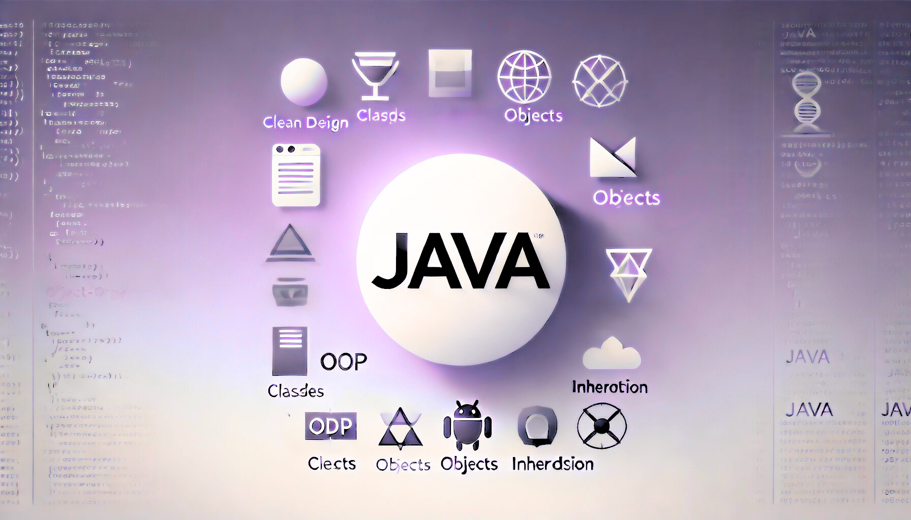
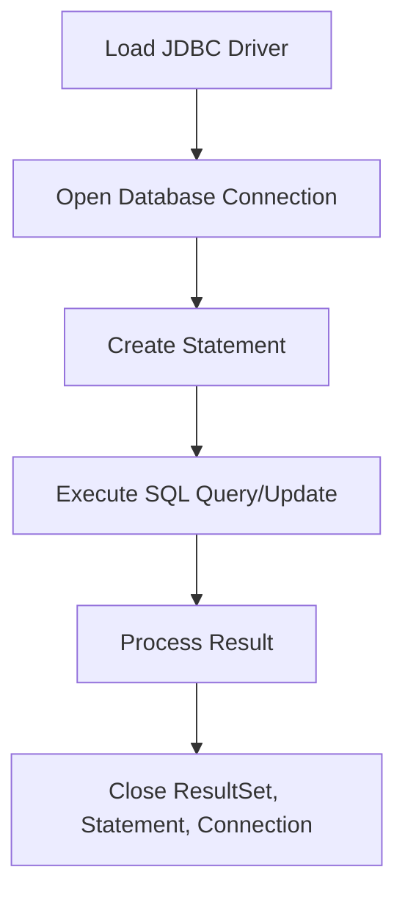

# OOP: Chapter 3

composed by [_Bimo Ade Budiman Fikri_](https://www.linkedin.com/in/bimoadee/)



<!-- [TOC] -->

## **Table of Contents**

<!-- - [What is a Design Pattern?](#what-is-a-design-pattern)
- [Types of Design Patterns in Java](#types-of-design-patterns-in-java)
  - [Creational Patterns](#creational-patterns)
    - [Singleton Pattern](#singleton-pattern)
    - [Factory Pattern](#factory-pattern)
    - [Abstract Factory Pattern](#abstract-factory-pattern)
    - [Builder Pattern](#builder-pattern)
    - [Prototype Pattern](#prototype-pattern)
  - [Structural Patterns](#structural-patterns)
    - [Adapter Pattern](#adapter-pattern)
    - [Bridge Pattern](#bridge-pattern)
    - [Composite Pattern](#composite-pattern)
    - [Decorator Pattern](#decorator-pattern)
    - [Facade Pattern](#facade-pattern)
    - [Flyweight Pattern](#flyweight-pattern)
    - [Proxy Pattern](#proxy-pattern)
  - [Behavioral Patterns](#behavioral-patterns)
    - [Chain of Responsibility Pattern](#chain-of-responsibility-pattern)
    - [Command Pattern](#command-pattern)
    - [Iterator Pattern](#iterator-pattern)
    - [Mediator Pattern](#mediator-pattern)
    - [Memento Pattern](#memento-pattern)
    - [Observer Pattern](#observer-pattern)
    - [State Pattern](#state-pattern)
    - [Strategy Pattern](#strategy-pattern)
    - [Template Method Pattern](#template-method-pattern)
    - [Visitor Pattern](#visitor-pattern) -->

---

Pernahkah kamu bayangin, "_Kenapa aplikasi di laptop kita bisa punya tombol, kotak teks, atau tabel yang bisa di-klik?_" atau "_Kenapa pas kita klik tombol "Save", aplikasi langsung nyimpen data kita?_"

Semua itu bisa terjadi berkat yang GUI dan _Event Handling_.

# Overview

GUI atau _Graphical User Interface_ adalah cara manusia berinteraksi dengan komputer lewat gambar, tombol, kotak input, bukan lewat kode-kode aneh kayak di terminal (_shell, command prompt, dsb._)

Kalau dunia nyata, GUI itu kayak:

- ATM screen → ada tombol "Tarik Tunai", "Cek Saldo".
- Smartphone → ada icon IG, WA, TikTok yang tinggal tap.
- Game → ada health bar, skor, tombol pause.

Karena GUI cuma tampilan. Kalau kita klik tombol tapi nggak ada yang ngerespons sama aja kayak pencet tombol _lift_ rusak lampunya nyala, tapi liftnya diem. 😵‍💫

Nah, Event Handling adalah otak di balik semua interaksi GUI.

`Event Handling = logika untuk mendeteksi aksi pengguna → lalu merespons`

Maka dari itu, kita bakal mencoba bahas GUI terlebih dahulu.

---

## Graphical User Interface (GUI)

GUI (_Graphical User Interface_) itu kayak baju keren buat program. Daripada cuma _text_ di console (ex: System.out.println()) doang, sekarang program kita bisa punya _window_, tombol, gambar, terus _user_ bisa klik, ketik, _drag_, dan masih banyak lagi.

Simple-nya: Dari "terminal hitam-hitam" bisa jadi "aplikasi yang bisa diklik-klik (interaktif)".

## Java Database Connectivity

Selama ini kita hanya belajar tentang fundamental dari Java yang mana hanya mengandalkan data dari user baik di-_hardcode_ ataupun di-_input_-kan. Cara tersebut memiliki banyak kekurangan seperti tidak tercatatnya data dalam waktu yang lama dan juga akan semakin kompleks ketika data semakin besar. Maka dari itu, sekarang kita akan mulai untuk mengikutsertakan koneksi _database_ ke dalam program kita. Materi ini bakal mengenalkan kita dengan _Java Database Connectivity_ (JDBC) sebagai konektor antara program dan database.

# Membangun Aplikasi GUI di Swing

Kali ini kita akan membuat program berupa form untuk mengisikan data mahasiswa dengan struktur pyoject sebagai berikut.

```
src/
 └── main/java/
      ├── Main.java             // Bootstrap program
      ├── Mahasiswa.java        // Class Model Mahasiswa
      └── MahasiswaForm.java    // GUI Form
```

## Step 1: Buat Frame

Nah, sebuah aplikasi Java GUI itu terdiri dari **Frame/Container** dan **Control**. **Frame** atau **Container** itu semacam ruangan atau bangunan utama. Semua _control_ (seperti tombol, input teks, gambar) itu harus nempel di dalam _Frame/Container_. Kalau gak ada _frame_, semua tombol dan teks bakal kayak barang berantakan di jalanan (karena gak ada yang nampung). Contoh dari **Frame/Container** bawaan dari Java Swing yaitu.

| Class         | Keterangan                                                         |
| ------------- | ------------------------------------------------------------------ |
| `JFrame`      | Jendela utama dengan title bar, minimize, close, maximize          |
| `JPanel`      | Panel biasa untuk mengelompokkan komponen, kayak sekat dalam rumah |
| `JWindow`     | Window polos tanpa title bar, kayak popup sederhana                |
| `JWindow`     | Jendela tanpa title bar (popup polos)                              |
| `JSplitPane`  | Membagi dua panel, bisa digeser ukurannya                          |
| `JTabbedPane` | Panel dengan tab seperti browser                                   |

Maka, berdasarkan studi kasus form Mahasiswa, kita perlu mendefinisikan _frame_ sebagai _constructor_ di `MahasiswaForm.java`

```java
import javax.swing.*;
import java.awt.*;
import java.util.ArrayList;

public class MahasiswaForm extends JFrame {

    public MahasiswaForm() {
        setTitle("Form Data Mahasiswa");
        setSize(400, 500);
        setDefaultCloseOperation(EXIT_ON_CLOSE);
        setLocationRelativeTo(null);
    }
}
```

Penjelasan:

- `setTitle` → Mengatur judul pada jendela/frame menjadi "Form Data Mahasiswa".
- `setSize` → Mengatur ukuran jendela/frame menjadi 400 piksel lebar dan 500 piksel tinggi.
- `setDefaultCloseOperation(EXIT_ON_CLOSE)` → Menentukan agar saat tombol close di klik, program akan benar-benar keluar dan tidak cuma menutup frame.
- `setLocationRelativeTo(null)` → Membuat posisi jendela muncul di tengah layar saat pertama kali dibuka.

<br>

## Step 2: Tambahkan Control

Lalu, **Control** itu adalah semua barang yang _user_ bisa lihat dan interaksikan di dalam _Container_. _Control_ ini nempel di atas _Frame/Container_.

Contoh **Control**
| Komponen | Deskripsi |
|----------|-----------|
| `JButton` | Tombol klik |
| `JLabel` | Label teks |
| `JTextField` | Input teks satu baris |
| `JTextArea` | Input teks banyak baris |
| `JPasswordField` | Input teks untuk password (disensor) |
| `JCheckBox` | Kotak centang |
| `JRadioButton` | Tombol pilihan tunggal |
| `JComboBox` | Dropdown pilihan |
| `JList` | Daftar pilihan |
| `JTable` | Menampilkan data dalam bentuk tabel |
| `JTree` | Menampilkan data hirarki seperti folder explorer |
| `JSlider` | Penggeser nilai (slider) |
| `JProgressBar` | Indikator progres tugas |
| `JSpinner` | Input angka dengan tombol naik/turun |
| `JScrollBar` | Scrollbar manual |
| `JToolBar` | Baris alat (biasanya icon shortcut) |
| `JMenuBar` | Menu bar di atas aplikasi (File, Edit, dll.) |
| `JEditorPane` | Komponen untuk menampilkan HTML atau teks format lainnya |
| `JColorChooser` | Dialog untuk memilih warna |
| `JFileChooser` | Dialog untuk memilih file |
| `...` | _dan masih banyak lagi_ |

Masih di file `MahasiswaForm.java`, kita akan menambahkan _control_ ke class tersebut.

```java
public class MahasiswaForm extends JFrame {
    // Components
    private final JTextField nimField = new JTextField(20);
    private final JTextField namaField = new JTextField(20);
    private final JRadioButton lakiRadio = new JRadioButton("Laki-laki");
    private final JRadioButton perempuanRadio = new JRadioButton("Perempuan");
    private final JSpinner umurSpinner = new JSpinner(new SpinnerNumberModel(18, 0, 100, 1));
    private final JTextArea alamatArea = new JTextArea(3, 20);
    private final JComboBox<String> provinsiCombo = new JComboBox<>(new String[]{"Jawa Tengah", "Jawa Barat", "DKI Jakarta", "Jawa Timur"});
    private final JCheckBox hobiMakan = new JCheckBox("Makan");
    private final JCheckBox hobiTidur = new JCheckBox("Tidur");
    private final JCheckBox hobiGaming = new JCheckBox("Gaming");
    private final JButton simpanButton = new JButton("Simpan");

    // Data Storage
    private final java.util.List<Mahasiswa> mahasiswaList = new ArrayList<>();
...
```

Penejelasan:

- `new JTextField(20)` → Membuat kotak teks (TextField) untuk input NIM dan Nama dengan lebar 20 kolom karakter.
- `JRadioButton()` → Membuat tombol pilihan (RadioButton) bertuliskan "Laki-laki" dan "Perempuan" untuk memilih jenis kelamin.
- `new JSpinner(new SpinnerNumberModel(18, 0, 100, 1))` → Membuat komponen spinner untuk input umur, default 18 tahun, minimum 0, maksimum 100, naik 1 angka tiap klik.
- `JTextArea(3, 20)` → Membuat area teks (TextArea) untuk input Alamat yang bisa multiline, berukuran 3 baris x 20 kolom.
- `new JComboBox<>()` → Membuat dropdown (ComboBox) berisi pilihan 4 nama provinsi.
- `new JCheckBox()` → Membuat checkbox bertuliskan "Makan","Tidur", dan "Gaming" untuk memilih hobi.
- `JButton("Simpan")` → Membuat tombol (Button) bertuliskan "Simpan" yang nanti dipakai untuk menyimpan data mahasiswa.
- `mahasiswaList` → akan menjadi list kosong (ArrayList) untuk menyimpan semua objek Mahasiswa yang berhasil diinput lewat form.

<br>

## Step 3: Tentukan Layout

Pada tahap ini kita perlu mengenal terlebih dahulu _apa itu Layout Manager?_

**Layout Manager** itu "design interior" di rumah kamu (_frame_). Kalau cuma taruh komponen tanpa layout, hasilnya bakal semrawut, tumpang tindih (_overlapping_), dan gak responsif. Maka dari itu, Layout Manager bakal bertugas untuk ngatur posisi komponen (Button, TextField, dll) dan ngaatur ukuran komponen sehingga adaptif ke ukuran _window_.

### Jenis-jenis Layout Manager

#### 1. FlowLayout — Santai berbaris

Komponen diatur dari kiri ke kanan seperti orang jalan santai. Kalau penuh komponen bakal pindah ke bawah. Layout ini merupakan default layout di JPanel.

Contoh:

```java
JPanel panel = new JPanel(new FlowLayout());
panel.add(new JButton("Satu"));
panel.add(new JButton("Dua"));
panel.add(new JButton("Tiga"));
```

<br>

#### 2. BorderLayout — Bagi-bagi wilayah

Frame dibagi 5 bagian: _North, South, East, West, Center_. Tiap bagian cuma bisa 1 komponen dan Biasanya buat layout utama.

Contoh:

```java
setLayout(new BorderLayout());
add(new JButton("Atas"), BorderLayout.NORTH);
add(new JButton("Bawah"), BorderLayout.SOUTH);
add(new JButton("Kiri"), BorderLayout.WEST);
add(new JButton("Kanan"), BorderLayout.EAST);
add(new JButton("Tengah"), BorderLayout.CENTER);
```

<br>

#### 3. GridLayout — Kayak Excel Sheet

Semua komponen dipaksa sebesar sama rata dalam bentuk grid. Kita perlu menentukan berapa baris dan kolom.

Contoh:

```java
setLayout(new GridLayout(2, 3)); // 2 baris, 3 kolom
add(new JButton("1"));
add(new JButton("2"));
add(new JButton("3"));
add(new JButton("4"));
add(new JButton("5"));
add(new JButton("6"));
```

<br>

#### 4. BoxLayout — Stack Vertikal / Horizontal

Stack komponen seperti tower (atas-bawah) atau sejajar (kiri-kanan).

```java
panel.setLayout(new BoxLayout(panel, BoxLayout.Y_AXIS)); // Vertikal
// atau
panel.setLayout(new BoxLayout(panel, BoxLayout.X_AXIS)); // Horizontal

```

<br>

#### 5. GridBagLayout — Layout Paling Fleksibel

Layout ini merupakan yang paling fleksibel tapi sayang dia juga yang paling ribet. Bisa atur ukuran, posisi, span kolom/baris, padding, alignment, dll. Layout ini bakal pakai `GridBagConstraints` buat atur satu-satu properti tiap komponen.

```java
setLayout(new GridBagLayout());
GridBagConstraints gbc = new GridBagConstraints();

gbc.gridx = 0; gbc.gridy = 0;
add(new JLabel("Nama:"), gbc);

gbc.gridx = 1; gbc.gridy = 0;
add(new JTextField(15), gbc);
```

<br>

Nah, lanjutan dari studi kasus **Form Mahasiswa** kita bakal nambahin layout di `MahasiswaForm.java` dengan membuat method `setupForm()`.

```java
private void setupForm() {
    setLayout(new GridBagLayout());
    GridBagConstraints gbc = new GridBagConstraints();
    gbc.insets = new Insets(5, 5, 5, 5);
    gbc.anchor = GridBagConstraints.WEST;

    int row = 0;

    // NIM
    gbc.gridx = 0; gbc.gridy = row;
    add(new JLabel("NIM:"), gbc);
    gbc.gridx = 1;
    add(nimField, gbc);

    // Nama
    row++;
    gbc.gridx = 0; gbc.gridy = row;
    add(new JLabel("Nama:"), gbc);
    gbc.gridx = 1;
    add(namaField, gbc);

    // Jenis Kelamin
    row++;
    gbc.gridx = 0; gbc.gridy = row;
    add(new JLabel("Jenis Kelamin:"), gbc);
    gbc.gridx = 1;
    JPanel genderPanel = new JPanel();
    genderPanel.add(lakiRadio);
    genderPanel.add(perempuanRadio);
    add(genderPanel, gbc);

    ButtonGroup genderGroup = new ButtonGroup();
    genderGroup.add(lakiRadio);
    genderGroup.add(perempuanRadio);

    // Umur
    row++;
    gbc.gridx = 0; gbc.gridy = row;
    add(new JLabel("Umur:"), gbc);
    gbc.gridx = 1;
    add(umurSpinner, gbc);

    // Alamat
    row++;
    gbc.gridx = 0; gbc.gridy = row;
    add(new JLabel("Alamat:"), gbc);
    gbc.gridx = 1;
    add(new JScrollPane(alamatArea), gbc);

    // Provinsi
    row++;
    gbc.gridx = 0; gbc.gridy = row;
    add(new JLabel("Provinsi:"), gbc);
    gbc.gridx = 1;
    add(provinsiCombo, gbc);

    // Hobi
    row++;
    gbc.gridx = 0; gbc.gridy = row;
    add(new JLabel("Hobi:"), gbc);
    gbc.gridx = 1;
    JPanel hobiPanel = new JPanel();
    hobiPanel.add(hobiMakan);
    hobiPanel.add(hobiTidur);
    hobiPanel.add(hobiGaming);
    add(hobiPanel, gbc);

    // Simpan Button
    row++;
    gbc.gridx = 1; gbc.gridy = row;
    gbc.anchor = GridBagConstraints.CENTER;
    add(simpanButton, gbc);
}
```

Penjelasan:

- `setLayout(new GridBagLayout())` ➔ Mengatur layout frame menggunakan GridBagLayout supaya komponen bisa ditempatkan fleksibel per baris/kolom.
- `new GridBagConstraints()` dan `gbc.insets = new Insets(5,5,5,5)` ➔ Membuat aturan penempatan komponen (posisi, padding antar komponen) di layout.
- `gbc.gridx = 0; gbc.gridy = row; add(new JLabel("NIM:"), gbc);` dan seterusnya (untuk Nama, Umur, Alamat, Provinsi, Hobi) ➔ Menambahkan label dan input field ke dalam form, dengan posisi grid X (kolom) dan Y (baris) yang ditentukan.
- `new JPanel(); genderPanel.add(lakiRadio); genderPanel.add(perempuanRadio); add(genderPanel, gbc)`➔ Membuat JPanel khusus untuk mengelompokkan dua JRadioButton agar tombol gender rapi dalam satu baris.
- `new ButtonGroup(); genderGroup.add(lakiRadio); genderGroup.add(perempuanRadio)` ➔ Menggabungkan kedua radio button ke dalam satu grup supaya hanya satu yang bisa dipilih.
- `new JScrollPane(alamatArea)` ➔ Membungkus JTextArea alamat dengan scroll pane supaya bisa di-scroll kalau teksnya panjang.
- `new JPanel(); hobiPanel.add(hobiMakan); hobiPanel.add(hobiTidur); hobiPanel.add(hobiGaming); add(hobiPanel, gbc)` ➔ Membuat panel kecil untuk mengatur checkbox hobi dalam satu baris yang rapi.
- `gbc.anchor = GridBagConstraints.CENTER` (khusus tombol Simpan) ➔ Mengatur agar tombol Simpan berada di tengah horizontal pada baris terakhir.
- `add(simpanButton, gbc)` ➔ Menambahkan tombol Simpan ke form, siap untuk dipasang event handler nanti.

Abistu, method `setupForm()` tersebut kemudian dipanggil di _contructor_-nya.

```java
public MahasiswaForm() {
    setTitle("Form Data Mahasiswa");
    setSize(400, 500);
    setDefaultCloseOperation(EXIT_ON_CLOSE);
    setLocationRelativeTo(null);
    setupForm(); // tambah di sini
}
```

## Step 4: Pasang Event Handling

### Konsep Event-Driven

Definisi simple-nya adalah program tidak melakukan apa-apa sampai sesuatu terjadi (event) baru bertindak.

> <br>Analoginya adalah coba bayangin kamu kerja di kedai kopi. Sebagai seorang barista, kalau ada pelanggan datang dan bilang "Mau Caramel Machiato!" pasti kamu baru bergerak untuk buat pesanan tersebut dong. Kalau sepi? Kamu bisa aja nyantai ambil scroll TikTok.<br><br>

Dari analogi di atas, bisa kita simpulin kalo:

- Pelanggan bicara = `event` terjadi.
- Kamu dengar dan buat kopi = `event handler` bekerja.
- Kalau gak ada `event`, kamu chill = hemat tenaga.

Nah, kalau misal kita ngga pakai _event-driven_? Bayangin kamu tiap 2 detik bikin kopi random padahal gak ada yang mesen. Capek, buang-buang resource, server lemot 🤡.

Kalau Di Java sendiri, _event-driven_ dipakai buat bikin aplikasi yang interaktif seprti aplikasi desktop, web, mobile, dll. Di Java (terutama _frameworkf_ Swing/JavaFX), semua jalan di atas **Event Dispatch Thread (EDT)**, semacam jalur khusus untuk semua event. Secara struktur umum:

| Komponen               | Peran                                                 |
| ---------------------- | ----------------------------------------------------- |
| **Event Source**       | Siapa yang memicu _event_ (contoh: Button, TextField) |
| **Event Object**       | Objek dari _event_ (contoh: waktu klik, sumber klik)  |
| **Listener / Handler** | Kode yang bilang: “Kalau ada _event_ X, lakukan Y”    |

Sehingga flow-nya sebagai berikut:

`Event Source → trigger Event → catch by Event Listener → invoke Event Method`

**Event source** mendelegasikan tugas untuk menghandle **event** kepada **event listener**, selanjutnya event listener akan meng-invoke **event method**

Terdapat beberapa cara dalam implementasi Listener:

### 1. Internal Class (Umum untuk Semua EventSource)

Kamu bikin satu _inner class_ yang nge-_handle_ semua tombol, terus kamu cek siapa sumber _event_-nya (pakai `e.getSource()` atau `e.getActionCommand()`).

Karakteristik:

- 1 class untuk banyak tombol.
- Di dalam event handler, harus cek sumber event-nya.

Contoh:

```java
import javax.swing.*;
import java.awt.event.*;

public class Main {
    public static void main(String[] args) {
        JFrame frame = new JFrame("Contoh 1");
        JButton btnA = new JButton("Tombol A");
        JButton btnB = new JButton("Tombol B");
        frame.setLayout(new java.awt.FlowLayout());

        frame.add(btnA);
        frame.add(btnB);

        // inner class
        class MyListener implements ActionListener {
            @Override
            public void actionPerformed(ActionEvent e) {
                if (e.getSource() == btnA) { // handle event A
                    System.out.println("Kamu klik Tombol A 😎");
                } else if (e.getSource() == btnB) { // handle event B
                    System.out.println("Kamu klik Tombol B 🚀");
                }
            }
        }

        MyListener listener = new MyListener();
        btnA.addActionListener(listener);
        btnB.addActionListener(listener);

        frame.pack();
        frame.setDefaultCloseOperation(JFrame.EXIT_ON_CLOSE);
        frame.setVisible(true);
    }
}
```

### 2. Internal Class (Satu Listener Khusus Tiap EventSource)

Dengan pendekatan ini kita bakal bikin class yang berbeda untuk masing-masing tombol (_event_).

Karakteristik:

- 1 class khusus buat 1 tombol.
- _Simpler event handling, no need_ `e.getSource()`.

Contoh:

```java
import javax.swing.*;
import java.awt.event.*;

public class Main {
    public static void main(String[] args) {
        JFrame frame = new JFrame("Contoh 2");
        JButton btnA = new JButton("Tombol A");
        JButton btnB = new JButton("Tombol B");
        frame.setLayout(new java.awt.FlowLayout());

        frame.add(btnA);
        frame.add(btnB);

        // inner class untuk event A
        class TombolAListener implements ActionListener {
            @Override
            public void actionPerformed(ActionEvent e) {
                System.out.println("Tombol A diklik 😎");
            }
        }

        // inner class untuk event B
        class TombolBListener implements ActionListener {
            @Override
            public void actionPerformed(ActionEvent e) {
                System.out.println("Tombol B diklik 🚀");
            }
        }

        btnA.addActionListener(new TombolAListener());
        btnB.addActionListener(new TombolBListener());

        frame.pack();
        frame.setDefaultCloseOperation(JFrame.EXIT_ON_CLOSE);
        frame.setVisible(true);
    }
}
```

### 3. Anonymous Inner Class (Langsung di Tempat)

Dengan cara ini kita gak perlu ribet bikin class baru. Langsung buat aja _instance_ dari implement interface di tempat saat `addActionListener`.

Karakteristik:

- Super simple.
- Cocok untuk event yang ringan dan kecil.
- Paling sering dipakai industri.

Contoh:

```java
import javax.swing.*;
import java.awt.event.*;

public class Main {
    public static void main(String[] args) {
        JFrame frame = new JFrame("Contoh 3");
        JButton btnA = new JButton("Tombol A");
        JButton btnB = new JButton("Tombol B");
        frame.setLayout(new java.awt.FlowLayout());

        frame.add(btnA);
        frame.add(btnB);

        // anonymous class untuk event A
        btnA.addActionListener(new ActionListener() {
            @Override
            public void actionPerformed(ActionEvent e) {
                System.out.println("Tombol A diklik 😎");
            }
        });

        // anonymous class untuk event B
        btnB.addActionListener(new ActionListener() {
            @Override
            public void actionPerformed(ActionEvent e) {
                System.out.println("Tombol B diklik 🚀");
            }
        });

        frame.pack();
        frame.setDefaultCloseOperation(JFrame.EXIT_ON_CLOSE);
        frame.setVisible(true);
    }
}
```

Kalau mau lebih kekinian banget, Anonymous Inner Class bisa diganti lambda (Java 8+):

```java
btnA.addActionListener(e -> System.out.println("Tombol A diklik 😎"));
btnB.addActionListener(e -> System.out.println("Tombol B diklik 🚀"));
```

## Step 5: Buat Class Mahasiswa

Seperti biasa ya kita tinggal membuat class `Mahasiswa.java`

```java
import java.util.List;

public class Mahasiswa {
    private String nim;
    private String nama;
    private String jenisKelamin;
    private int umur;
    private String alamat;
    private String provinsi;
    private List<String> hobi;

    public Mahasiswa(String nim, String nama, String jenisKelamin, int umur, String alamat, String provinsi, List<String> hobi) {
        this.nim = nim;
        this.nama = nama;
        this.jenisKelamin = jenisKelamin;
        this.umur = umur;
        this.alamat = alamat;
        this.provinsi = provinsi;
        this.hobi = hobi;
    }

    // Optional: Buat getter kalau mau nanti
}
```

## Step 6: Pasang Event Handling

Sekarang masih di file `MahasiswaForm.java`, kita akan membuat method `setupEvents()` untuk mengelola input event lalu memberikan respons-nya.

```java
private void setupEvents() {
    simpanButton.addActionListener(e -> {
        String nim = nimField.getText();
        String nama = namaField.getText();
        String jenisKelamin = lakiRadio.isSelected() ? "Laki-laki" : "Perempuan";
        int umur = (Integer) umurSpinner.getValue();
        String alamat = alamatArea.getText();
        String provinsi = (String) provinsiCombo.getSelectedItem();

        java.util.List<String> hobiList = new ArrayList<>();
        if (hobiMakan.isSelected()) hobiList.add("Makan");
        if (hobiTidur.isSelected()) hobiList.add("Tidur");
        if (hobiGaming.isSelected()) hobiList.add("Gaming");

        Mahasiswa mhs = new Mahasiswa(nim, nama, jenisKelamin, umur, alamat, provinsi, hobiList);
        mahasiswaList.add(mhs);

        JOptionPane.showMessageDialog(this, "Data Mahasiswa Berhasil Disimpan! 🎉");
        clearForm();
    });
}

private void clearForm() {
    nimField.setText("");
    namaField.setText("");
    lakiRadio.setSelected(false);
    perempuanRadio.setSelected(false);
    umurSpinner.setValue(18);
    alamatArea.setText("");
    provinsiCombo.setSelectedIndex(0);
    hobiMakan.setSelected(false);
    hobiTidur.setSelected(false);
    hobiGaming.setSelected(false);
}
```

Penjelasan:

- `simpanButton.addActionListener(e -> {...})` → Menambahkan listener ke tombol Simpan agar ketika diklik, seluruh blok kode di dalam lambda akan dieksekusi.
- `String nim = nimField.getText()` → Mengambil teks yang diketik user pada field NIM.
- `String nama = namaField.getText()` → Mengambil teks yang diketik user pada field Nama.
- `String jenisKelamin = lakiRadio.isSelected() ? "Laki-laki" : "Perempuan"` → Mengecek radio button mana yang dipilih dan menentukan nilai Jenis Kelamin.
- `int umur = (Integer) umurSpinner.getValue()` → Mengambil nilai umur yang dipilih dari komponen spinner.
- `String alamat = alamatArea.getText()` → Mengambil teks alamat dari input area teks.
- `String provinsi = (String) provinsiCombo.getSelectedItem()` → Mengambil nama provinsi yang dipilih dari dropdown ComboBox.
- `(if (hobiXxx.isSelected()))` → Mengecek checkbox yang tercentang, lalu menambahkan nama hobi ke dalam list hobi (penjelasan ini berlaku untuk semua checkbox yang diperiksa).
- `Mahasiswa mhs = new Mahasiswa(...)` → Membuat objek Mahasiswa baru menggunakan semua data inputan yang sudah dikumpulkan.
- `mahasiswaList.add(mhs)` → Menyimpan objek Mahasiswa ke dalam ArrayList untuk database sementara di memori.
- `JOptionPane.showMessageDialog(this, "...")` → Menampilkan pop-up dialog untuk memberitahu user bahwa data berhasil disimpan.
- `clearForm()` → Memanggil method untuk mengosongkan semua field input agar form siap untuk input berikutnya.

Abistu, method `setupEvents()` tersebut kemudian dipanggil di _contructor_-nya.

```java
public MahasiswaForm() {
    setTitle("Form Data Mahasiswa");
    setSize(400, 500);
    setDefaultCloseOperation(EXIT_ON_CLOSE);
    setLocationRelativeTo(null);
    setupForm();
    setupEvents(); // tambah di sini
}
```

## Step 7: Jalankan di EDT

Setelah semua persiapan selesai, sekarang waktunya kita memanggil semua file dan menjalankannya di `Main.java`

```java
public class Main {
    public static void main(String[] args) {
        SwingUtilities.invokeLater(() -> {
            MahasiswaForm form = new MahasiswaForm();
            form.setupForm();    // Panggil method untuk setup GUI
            form.setupEvents();  // Panggil method untuk pasang event
            form.setVisible(true);
        });
    }
}
```

Penjelasan:

- `SwingUtilities.invokeLater(...)` → pastikan semua operasi GUI dilakukan aman di thread khusus Swing (EDT).
- `setupForm()` → susun layout dan komponen GUI.
- `setupEvents()` → sambungkan aksi tombol/switch ke kode (event handling).
- `setVisible(true)` → baru setelah semuanya siap, tampilkan jendela ke user.

# Membangun Koneksi ke Database

## Apa itu JDBC?

_JDBC_ itu adalah jembatan antara program Java dan database. Kalau Java mau ngobrol sama database, gak bisa langsung. Butuh translator/jembatan, yaitu JDBC.

**Tanpa JDBC**: Java ngomong bahasa Java, Database ngomong bahasa SQL → kagak nyambung.
**Dengan JDBC**: Java bisa kirim query (kayak "INSERT", "SELECT"), Database jawab pake hasilnya.

### Komponen Utama JDBC

#### 1. DriverManager

`DriverManager` adalah manajer koneksi di JDBC yang tugas utamanya adalah:

- Menemukan driver database yang cocok.
- Membuka koneksi ke database.
- Mengatur dan mengelola koneksi database yang dipakai program Java-mu.

Fungsi:

- Ngelola koneksi dari program Java ke database.
- Tugasnya cari tahu: "Mana driver yang cocok?"

Contoh:

```java
Connection conn = DriverManager.getConnection(
    "jdbc:mysql://localhost:3306/db_kampus", "root", ""
);
```

Kalau sukses, kamu punya `Connection` yang aktif.

<br>

#### 2. Connection

_Connection_ adalah jembatan hidup antara program Java kamu dengan database. Kalau kamu mau ngirim atau ambil data dari database, wajib punya `Connection` dulu. Tanpa `Connection`, programmu gak bakal nyambung.

Fungsi:

- Objek nyambung ke database.
- Setelah berhasil connect, kamu bisa kirim perintah SQL melalui koneksi ini.

```java
String url = "jdbc:mysql://localhost:3306/db_kampus";
String username = "root";
String password = "";
Connection conn = DriverManager.getConnection(url, username, password);
```

Dan wajib banget! `Connection` Harus Ditutup karena koneksi ke database itu berat. Kalau gak ditutup, lama-lama server database bisa overload.

```java
conn.close();
```

#### 3. Statement

Statement di JDBC adalah tool buat ngirim _SQL query_ dari Java ke database. Setiap kali kamu mau SELECT, INSERT, UPDATE, DELETE, kamu butuh Statement.

Fungsi:

- Alat buat ngirim SQL command ke database.
- Bisa kirim: SELECT, INSERT, UPDATE, DELETE, dll.

Tiga Jenis Statement di JDBC, yaitu.

**Ordinary Statement**
Ciri-ciri:

- SQL ditulis langsung dalam kode Java.
- Buat query sederhana dan tetap (gak ada parameter dinamis).
- Rendah keamanan kalau dipakai dengan input user.

Contoh:

```java
Statement stmt = conn.createStatement();
ResultSet rs = stmt.executeQuery("SELECT * FROM mahasiswa WHERE umur > 18");
```

Namun, statement ini rentan akan serangan seprti SQL Injection sehingga perlu dihindari penggunaannya ketika berkaitan dengan data dari _user_ (form).

<br>

**PreparedStatement**

Ciri-ciri:

- SQL disiapkan dulu, baru diisi parameter.
- Aman dari SQL Injection.
- Lebih cepat kalau query dipanggil berulang-ulang (karena database bisa pre-compile query-nya).

Keunggulan PreparedStatement:

- Placeholder (?) bikin input lebih aman.
- Bisa reuse query dengan beda nilai parameter.
- Performansi naik (precompiled).

Contoh:

```java
String sql = "SELECT * FROM mahasiswa WHERE nama = ?";
PreparedStatement ps = conn.prepareStatement(sql);
ps.setString(1, "Abidin"); // set parameter ke-1
ResultSet rs = ps.executeQuery();
```

Jadi, Kalau ada input dari user, WAJIB pakai `PreparedStatement`.

<br>

**CallableStatement**

Ciri-ciri:

- Buat manggil stored procedure atau fungsi yang disimpan di database.
- Biasanya dipakai kalau bisnis logic sudah ada di database.

Contoh _Stored Procedure_ di Database:

```sql
CREATE PROCEDURE getMahasiswa()
BEGIN
  SELECT * FROM mahasiswa;
END
```

Cara manggilnya di Java:

```java
CallableStatement cs = conn.prepareCall("{call getMahasiswa()}");
ResultSet rs = cs.executeQuery();
```

Namun, penggunaan statement jarang digunakan pada proyek level sedang ke bawah sehingga jarang digunakan.

<br>

#### 4. ResultSet

Fungsi:

- Tempat buat nampung jawaban dari database.
- Kalau kamu ngirim SELECT, database bakal jawab: "Ini data yang kamu minta."

```java
ResultSet rs = stmt.executeQuery("SELECT * FROM mahasiswa");
while (rs.next()) {
    System.out.println(rs.getString("nim") + " - " + rs.getString("nama"));
}
```

<br>

| Tips                                                 | Kenapa                                                                 |
| ---------------------------------------------------- | ---------------------------------------------------------------------- |
| Selalu `rs.next()` dulu sebelum ambil data           | Karena posisi awal ResultSet belum di baris pertama                    |
| Tutup `ResultSet` setelah selesai                    | Biar koneksi resource gak bocor                                        |
| Hati-hati dengan tipe data                           | Kalau kolom di DB integer, ambil pakai `getInt()`, bukan `getString()` |
| Kolom bisa diakses pakai nama kolom atau index kolom | `rs.getString("nama")` sama kayak `rs.getString(2)` (kalau kolom ke-2) |
| Null handling                                        | Gunakan `rs.wasNull()` kalau ada kemungkinan NULL di DB                |

<br>

#### 5. SQLException

_SQLException_ itu exception yang terjadi ketika program Java kamu berinteraksi dengan database, dan sesuatu berjalan tidak seperti rencana.

Fungsi:

- Nge-_handle_ kesalahan saat komunikasi dengan database.
- Misal: koneksi error, query salah, server mati, password salah, dll.

Contoh:

```java
try {
    Connection conn = DriverManager.getConnection(url, user, pass);
    Statement stmt = conn.createStatement();
    ResultSet rs = stmt.executeQuery("SELECT * FROM mahasiswa");
} catch (SQLException e) {
    System.out.println("Ada masalah saat akses database!");
    e.printStackTrace(); // Debug detail error
}
```

Kalau kamu cetak `e.printStackTrace()`, kamu bisa dapet banyak informasi seperti:

- `getMessage()` Pesan error spesifik dari database
- `getErrorCode()` Kode error (setiap DBMS punya kode masing-masing)
- `getSQLState()` Kode standar SQLState error
- `printStackTrace()` Cetak jalur error lengkap (_stacktrace_)

<br>

### Alur Kerja JDBC



## Step by step

### Step 1: Persiapkan Database

1. Install MySQL Server (kalau belum ada) → bisa pakai XAMPP, WAMP, atau install manual.
2. Buka phpMyAdmin / MySQL Workbench / command line.
3. Buat database baru, misalnya:

```java
CREATE DATABASE db_mahasiswa;
```

4. Buat tabel mahasiswa:

```java
CREATE TABLE mahasiswa (
    id INT AUTO_INCREMENT PRIMARY KEY,
    nim VARCHAR(20) NOT NULL,
    nama VARCHAR(50) NOT NULL,
    jenis_kelamin VARCHAR(10),
    umur INT,
    alamat TEXT,
    provinsi VARCHAR(30),
    hobi TEXT
);
```

### Step 2: Tambahkan MySQL JDBC Driver ke Project

1. Download **mysql-connector-java.jar** dari website [resmi MySQL](https://dev.mysql.com/downloads/connector/j/).
2. Di IntelliJ / Eclipse:
   - Klik kanan Project → Open Module Settings
   - Tambahkan .jar file ke Library / Dependencies.

### Step 3: Buat Kelas Koneksi ke Database

Buat file **DatabaseConnection.java**

```java
import java.sql.Connection;
import java.sql.DriverManager;
import java.sql.SQLException;

public class DatabaseConnection {
    private static final String URL = "jdbc:mysql://localhost/db_kampus";
    private static final String USER = "root";
    private static final String PASSWORD = "";

    public static Connection getConnection() throws SQLException {
        return DriverManager.getConnection(URL, USER, PASSWORD);
    }
}
```

### Step 4: Modifikasi Form Mahasiswa untuk Menyimpan ke Database

Di **MahasiswaForm.java**, setelah user klik tombol `Simpan`, selain simpan ke `ArrayList`,
kita tambahkan _query_ ke database. Sehingga, kita perlu ubah method `setupEvents()`

```java
private void setupEvents() {
    simpanButton.addActionListener((ActionEvent e) -> {
        try {
            String nim = nimField.getText().trim();
            String nama = namaField.getText().trim();
            String jenisKelamin = lakiRadio.isSelected() ? "Laki-laki" : "Perempuan";
            int umur = (Integer) umurSpinner.getValue();
            String alamat = alamatArea.getText().trim();
            String provinsi = (String) provinsiCombo.getSelectedItem();

            List<String> hobiList = new ArrayList<>();
            if (hobiMakan.isSelected()) hobiList.add("Makan");
            if (hobiTidur.isSelected()) hobiList.add("Tidur");
            if (hobiGaming.isSelected()) hobiList.add("Gaming");

            String hobiGabung = String.join(",", hobiList); // gabungkan hobi jadi satu string

            // Simpan ke database
            try (Connection conn = DatabaseConnection.getConnection()) {
                String sql = "INSERT INTO mahasiswa (nim, nama, jenis_kelamin, umur, alamat, provinsi, hobi) VALUES (?, ?, ?, ?, ?, ?, ?)";
                PreparedStatement stmt = conn.prepareStatement(sql);
                stmt.setString(1, nim);
                stmt.setString(2, nama);
                stmt.setString(3, jenisKelamin);
                stmt.setInt(4, umur);
                stmt.setString(5, alamat);
                stmt.setString(6, provinsi);
                stmt.setString(7, hobiGabung);

                stmt.executeUpdate(); // execute the insert
            }

            // Kalau sukses:
            JOptionPane.showMessageDialog(this, "Data Mahasiswa Berhasil Disimpan ke Database! 🎉");

            clearForm();
        } catch (Exception ex) {
            ex.printStackTrace();
            JOptionPane.showMessageDialog(this, "Gagal Simpan: " + ex.getMessage(), "Error", JOptionPane.ERROR_MESSAGE);
        }
    });
}
```

Penjelasan

- Pakai `PreparedStatement` buat keamanan (anti _SQL Injection_).
- Data langsung masuk database, bukan hanya _ArrayList_.
- Kalau sukses, munculin `JOptionPane`.
- Kalau error, tampilkan error message.

### Step 5: Jalankan Program

---

# The End

```
Have a nice day 👋
```
