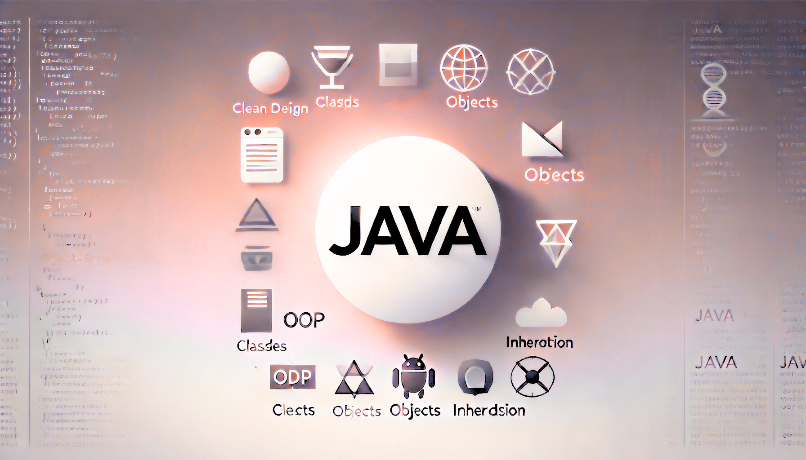

# OOP: Chapter 6

composed by [_Bimo Ade Budiman Fikri_](https://www.linkedin.com/in/bimoadee/)



<!-- [TOC] -->

## **Table of Contents**

<!-- - [Overview](#overview)
  - [Graphical User Interface](#graphical-user-interface-gui)
  - [Java Database Connectivity](#java-database-connectivity)
- [Membangun Aplikasi GUI di Swift](#membangun-aplikasi-gui-di-swing)
  - [Step 1: Buat Frame](#step-1-buat-frame)
  - [Step 2: Tambahkan Control](#step-2-tambahkan-control)
  - [Step 3: Bentukan Layout](#step-3-tentukan-layout)
  - [Step 4: Pasang Event Handling](#step-4-pasang-event-handling)
  - [Step 5: Buat Class Mahasiswa](#step-5-buat-class-mahasiswa)
  - [Step 6: Pasang Event Handling](#step-6-pasang-event-handling)
  - [Step 7: Jalankan di EDT](#step-7-jalankan-di-edt)
- [Membangun Koneksi ke Database](#membangun-koneksi-ke-database)
  - [Apa itu JDBC?](#apa-itu-jdbc)
  - [Step by Step](#step-by-step) -->

---

# Pemrosesan I/O

## Pendahuluan

Dalam pengembangan aplikasi Java, kemampuan untuk berinteraksi dengan dunia luar adalah fundamental. Interaksi ini seringkali melibatkan pemrosesan input (membaca data dari sumber eksternal) dan pemrosesan output (menulis data ke tujuan eksternal). Java menyediakan kerangka kerja I/O yang kaya dan kuat, yang sebagian besar dibangun di atas prinsip-prinsip Object-Oriented Programming (OOP). Materi ini akan membahas konsep dasar I/O dalam Java, penjelasan rinci mengenai kelas-kelas kunci, analogi atau studi kasus nyata untuk memperjelas pemahaman, dan contoh kode lengkap untuk setiap skenario.

---

## Konsep Dasar I/O dalam Java

Secara umum, I/O dalam Java melibatkan transfer data antara program Anda dan perangkat eksternal. Perangkat eksternal ini bisa berupa:

- **Keyboard**: Sumber input paling umum dari pengguna.
- **Layar Konsol**: Tujuan output paling umum untuk menampilkan informasi.
- **File**: Penyimpanan data persisten di disk.
- **Jaringan**: Komunikasi dengan aplikasi atau server lain melalui internet/intranet.
- **Memory**: Transfer data antar bagian dalam program.

Java mengimplementasikan I/O berdasarkan konsep _[stream](#stream)_.


### Stream

Stream adalah abstraksi aliran data. Bayangkan sebuah pipa air:

- **Input Stream:** Air mengalir dari sumber ke wadah (program Anda). Ini digunakan untuk membaca data.
- **Output Stream:** Air mengalir dari wadah (program Anda) ke tujuan. Ini digunakan untuk menulis data.

Stream adalah cara untuk menangani data secara berurutan, satu per satu. Mereka bisa berupa _[byte stream](#byte-stream)_ (untuk data biner) atau _[character stream](#character-stream)_ (untuk data teks).

### Exception Handling untuk I/O

Operasi I/O seringkali dapat gagal karena berbagai alasan (misalnya, file tidak ditemukan, izin akses ditolak, jaringan terputus). Oleh karena itu, Java mewajibkan penanganan exception untuk operasi I/O. Sebagian besar metode I/O akan mendeklarasikan `IOException` atau _subclass_-nya, yang berarti Anda harus menangani exception tersebut menggunakan blok `try-catch` atau mendeklarasikan `throws IOException` pada metode Anda.

### Menutup Stream

Sangat penting untuk selalu menutup stream setelah selesai menggunakannya. Kegagalan menutup stream dapat menyebabkan:

- **Kebocoran Sumber Daya:** Sumber daya sistem (seperti file handle) tetap terbuka, menghabiskan memori dan membatasi aplikasi lain.
- **Data _Corrupt_/Hilang:** Data yang ditulis mungkin tidak sepenuhnya disimpan ke tujuan hingga stream ditutup.

Java 7 memperkenalkan _try-with-resources statement_, yang secara otomatis menutup _stream_ (atau sumber daya lain yang mengimplementasikan _AutoCloseable_) setelah blok _try_ selesai, baik secara normal maupun karena _exception_. Ini adalah praktik terbaik yang sangat direkomendasikan.

## Class-class Kunci pada I/O

Java memiliki hierarki kelas I/O yang luas di dalam paket `java.io`. Kelas-kelas ini dibagi menjadi dua kategori utama berikut ini.

### Byte Stream

Digunakan untuk membaca dan menulis data biner, seperti gambar, audio, video, atau file yang tidak berformat teks. Kelas-kelas utamanya adalah InputStream dan OutputStream.

#### `InputStream` (Abstrak Class)

Merupakan superclass dari semua kelas input stream. Metode Kunci:

- `int read()`: Membaca satu byte data. Mengembalikan -1 jika akhir stream tercapai.
- `int read(byte[] b)`: Membaca sejumlah byte ke dalam array b. Mengembalikan jumlah byte yang dibaca, atau -1 jika akhir stream tercapai.
- `void close()`: Menutup input stream.

#### `OutputStream` (Abstrak Class)

Merupakan superclass dari semua kelas output stream.

- `void write(int b)`: Menulis satu byte data.
- `void write(byte[] b)`: Menulis seluruh array byte.
- `void wrie(byte[] b, int off, int len)`: Menulis len byte dari array b dimulai dari offset off.
- `void flush()`: Memaksa byte yang di-buffer untuk ditulis ke tujuan. Penting untuk memastikan data benar-benar tersimpan.
- `void close()`: Menutup output stream.

#### Subclass Penting dari Byte Stream

- `FileInputStream` / `FileOutputStream`: Untuk membaca/menulis data dari/ke file.
- `ByteArrayInputStream` / `ByteArrayOutputStream`: Untuk membaca/menulis data dari/ke array byte di memori. Berguna untuk memproses data secara internal tanpa melibatkan file.
- `BufferedInputStream` / `BufferedOutputStream`: Meningkatkan kinerja I/O dengan menggunakan buffer internal. Data dibaca/ditulis dalam blok yang lebih besar daripada satu byte pada satu waktu.
- `DataInputStream` / `DataOutputStream`: Memungkinkan membaca/menulis tipe data primitif Java (int, double, boolean, dll.) secara portabel.
- `ObjectInputStream` / `ObjectOutputStream`: Untuk melakukan serialisasi/deserialisasi objek Java. Objek harus mengimplementasikan antarmuka Serializable.

### Character Stream

Digunakan untuk membaca dan menulis data teks. Secara otomatis menangani encoding karakter (misalnya, UTF-8, ISO-8859-1). Kelas-kelas utamanya adalah `Reader` dan `Writer`. Ini adalah preferensi untuk menangani teks.

#### `Reader` (Abstrak Class)

Merupakan superclass dari semua kelas input character stream. Metode Kunci:

- `int read()`: Membaca satu karakter. Mengembalikan -1 jika akhir stream tercapai.
- `int read(char[] cbuf)`: Membaca sejumlah karakter ke dalam array cbuf. Mengembalikan jumlah karakter yang dibaca, atau -1 jika akhir stream tercapai.
- `void close()`: Menutup reader.

#### `Writer` (Abstrak Class)

Merupakan superclass dari semua kelas output character stream. Metode Kunci:

- `void write(int c)`: Menulis satu karakter.
- `void write(char[] cbuf)`: Menulis array karakter.
- `void write(String str)`: Menulis string.
- `void flush()`: Memaksa karakter yang di-buffer untuk ditulis ke tujuan.
- `void close()`: Menutup writer.

#### Subclass Penting dari Character Stream

- `FileReader` / `FileWriter`: Untuk membaca/menulis karakter dari/ke file.
- `BufferedReader` / `BufferedWriter`: Meningkatkan kinerja I/O dengan menggunakan buffer internal. Penting untuk membaca baris demi baris (readLine() pada BufferedReader).
- `InputStreamReader` / `OutputStreamWriter`: Bertindak sebagai jembatan antara byte stream dan character stream. Berguna saat Anda perlu membaca/menulis data teks dari/ke byte stream (misalnya, dari `System.in` atau `System.out`).
- `PrintWriter`: Kelas yang sangat berguna untuk menulis data berformat (seperti System.out) ke berbagai tujuan. Memiliki metode print() dan println().

### `Scanner` untuk Input User

Meskipun bukan bagian dari hierarki `java.io.Stream`, `Scanner` (dari `java.util`) adalah kelas yang sangat populer dan mudah digunakan untuk memproses input dari pengguna (misalnya, dari keyboard atau file teks). `Scanner` dapat menguraikan tipe data primitif dan string menggunakan _regular expressions_.

- `hasNextLine()`: Memeriksa apakah ada baris berikutnya.
- `nextLine()`: Membaca seluruh baris.
- `hasNextInt()`, `nextInt()`, `hasNextDouble()`, `nextDouble()`, dll.: Untuk membaca tipe data spesifik.
- `close()`: Menutup scanner.

### Analogi atau Studi Kasus Nyata

#### Studi Kasus 1: Memasak dan Buku Resep

Bayangkan program Java Anda adalah seorang koki di dapur.

- **Input Stream:** Anggap ini seperti Anda membaca resep dari sebuah buku resep (file input) atau mendengarkan instruksi dari seseorang (keyboard input). Anda mendapatkan bahan-bahan atau langkah-langkah satu per satu.
- **Output Stream:** Ini seperti Anda menulis resep baru ke dalam buku resep Anda (file output) atau mengatakan instruksi kepada asisten Anda (konsol output). Anda memberikan informasi.
- **Byte Stream vs. Character Stream:**

  - Jika Anda membaca resep dalam bentuk gambar (misalnya, dari buku resep kuno yang difoto), itu seperti byte stream karena Anda membaca piksel-piksel biner.
  - Jika Anda membaca resep yang ditulis dalam teks biasa, itu seperti character stream karena Anda membaca huruf demi huruf atau kata demi kata.

- **Buffering:** Jika Anda harus mengambil satu butir beras setiap kali Anda memasak, itu akan sangat lambat. Lebih baik mengambil segenggam beras (buffer) sekaligus. BufferedReader dan BufferedWriter bekerja seperti ini, mereka mengumpulkan sejumlah data sebelum benar-benar memprosesnya, mempercepat operasi.
- **try-with-resources:** Jika Anda menggunakan buku resep dan selesai memasak, Anda harus menutup buku dan meletakkannya kembali agar tidak rusak atau hilang. try-with-resources secara otomatis melakukan "menutup buku" ini untuk Anda, bahkan jika ada masalah saat memasak.

#### Studi Kasus 2: Aplikasi Catatan Sederhana

Bayangkan Anda sedang membangun aplikasi catatan sederhana.

- Menulis Catatan ke File (_Output_):

  - Pengguna mengetik catatannya di antarmuka pengguna.
  - Anda akan menggunakan FileWriter atau BufferedWriter (dibungkus FileWriter) untuk menulis teks catatan tersebut ke sebuah file .txt.
  - Jika Anda ingin menyimpan juga tanggal dan waktu catatan dibuat dalam format biner, Anda bisa menggunakan DataOutputStream.

- Membaca Catatan dari File (_Input_):
  - Ketika aplikasi dibuka, Anda perlu membaca catatan-catatan yang sudah ada.
  - Anda akan menggunakan FileReader atau BufferedReader (dibungkus FileReader) untuk membaca teks dari file .txt.
  - Jika ada data biner seperti tanggal dan waktu, Anda akan menggunakan DataInputStream.
- Input dari Pengguna (_Konsol_):
  - Jika Anda membuat aplikasi konsol, Anda akan menggunakan Scanner untuk membaca input dari keyboard (misalnya, judul catatan, isi catatan).
- Output ke Konsol:
  - Anda akan menggunakan System.out.println() (yang pada dasarnya adalah PrintWriter) untuk menampilkan pesan kepada pengguna, seperti "Catatan berhasil disimpan!" atau menampilkan daftar catatan.

---

## Contoh Kode Lengkap

Berikut adalah contoh kode untuk berbagai skenario I/O.

### Membaca Input dari Konsol menggunakan `Scanner`

```java
import java.util.Scanner;

public class KonsolInput {
    public static void main(String[] args) {
        // Membuat objek Scanner untuk membaca input dari System.in (keyboard)
        Scanner scanner = new Scanner(System.in);

        System.out.print("Masukkan nama Anda: ");
        String nama = scanner.nextLine(); // Membaca satu baris string

        System.out.print("Masukkan usia Anda: ");
        int usia = scanner.nextInt(); // Membaca integer

        // Membersihkan buffer setelah nextInt() jika ada nextLine() setelahnya
        // karena nextInt() hanya membaca angka, tidak membaca karakter newline
        scanner.nextLine();

        System.out.print("Masukkan kota asal Anda: ");
        String kota = scanner.nextLine(); // Membaca string lagi

        System.out.println("\nHalo, " + nama + "!");
        System.out.println("Anda berusia " + usia + " tahun dan berasal dari " + kota + ".");

        // Penting: Selalu tutup Scanner setelah selesai digunakan
        scanner.close();
    }
}
```

### Menulis dan Membaca Data Teks ke/dari File menggunakan `FileWriter` dan `FileReader` (tanpa buffering)

```java
import java.io.FileReader;
import java.io.FileWriter;
import java.io.IOException;

public class FileTeksDasar {
    private static final String NAMA_FILE = "catatan_dasar.txt";

    public static void main(String[] args) {
        // Menulis ke file
        try (FileWriter writer = new FileWriter(NAMA_FILE)) {
            writer.write("Ini adalah baris pertama.\n");
            writer.write("Baris kedua berisi angka: " + 123 + "\n");
            writer.write("Dan ini adalah baris terakhir.\n");
            System.out.println("Data berhasil ditulis ke " + NAMA_FILE);
        } catch (IOException e) {
            System.err.println("Terjadi kesalahan saat menulis ke file: " + e.getMessage());
        }

        // Membaca dari file
        try (FileReader reader = new FileReader(NAMA_FILE)) {
            int karakter;
            System.out.println("\nMembaca data dari " + NAMA_FILE + ":");
            while ((karakter = reader.read()) != -1) {
                System.out.print((char) karakter); // Mengkonversi integer ke karakter
            }
        } catch (IOException e) {
            System.err.println("Terjadi kesalahan saat membaca dari file: " + e.getMessage());
        }
    }
}
```

### Menulis dan Membaca Data Teks ke/dari File menggunakan `BufferedWriter` dan `BufferedReader` (dengan buffering)

Ini adalah cara yang lebih efisien dan direkomendasikan untuk menangani file teks.

```java
import java.io.BufferedReader;
import java.io.BufferedWriter;
import java.io.FileReader;
import java.io.FileWriter;
import java.io.IOException;

public class FileTeksBuffer {
    private static final String NAMA_FILE = "catatan_buffer.txt";

    public static void main(String[] args) {
        // Menulis ke file dengan buffering
        try (BufferedWriter writer = new BufferedWriter(new FileWriter(NAMA_FILE))) {
            writer.write("Java OOP adalah fundamental.");
            writer.newLine(); // Menulis karakter baris baru
            writer.write("Input/Output adalah bagian penting dari interaksi aplikasi.");
            writer.newLine();
            writer.write("Gunakan buffering untuk performa yang lebih baik.");
            System.out.println("Data berhasil ditulis ke " + NAMA_FILE + " dengan buffering.");
        } catch (IOException e) {
            System.err.println("Terjadi kesalahan saat menulis ke file: " + e.getMessage());
        }

        // Membaca dari file dengan buffering
        try (BufferedReader reader = new BufferedReader(new FileReader(NAMA_FILE))) {
            String baris;
            System.out.println("\nMembaca data dari " + NAMA_FILE + " dengan buffering:");
            while ((baris = reader.readLine()) != null) { // Membaca per baris
                System.out.println(baris);
            }
        } catch (IOException e) {
            System.err.println("Terjadi kesalahan saat membaca dari file: " + e.getMessage());
        }
    }
}
```

### Menulis dan Membaca Data Biner ke/dari File menggunakan `FileOutputStream` dan `FileInputStream`

```java
import java.io.FileInputStream;
import java.io.FileOutputStream;
import java.io.IOException;

public class FileBinerDasar {
    private static final String NAMA_FILE = "data_biner.bin";

    public static void main(String[] args) {
        // Data biner contoh (array byte)
        byte[] dataUntukDitulis = {72, 101, 108, 108, 111, 32, 87, 111, 114, 108, 100}; // "Hello World" dalam ASCII

        // Menulis data biner ke file
        try (FileOutputStream fos = new FileOutputStream(NAMA_FILE)) {
            fos.write(dataUntukDitulis);
            System.out.println("Data biner berhasil ditulis ke " + NAMA_FILE);
        } catch (IOException e) {
            System.err.println("Terjadi kesalahan saat menulis data biner: " + e.getMessage());
        }

        // Membaca data biner dari file
        try (FileInputStream fis = new FileInputStream(NAMA_FILE)) {
            int byteDibaca;
            System.out.println("\nMembaca data biner dari " + NAMA_FILE + ":");
            while ((byteDibaca = fis.read()) != -1) {
                System.out.print((char) byteDibaca); // Menampilkan sebagai karakter (jika bisa dibaca)
            }
            System.out.println(); // Baris baru setelah selesai membaca
        } catch (IOException e) {
            System.err.println("Terjadi kesalahan saat membaca data biner: " + e.getMessage());
        }
    }
}
```

### Menulis dan Membaca Tipe Data Primitif dengan `DataOutputStream` dan `DataInputStream`

```java
import java.io.DataInputStream;
import java.io.DataOutputStream;
import java.io.FileInputStream;
import java.io.FileOutputStream;
import java.io.IOException;

public class DataStreamContoh {
    private static final String NAMA_FILE = "data_primitif.dat";

    public static void main(String[] args) {
        // Menulis tipe data primitif
        try (FileOutputStream fos = new FileOutputStream(NAMA_FILE);
             DataOutputStream dos = new DataOutputStream(fos)) {

            dos.writeInt(12345);
            dos.writeDouble(3.14159);
            dos.writeBoolean(true);
            dos.writeUTF("Ini adalah sebuah string UTF-8."); // Untuk string

            System.out.println("Tipe data primitif berhasil ditulis ke " + NAMA_FILE);
        } catch (IOException e) {
            System.err.println("Terjadi kesalahan saat menulis data primitif: " + e.getMessage());
        }

        // Membaca tipe data primitif
        try (FileInputStream fis = new FileInputStream(NAMA_FILE);
             DataInputStream dis = new DataInputStream(fis)) {

            int nilaiInt = dis.readInt();
            double nilaiDouble = dis.readDouble();
            boolean nilaiBoolean = dis.readBoolean();
            String nilaiString = dis.readUTF();

            System.out.println("\nMembaca data primitif dari " + NAMA_FILE + ":");
            System.out.println("Integer: " + nilaiInt);
            System.out.println("Double: " + nilaiDouble);
            System.out.println("Boolean: " + nilaiBoolean);
            System.out.println("String: " + nilaiString);

        } catch (IOException e) {
            System.err.println("Terjadi kesalahan saat membaca data primitif: " + e.getMessage());
        }
    }
}
```

### Serialisasi dan Deserialisasi Objek dengan `ObjectOutputStream` dan `ObjectInputStream`

Untuk menyimpan objek Java secara langsung, objek tersebut harus mengimplementasikan antarmuka _Serializable_.

```java
import java.io.FileInputStream;
import java.io.FileOutputStream;
import java.io.IOException;
import java.io.ObjectInputStream;
import java.io.ObjectOutputStream;
import java.io.Serializable;

// Kelas yang akan diserialisasi
class Mahasiswa implements Serializable {
    private static final long serialVersionUID = 1L; // Direkomendasikan untuk serializable

    private String nama;
    private int nim;
    private transient String kataSandi; // 'transient' berarti tidak akan diserialisasi

    public Mahasiswa(String nama, int nim, String kataSandi) {
        this.nama = nama;
        this.nim = nim;
        this.kataSandi = kataSandi;
    }

    public String getNama() {
        return nama;
    }

    public int getNim() {
        return nim;
    }

    public String getKataSandi() {
        return kataSandi; // Akan null setelah deserialisasi karena transient
    }

    @Override
    public String toString() {
        return "Mahasiswa{" +
               "nama='" + nama + '\'' +
               ", nim=" + nim +
               ", kataSandi='" + kataSandi + '\'' + // Akan null setelah deserialisasi
               '}';
    }
}

public class ObjekSerialisasi {
    private static final String NAMA_FILE = "objek_mahasiswa.ser";

    public static void main(String[] args) {
        Mahasiswa mahasiswa1 = new Mahasiswa("Budi Santoso", 10123, "rahasia123");

        // Serialisasi objek
        try (FileOutputStream fos = new FileOutputStream(NAMA_FILE);
             ObjectOutputStream oos = new ObjectOutputStream(fos)) {

            oos.writeObject(mahasiswa1);
            System.out.println("Objek Mahasiswa berhasil diserialisasi ke " + NAMA_FILE);
            System.out.println("Objek asli: " + mahasiswa1);
        } catch (IOException e) {
            System.err.println("Terjadi kesalahan saat serialisasi objek: " + e.getMessage());
        }

        // Deserialisasi objek
        Mahasiswa mahasiswaBaca = null;
        try (FileInputStream fis = new FileInputStream(NAMA_FILE);
             ObjectInputStream ois = new ObjectInputStream(fis)) {

            mahasiswaBaca = (Mahasiswa) ois.readObject();
            System.out.println("\nObjek Mahasiswa berhasil dideserialisasi dari " + NAMA_FILE);
            System.out.println("Objek hasil deserialisasi: " + mahasiswaBaca);
            System.out.println("Kata sandi (setelah deserialisasi): " + mahasiswaBaca.getKataSandi()); // Akan null
        } catch (IOException | ClassNotFoundException e) {
            System.err.println("Terjadi kesalahan saat deserialisasi objek: " + e.getMessage());
        }
    }
}
```

---

# Pemrograman Jaringan

## Pendahuluan

Dalam era digital modern, kemampuan aplikasi untuk berkomunikasi melalui jaringan adalah hal yang sangat penting. Dari aplikasi chat sederhana hingga sistem terdistribusi yang kompleks, pemrograman jaringan memungkinkan aplikasi untuk saling berinteraksi, berbagi data, dan menyediakan layanan. Java, dengan pustaka `java.net` yang kaya, menawarkan kerangka kerja Object-Oriented Programming (OOP) yang kuat untuk membangun aplikasi jaringan yang andal dan skalabel.

---

## Konsep Dasar Pemrograman Jaringan

Pemrograman jaringan pada dasarnya melibatkan dua atau lebih program yang berkomunikasi satu sama lain melalui jaringan. Komunikasi ini mengikuti model client-server.

### Model Client-Server


- **Server:** Sebuah program yang menunggu (mendengarkan) koneksi dari klien, menyediakan layanan, dan merespons permintaan klien. Server biasanya berjalan terus-menerus. Ini seperti restoran atau toko yang selalu buka dan siap melayani pelanggan. Server menunggu permintaan dari "pelanggan" (klien), memprosesnya, lalu memberikan hasilnya.
- **Client:** Sebuah program yang menginisiasi koneksi ke server, membuat permintaan, dan menerima respons dari server. Klien biasanya diaktifkan oleh pengguna. Ini seperti Anda yang datang ke restoran (server) untuk memesan makanan (membuat permintaan) dan menunggu makanan Anda disajikan (menerima respons). Klien memulai komunikasi.

### Protokol Jaringan

Agar klien dan server dapat berkomunikasi, mereka harus berbicara dalam "bahasa" yang sama, yang dikenal sebagai protokol jaringan. Beberapa protokol yang umum digunakan dalam Java meliputi:


- **TCP** (_Transmission Control Protocol_): Protokol berorientasi koneksi yang menjamin pengiriman data yang andal, berurutan, dan bebas kesalahan.Seperti menelepon teman. Sebelum bicara, Anda harus men-_dial_ nomor dan memastikan teman Anda mengangkat telepon (proses _handshake_ atau membangun koneksi). Setelah tersambung, percakapan Anda terjamin sampai, berurutan, dan jika ada yang terlewat, Anda bisa meminta diulang. Jika telepon mati, Anda harus mendial lagi. Cocok untuk aplikasi yang memerlukan keandalan tinggi seperti transfer file, web Browse, atau email.

  - **Kapan dipakai?** Untuk komunikasi yang sangat penting dan harus sampai dengan utuh, seperti:
    - Mengirim email
    - Membuka halaman web
    - Transfer file (Anda tidak mau file rusak kan?)
  - **Keunggulan:** Sangat andal, data pasti sampai dan utuh.
  - **Kekurangan:** Sedikit lebih lambat karena ada proses "_dial_" dan "memastikan".

<br>

- **UDP** (_User Datagram Protocol_): Protokol tanpa koneksi yang lebih cepat tetapi tidak menjamin pengiriman data atau urutan data. Seperti mengirim surat kilat. Anda menulis surat, masukkan ke amplop, dan langsung kirim. Anda tidak perlu memastikan apakah surat itu sampai, atau apakah sampai dalam urutan yang benar jika Anda kirim banyak surat. Mungkin saja suratnya hilang di jalan atau datang duluan yang terakhir Anda kirim. Cocok untuk aplikasi yang sensitif terhadap waktu dan dapat mentolerir kehilangan data, seperti streaming video/audio atau game online real-time.

  - **Kapan dipakai?** Untuk komunikasi yang butuh kecepatan tinggi dan sedikit kehilangan data tidak masalah, seperti:
    - Streaming video/musik (lag sedikit tidak terlalu fatal)
    - Game online real-time (Anda lebih peduli kecepatan daripada setiap paket data sampai)
  - **Keunggulan:** Sangat cepat karena tidak ada proses "mendial" atau "memastikan".
  - **Kekurangan:** Tidak ada jaminan data sampai atau urutan data benar.

### Port dan IP Address

Untuk mengidentifikasi sebuah aplikasi di suatu mesin dalam jaringan, kita membutuhkan dua hal:


- Alamat IP (Internet Protocol Address): Mengidentifikasi perangkat (komputer, server, smartphone) dalam jaringan. Contoh: 192.168.1.1 atau 203.0.113.45.
- Nomor Port: Mengidentidentifikasi aplikasi atau layanan spesifik yang berjalan pada perangkat dengan alamat IP tertentu. Contoh: Port 80 untuk HTTP, Port 22 untuk SSH, Port 8080 untuk aplikasi web kustom.

Kombinasi alamat IP dan nomor port (IP Address:Port) dikenal sebagai _socket address_ atau _network address_.

**Analogi Sederhana:**

Setiap rumah punya alamat jalan yang unik (misalnya, Jl. Merdeka No. 10). Ini seperti IP Address di dunia jaringan. IP Address adalah identitas unik setiap perangkat di jaringan.

Tapi di dalam satu rumah, bisa ada banyak orang atau "layanan". Misalnya, di Jl. Merdeka No. 10, ada ruang tamu untuk menerima tamu (web server), ada dapur untuk masak (aplikasi database), dan ada kamar tidur (layanan lain). Nah, nomor pintu untuk setiap ruangan ini disebut Port.

Jadi, ketika Anda ingin menghubungi suatu layanan, Anda perlu tahu Alamat IP (rumah) dan Nomor Port (pintu) yang tepat. Contoh: 192.168.1.1:80 berarti Anda ingin terhubung ke rumah dengan IP 192.168.1.1 melalui pintu nomor 80 (yang biasanya untuk layanan web).

### Socket

_Socket_ adalah titik akhir (_endpoint_) komunikasi. Dalam Java, sebuah _socket_ adalah objek yang mewakili koneksi antara dua program di jaringan. Jika perangkat adalah rumah, dan alamat IP serta port adalah pintu, maka Socket adalah jendela komunikasi yang kita buka untuk mengirim dan menerima data.

- **Server _Socket_:** Digunakan oleh server untuk mendengarkan koneksi masuk dari klien. Ini adalah jendela yang dibuka oleh "pelayan" (server) untuk mendengarkan apakah ada "pelanggan" (klien) yang ingin masuk dan terhubung. Ketika ada pelanggan yang datang, server akan membuat jendela baru khusus untuk pelanggan itu.
- **Client _Socket_:** Digunakan oleh klien untuk membuat koneksi ke server. Ini adalah jendela yang dibuka oleh "pelanggan" (klien) untuk menghubungi jendela pelayan (server) dan memulai percakapan.

---

## Class-class Kunci pada Networking

Java menyediakan kelas-kelas inti untuk pemrograman jaringan di paket `java.net`.

#### Kelas untuk Alamat IP

`InetAddress`merupakan kelas representasi alamat IP. Metode kunci:

- `static InetAddress getByName(String host)`: Mengembalikan objek InetAddress untuk nama host atau alamat IP tertentu.
- `static InetAddress getLocalHost()`: Mengembalikan objek InetAddress untuk alamat IP mesin lokal.
- `String getHostName()`: Mengembalikan nama host.
- `String getHostAddress()`: Mengembalikan representasi string dari alamat IP.

### Kelas untuk TCP (Socket Berorientasi Koneksi)

#### `ServerSocket` (untuk Server)

Kelas ini digunakan oleh server untuk mendengarkan permintaan koneksi klien pada port tertentu.

- **Konstruktor Kunci:**
  - `ServerSocket(int port)`: Membuat server socket yang mendengarkan pada port yang ditentukan.
- **Metode Kunci:**
  - `Socket accept()`: Menunggu (memblokir) hingga koneksi klien diterima. Ketika klien terhubung, metode ini mengembalikan objek Socket baru yang mewakili koneksi dengan klien tersebut.
  - `void close()`: Menutup server socket.

#### `Socket` (untuk Klien dan Server)

Kelas ini merepresentasikan salah satu ujung koneksi TCP. Klien menggunakannya untuk membuat koneksi, dan server menggunakannya (objek yang dikembalikan oleh `accept()`) untuk berkomunikasi dengan klien yang terhubung.

- **Konstruktor Kunci (untuk Klien):**
  - `Socket(String host, int port)`: Membuat socket dan mencoba terhubung ke host dan port yang ditentukan.
- **Metode Kunci (untuk Input/Output Data):**
  - `InputStream getInputStream()`: Mengembalikan InputStream untuk membaca data yang dikirim oleh ujung koneksi lainnya.
  - `OutputStream getOutputStream()`: Mengembalikan OutputStream untuk menulis data ke ujung koneksi lainnya.
  - `void close()`: Menutup socket.

**PENTING!!:** Setelah mendapatkan `InputStream` dan `OutputStream` dari `Socket`, Anda akan menggunakan kelas-kelas I/O Java yang telah kita bahas sebelumnya (`BufferedReader`, `PrintWriter`, `DataInputStream`, dll.) untuk membaca dan menulis data yang sebenarnya.

### Kelas untuk UDP (Socket Tanpa Koneksi)

#### `DatagramSocket`

Kelas ini digunakan untuk mengirim dan menerima paket data UDP (`DatagramPacket`).

- **Konstruktor Kunci:**
  - `DatagramSocket()`: Membuat datagram socket yang mengikat ke port yang tersedia di mesin lokal.
  - `DatagramSocket(int port)`: Membuat datagram socket yang mengikat ke port yang ditentukan.
- **Metode Kunci:**
  - `void send(DatagramPacket p)`: Mengirim datagram packet.
  - `void receive(DatagramPacket p)`: Menerima datagram packet. Metode ini memblokir hingga paket diterima.
  - `void close()`: Menutup datagram socket.

#### `DatagramPacket`

Kelas ini merepresentasikan paket data yang akan dikirim atau diterima melalui `DatagramSocket`.

- **Konstruktor Kunci:**
  - `DatagramPacket(byte[] buf, int length, InetAddress address, int port)`: Untuk mengirim paket. buf adalah data, address adalah alamat IP tujuan, port adalah port tujuan.
  - `DatagramPacket(byte[] buf, int length)`: Untuk menerima paket. buf adalah buffer tempat data yang diterima akan disimpan.
- **Metode Kunci:**
  - `InetAddress getAddress()`: Mengembalikan alamat IP pengirim/penerima.
  - `int getPort()`: Mengembalikan nomor port pengirim/penerima.
  - `byte[] getDat`a(): Mengembalikan array byte yang berisi data.
  - `int getLength()`: Mengembalikan panjang data yang valid dalam array.

---

## Analogi atau Studi Kasus Nyata

### TCP (Transmission Control Protocol) - Sistem Telepon

**Bayangkan Anda ingin menelepon teman**. Pertama, Anda harus membangun koneksi (mendial nomor). Setelah terhubung, Anda berdua dapat berbicara (mengirim data) dan yakin bahwa apa yang Anda katakan akan didengar dalam urutan yang benar. Jika koneksi terputus, Anda harus menelepon lagi. Ini adalah komunikasi yang andal, berurutan, dan terkonfirmasi.

- **Server Socket** adalah telepon teman Anda yang menunggu panggilan masuk (mendengarkan).
- **Socket** adalah koneksi telepon yang sudah terjalin antara Anda dan teman Anda.

### UDP (User Datagram Protocol) - Kantor Pos

**Bayangkan Anda mengirim surat melalui kantor pos**. Anda menulis surat, menaruhnya di amplop, menulis alamat dan melemparkannya ke kotak surat. Anda tidak tahu pasti kapan atau bahkan apakah surat itu akan sampai, dan Anda tidak akan tahu urutan pengirimannya jika Anda mengirim beberapa surat sekaligus. Ini lebih cepat karena tidak ada proses handshake awal, tetapi kurang andal.

- **DatagramSocket** adalah kantor pos Anda yang menerima dan mengirimkan surat.
- **DatagramPacket** adalah surat itu sendiri, berisi pesan dan alamat tujuan.

### Studi Kasus Nyata: Aplikasi Chat Sederhana

Mari kita bayangkan membangun aplikasi chat sederhana.

#### Menggunakan TCP (Untuk Keandalan Pesan):

- **Server Chat:**
  - Membuat `ServerSocket` pada port tertentu (misal: 12345).
  - Dalam _loop_ tak terbatas, server memanggil `accept()` untuk menunggu klien terhubung.
  - Ketika klien terhubung, `accept()` mengembalikan `Socket` baru. Server kemudian membuat _thread_ baru untuk menangani komunikasi dengan klien ini. Ini penting agar server dapat menangani banyak klien secara bersamaan.
  - Dalam _thread_ klien, server mendapatkan `InputStream` dan `OutputStream` dari `Socket` untuk membaca pesan dari klien dan mengirim pesan kembali.
  - Server dapat menyiarkan pesan dari satu klien ke semua klien lain yang terhubung.
- **Client Chat:**
  - Membuat `Socket` dan mencoba terhubung ke alamat IP server dan port 12345.
  - Setelah terhubung, klien mendapatkan `InputStream` dan `OutputStream` dari `Socket` untuk mengirim pesan ke server dan menerima pesan dari server.
  - Klien biasanya akan memiliki dua thread internal: satu untuk mengirim pesan (membaca dari input pengguna dan menulis ke `socket`) dan satu lagi untuk menerima pesan (membaca dari `socket` dan menampilkannya).

#### Menggunakan UDP (Untuk Kecepatan atau Siaran):

Jika kita ingin membuat aplikasi chat yang sangat ringan atau untuk mengirim pesan siaran ke semua perangkat di jaringan lokal tanpa perlu koneksi berkelanjutan, UDP bisa menjadi pilihan.

- **Klien/Server (P2P):** Setiap partisipan bisa memiliki `DatagramSocket`.
  - Untuk mengirim pesan: Buat DatagramPacket dengan pesan, alamat IP tujuan, dan port, lalu kirim menggunakan DatagramSocket.send().
  - Untuk menerima pesan: Buat DatagramPacket kosong dengan buffer, lalu panggil DatagramSocket.receive() untuk menunggu paket.

**Kekurangan:** Pesan bisa hilang atau datang tidak berurutan. Anda perlu mekanisme sendiri untuk menangani keandalan jika diperlukan.

---

## Contoh Kode Lengkap

Berikut adalah contoh kode untuk TCP dan UDP.

### Contoh TCP: Server dan Klien Sederhana

Buat `EchoServer.java` sebagai Server TCP.

```java
import java.io.BufferedReader;
import java.io.IOException;
import java.io.InputStreamReader;
import java.io.PrintWriter;
import java.net.ServerSocket;
import java.net.Socket;

public class EchoServer {
    private static final int PORT = 12345; // Port server akan mendengarkan

    public static void main(String[] args) {
        System.out.println("Echo Server dimulai pada port " + PORT + "...");

        try (ServerSocket serverSocket = new ServerSocket(PORT)) {
            // Server terus-menerus mendengarkan koneksi klien
            while (true) {
                System.out.println("Menunggu koneksi klien...");
                // accept() memblokir hingga klien terhubung
                Socket clientSocket = serverSocket.accept();
                System.out.println("Klien terhubung: " + clientSocket.getInetAddress().getHostAddress());

                // Membuat thread baru untuk setiap klien yang terhubung
                // Ini memungkinkan server menangani banyak klien secara bersamaan
                new Thread(() -> handleClient(clientSocket)).start();
            }
        } catch (IOException e) {
            System.err.println("Kesalahan server: " + e.getMessage());
            e.printStackTrace();
        }
    }

    private static void handleClient(Socket clientSocket) {
        try (
            // Mendapatkan input stream dari klien
            BufferedReader in = new BufferedReader(new InputStreamReader(clientSocket.getInputStream()));
            // Mendapatkan output stream ke klien
            PrintWriter out = new PrintWriter(clientSocket.getOutputStream(), true); // 'true' untuk auto-flush
        ) {
            String inputLine;
            // Membaca input dari klien baris demi baris
            while ((inputLine = in.readLine()) != null) {
                System.out.println("Diterima dari klien " + clientSocket.getInetAddress().getHostAddress() + ": " + inputLine);
                // Mengirim kembali (echo) input ke klien
                out.println("Echo: " + inputLine);
                if (inputLine.equalsIgnoreCase("exit")) {
                    break; // Keluar dari loop jika klien mengetik 'exit'
                }
            }
            System.out.println("Klien " + clientSocket.getInetAddress().getHostAddress() + " terputus.");
        } catch (IOException e) {
            System.err.println("Kesalahan penanganan klien " + clientSocket.getInetAddress().getHostAddress() + ": " + e.getMessage());
            e.printStackTrace();
        } finally {
            try {
                clientSocket.close(); // Pastikan socket klien ditutup
            } catch (IOException e) {
                System.err.println("Gagal menutup socket klien: " + e.getMessage());
            }
        }
    }
}
```

<br>
Buat `EchoClient.java` sebagai Klien TCP.

```java
import java.io.BufferedReader;
import java.io.IOException;
import java.io.InputStreamReader;
import java.io.PrintWriter;
import java.net.Socket;
import java.net.UnknownHostException;
import java.util.Scanner;

public class EchoClient {
private static final String SERVER_ADDRESS = "localhost"; // Ganti dengan IP server jika berbeda
private static final int SERVER_PORT = 12345;

    public static void main(String[] args) {
        System.out.println("Mencoba terhubung ke server " + SERVER_ADDRESS + " pada port " + SERVER_PORT + "...");

        try (
            // Membuat socket klien dan terhubung ke server
            Socket socket = new Socket(SERVER_ADDRESS, SERVER_PORT);
            // Mendapatkan output stream untuk mengirim data ke server
            PrintWriter out = new PrintWriter(socket.getOutputStream(), true); // 'true' untuk auto-flush
            // Mendapatkan input stream untuk membaca data dari server
            BufferedReader in = new BufferedReader(new InputStreamReader(socket.getInputStream()));
            // Scanner untuk membaca input dari keyboard pengguna
            Scanner scanner = new Scanner(System.in);
        ) {
            System.out.println("Berhasil terhubung ke server. Ketik 'exit' untuk keluar.");
            String userInput;
            String serverResponse;

            while (true) {
                System.out.print("Anda: ");
                userInput = scanner.nextLine(); // Membaca input dari keyboard

                out.println(userInput); // Mengirim input ke server

                if (userInput.equalsIgnoreCase("exit")) {
                    break; // Keluar dari loop jika pengguna mengetik 'exit'
                }

                // Membaca respons dari server
                serverResponse = in.readLine();
                System.out.println("Server: " + serverResponse);
            }
            System.out.println("Koneksi ditutup.");
        } catch (UnknownHostException e) {
            System.err.println("Host tidak ditemukan: " + SERVER_ADDRESS);
            e.printStackTrace();
        } catch (IOException e) {
            System.err.println("Kesalahan I/O saat terhubung ke server: " + e.getMessage());
            e.printStackTrace();
        }
    }

}

```

<br>

**Cara Menjalankan:**

1. Compile kedua file: `javac EchoServer.java EchoClient.java`
2. Jalankan server terlebih dahulu: `java EchoServer`
3. Di terminal/CMD terpisah, jalankan klien: `java EchoClient`
4. Ketik pesan di klien, dan server akan "menggema" kembali pesan tersebut.

<br>

### Contoh UDP: Pengirim dan Penerima Pesan Sederhana

Buat file `UDPSender.java` sebagai Pengirim UDP.

```java
import java.io.IOException;
import java.net.DatagramPacket;
import java.net.DatagramSocket;
import java.net.InetAddress;
import java.util.Scanner;

public class UDPSender {
    private static final String RECEIVER_ADDRESS = "localhost"; // Ganti dengan IP penerima
    private static final int RECEIVER_PORT = 9876; // Port penerima mendengarkan

    public static void main(String[] args) {
        System.out.println("UDP Sender siap mengirim pesan.");

        try (DatagramSocket socket = new DatagramSocket(); // Socket pengirim
             Scanner scanner = new Scanner(System.in)) {

            InetAddress address = InetAddress.getByName(RECEIVER_ADDRESS); // Alamat tujuan

            String message;
            while (true) {
                System.out.print("Ketik pesan untuk dikirim (atau 'exit' untuk keluar): ");
                message = scanner.nextLine();

                if (message.equalsIgnoreCase("exit")) {
                    System.out.println("Keluar dari UDP Sender.");
                    break;
                }

                byte[] buffer = message.getBytes(); // Konversi pesan ke byte
                // Buat DatagramPacket dengan data, panjang, alamat, dan port tujuan
                DatagramPacket packet = new DatagramPacket(buffer, buffer.length, address, RECEIVER_PORT);

                socket.send(packet); // Kirim paket
                System.out.println("Pesan terkirim: '" + message + "'");
            }
        } catch (IOException e) {
            System.err.println("Kesalahan I/O UDP Sender: " + e.getMessage());
            e.printStackTrace();
        }
    }
}
```

Buat file `UDPReceiver.java` sebagai Penerima UDP.

```java
import java.io.IOException;
import java.net.DatagramPacket;
import java.net.DatagramSocket;

public class UDPReceiver {
    private static final int PORT = 9876; // Port penerima akan mendengarkan
    private static final int BUFFER_SIZE = 1024; // Ukuran buffer untuk menerima data

    public static void main(String[] args) {
        System.out.println("UDP Receiver dimulai pada port " + PORT + "...");

        try (DatagramSocket socket = new DatagramSocket(PORT)) {
            byte[] buffer = new byte[BUFFER_SIZE]; // Buffer untuk menyimpan data yang diterima

            while (true) {
                // Buat DatagramPacket untuk menerima data
                DatagramPacket packet = new DatagramPacket(buffer, buffer.length);
                System.out.println("Menunggu paket UDP...");

                socket.receive(packet); // Memblokir hingga paket diterima

                // Ekstrak data dari paket
                String receivedMessage = new String(packet.getData(), 0, packet.getLength());
                InetAddress senderAddress = packet.getAddress();
                int senderPort = packet.getPort();

                System.out.println("Diterima dari " + senderAddress.getHostAddress() + ":" + senderPort + " -> " + receivedMessage);

                // Opsional: Kirim respons (uncomment jika perlu)
                // String response = "ACK: " + receivedMessage;
                // byte[] responseBuffer = response.getBytes();
                // DatagramPacket responsePacket = new DatagramPacket(responseBuffer, responseBuffer.length, senderAddress, senderPort);
                // socket.send(responsePacket);
            }
        } catch (IOException e) {
            System.err.println("Kesalahan I/O UDP Receiver: " + e.getMessage());
            e.printStackTrace();
        }
    }
}
```

<br>

**Cara Menjalankan:**

1. Compile kedua file: `javac UDPSender.java UDPReceiver.java`
2. Jalankan penerima terlebih dahulu: `java UDPReceiver`
3. Di terminal/CMD terpisah, jalankan pengirim: `java UDPSender`
4. Ketik pesan di pengirim, dan pesan akan muncul di penerima.

---

# The End

```

Have a nice day 👋

```

```

```
