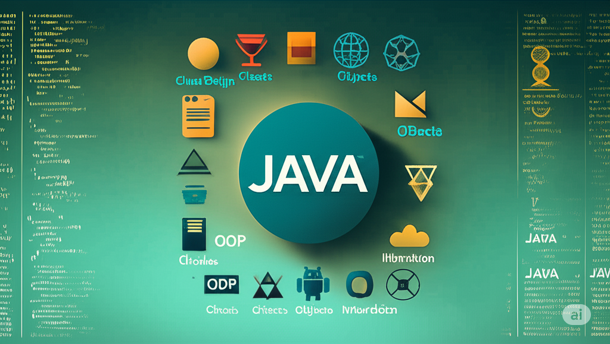

# OOP: Chapter 7

composed by [_Bimo Ade Budiman Fikri_](https://www.linkedin.com/in/bimoadee/)



## **Table of Contents**

<!-- - [Pemrosesan Input/Output](#pemrosesan-io)
  - [Pendahuluan](#pendahuluan)
  - [Konsep Dasar I/O](#konsep-dasar-io-dalam-java)
  - [Class-Class Kunci pada I/O](#class-class-kunci-pada-io)
  - [Contoh Kode](#contoh-kode)
- [Pemrograman Jaringan](#pemrograman-jaringan)
  - [Pendahuluan](#pendahuluan-1)
  - [Konsep Dasar Networking](#konsep-dasar-pemrograman-jaringan)
  - [Class-Class Kunci pada Networking](#class-class-kunci-pada-networking)
  - [Contoh Kode](#contoh-kode-1) -->

---

# Multithreading

## Concept of Multihtreading

### What is Multithreading?

Istilah "multithreading" sebenarnya berasal dari gabungan dua kata:

- **Multi** berarti **banyak** atau lebih dari satu.
- **Thread** berarti **untaian** dalam konteks program.

Jadi, ketika digabungkan,

> <br> **multithreading** secara harfiah berarti **banyak untaian eksekusi** <br><br>

Ini menggambarkan kemampuan sebuah program atau sistem untuk menjalankan banyak bagian kode (untaian/thread) secara bersamaan atau hampir bersamaan, alih-alih hanya satu per satu.


### Why is Multithreading?

Di awal-awal era komputasi, sebagian besar program dirancang dengan **paradigma sekuensial** (atau serial) yang mana setiap instruksi dalam program dieksekusi satu per satu, secara berurutan, dari awal hingga akhir. Seiring berjalannya waktu dan perkembangan komputer serta kebutuhan pengguna, program sekuensial mulai menunjukkan keterbatasannya:

- **Antarmuka Pengguna (UI) yang Kaku**: Bayangkan Anda menekan tombol "Download" di sebuah aplikasi. Jika aplikasi itu sekuensial, seluruh UI bisa "beku" (tidak bisa di-klik, digulir, atau diketik) sampai proses download selesai. Ini karena satu-satunya alur eksekusi sedang sibuk menangani download.
- **Pemanfaatan Sumber Daya yang Kurang Optimal**: Komputer modern mulai memiliki CPU multi-core (lebih dari satu "otak" pemrosesan). Program sekuensial hanya bisa menggunakan satu core CPU saja. Core lain akan menganggur, seperti memiliki banyak juru masak di dapur, tapi hanya satu yang bekerja. Ini adalah pemborosan potensi perangkat keras.
- **Tugas Berat yang Memperlambat Semuanya:** Untuk tugas-tugas yang membutuhkan waktu lama (misalnya pemrosesan data berukuran besar, perhitungan ilmiah kompleks, atau komunikasi jaringan yang lambat), seluruh aplikasi akan terhenti dan menjadi tidak responsif.

Keterbatasan program sekuensial mendorong lahirnya solusi-solusi baru berupa kemampuan program untuk menangani banyak tugas yang sedang berjalan pada saat yang bersamaan, atau setidaknya terlihat berjalan pada saat yang bersamaan (_concurrency_). Berangkat dari situ, lahirlah 2 mekanisme dalam mewujudkan konsep tersebut: _multiprocessing_ dan _multithreading_

<br>

### Multiprocessing vs Multithreading

Kita perlu tahu bahwa **Proses** adalah program yang sedang berjalan (misalnya, browser Chrome Anda, Microsoft Word, atau sebuah game), dan **Thread** adalah unit eksekusi di dalam sebuah proses. Sekarang, mari kita lihat bagaimana perbedaannya:


#### Process-based

Pendekatan ini melibatkan menjalankan beberapa proses yang terpisah secara bersamaan. Setiap proses adalah entitas yang sepenuhnya independen.

> <br>Bayangkan Anda memiliki beberapa dapur terpisah di gedung yang berbeda. Setiap dapur memiliki koki (proses) dan semua peralatannya sendiri (memori, file, sumber daya). Jika satu dapur mengalami masalah (misalnya, panci terbakar), itu tidak akan mempengaruhi dapur lain sama sekali <br><br>

**Karakteristik Kunci:**

- **Isolasi Kuat:** Setiap proses memiliki ruang memori dan sumber dayanya sendiri yang terisolasi dari proses lain. Jika satu proses _crash_ (mengalami kesalahan fatal), proses lain biasanya tidak terpengaruh. Ini memberikan stabilitas dan keamanan yang tinggi.
- **Komunikasi Antar Proses (IPC):** Karena terisolasi, proses-proses ini tidak bisa langsung "bicara" atau berbagi data dengan mudah. Mereka memerlukan mekanisme khusus yang disediakan oleh sistem operasi, seperti _pipes_, _sockets_, atau _shared memory_, untuk bertukar informasi. Ini bisa lebih kompleks dan lambat.
- **Overhead Tinggi:** Membuat dan mengelola proses baru membutuhkan lebih banyak sumber daya (memori dan waktu CPU) dibandingkan membuat _thread_. Peralihan (konteks _switching_) antara dua proses juga lebih lambat karena sistem operasi harus menyimpan dan memuat seluruh status dari setiap proses.

**Contoh Penggunaan:**

- Menjalankan beberapa aplikasi berbeda secara bersamaan di komputer Anda (misalnya, browser, editor teks, dan pemutar musik).
- _Server web_ yang meluncurkan proses terpisah untuk setiap permintaan klien.

#### Thread-based

Pendekatan ini melibatkan menjalankan beberapa thread di dalam satu proses tunggal. Seperti yang sudah dibahas, thread-thread ini berbagi sumber daya yang sama dalam proses tersebut.

> <br>Bayangkan Anda memiliki satu dapur besar (proses). Di dalam dapur ini, ada beberapa koki (_thread_) yang bekerja bersama. Mereka semua berbagi satu meja kerja, satu set pisau, dan satu kulkas. Jika satu koki menjatuhkan pisau, koki lain mungkin bisa membantu atau setidaknya melihatnya <br><br>

**Karakteristik Kunci:**

- **Berbagi Sumber Daya:** Semua thread dalam satu proses berbagi ruang memori, file, dan sumber daya lainnya. Ini membuat komunikasi antar thread (disebut _Inter-Thread Communication_) jauh lebih cepat dan lebih mudah karena mereka dapat langsung mengakses data yang sama.
- **Overhead Rendah:** Membuat dan mengelola thread jauh lebih "ringan" (membutuhkan lebih sedikit memori dan waktu CPU) dibandingkan proses. Peralihan (konteks _switching_) antar-thread juga jauh lebih cepat karena mereka berbagi sebagian besar konteks yang sama.
- **Potensi Masalah:** Karena berbagi sumber daya, ada risiko yang lebih tinggi untuk masalah seperti Race Condition (dua thread mencoba mengubah data yang sama secara bersamaan, menghasilkan hasil yang tidak terduga) atau Deadlock (dua thread saling menunggu satu sama lain). Ini memerlukan mekanisme sinkronisasi yang cermat.

**Contoh Penggunaan:**

- Dalam sebuah aplikasi web browser, satu thread mengelola antarmuka pengguna, thread lain mengunduh gambar, dan thread lain lagi memproses JavaScript.
- Server web modern yang menggunakan thread pool untuk menangani banyak permintaan klien secara bersamaan dalam satu proses.
- Aplikasi game, satu thread untuk grafik, satu untuk AI musuh, satu untuk input pemain.

Dalam Java (dan banyak bahasa modern lainnya), fokus utama kita dalam konteks Multithreading Programming adalah pada **_concurrency_ Berbasis Thread**. _Mengapa?_ Karena sebagian besar kebutuhan kita adalah membuat satu aplikasi menjadi lebih responsif dan efisien yang memecah tugas dengan thread yang berbagi sumber daya untuk komunikasi yang cepat. Di sisi lain, _concurrency_ berbasis proses biasanya ditangani oleh sistem operasi dan jarang diimplementasikan langsung di tingkat aplikasi dalam Java, kecuali untuk kasus-kasus sangat spesifik yang memerlukan isolasi ekstrem.

### When We Used Multihtreading?

Multithreading sangat berguna dalam skenario berikut:

- **Mengunduh File:** Bayangkan aplikasi download manager. Ia bisa mengunduh beberapa bagian file secara bersamaan dari server yang berbeda, atau mengunduh banyak file sekaligus.
- **Aplikasi dengan Antarmuka Pengguna (UI):** Seperti yang kita bahas, agar aplikasi tetap responsif, tugas-tugas seperti memuat data dari internet, memproses gambar, atau menyimpan ke database sebaiknya dilakukan di thread terpisah.
- **Komputasi Berat:** Misalnya, perhitungan ilmiah yang kompleks, pemrosesan video, atau simulasi. Bagian-bagian dari perhitungan ini bisa dibagi ke beberapa thread.
- **Server Jaringan dengan Traffic Tinggi:** Server yang melayani banyak permintaan dari klien secara bersamaan. Setiap permintaan klien bisa ditangani oleh thread terpisah.

---

## How to make a Thread

Setelah memahami mengapa _multithreading_ itu penting, sekarang saatnya kita belajar bagaimana caranya membuat "pekerja" (thread) baru di dalam program Java kita. Ada dua cara utama untuk melakukannya, dan kita akan bahas satu per satu.

Sebelum itu, apabila kita kilas balik sejenak, mulai dari pertemuan pertama kita telah membuat banyak sekali program Java. Namun muncul pertanyaan,

> <br>_apakah selama ini kita sudah memanfaatkan thread atau belum? Jika iya, dimanakah posisi thread pada program-program yang telah dibuat?_ <br><br>

### Main Thread

Jadi, setiap kali menjalankan sebuah program Java, baik itu program sederhana "Hello World" atau aplikasi kompleks, _Java Virtual Machine_ (JVM) akan secara otomatis membuat dan menjalankan **satu thread pertama yang disebut Main thread**.

Method `public static void main(String[] args)` yang selalu kita tulis adalah titik masuk bagi _Main thread_. Semua kode yang Anda tulis di dalam method `main()` dieksekusi oleh Main thread ini.

Maka secara visual, proses _threading_ bisa kita gambarkan sebagai berikut:

```
JVM START
   |
   V
Membuat Main Thread
   |
   V
Main Thread mulai eksekusi di method main()
   |
   V
(Kode Anda di dalam main() berjalan)
   |
   V
*Jika Anda membuat dan memulai thread lain (misalnya, `worker1.start();`),
Main Thread akan memberitahu JVM untuk membuat thread baru,
dan kemudian Main Thread akan terus berjalan sendiri
tanpa menunggu thread baru itu selesai.
```

Ketika melakukan _multihtreading programming_ kita akan sering memanggil `InterruptedException` sebagai sebuah _Checked Exception_ di Java. Hal tersebut berarti _compiler_ Java memaksa kita untuk menanganinya (baik dengan `try-catch` atau dengan mendeklarasikan `throws InterruptedException`).

`InterruptedException` dilemparkan ketika sebuah thread yang sedang dalam status "tidur" (`sleep()`), "menunggu" (`wait()`), atau "bergabung" (`join()`) yang tiba-tiba diinterupsi oleh thread lain.

Sehingga, poin utama yang dibahas pada _multithreading programming_ ini adakah bagaimana kita mengelola thread tambahan di luar Main thread untuk menghasilkan program yang lebih cepat dan responsif. Terdapat dua cara umum dalam mengatur thread tambahan pada program Java yaitu dengan memanfaatkan class `Thread` dan implementasi interface `Runnable`.

<br>

### Cara 1: Extending Class `Thread`

Cara pertama adalah dengan membuat class kita sendiri yang merupakan turunan (_extends_) dari class bawaan Java bernama `Thread`. Bayangkan `Thread` ini seperti sebuah cetakan dasar untuk membuat "pekerja". Kita akan membuat cetakan kita sendiri berdasarkan cetakan dasar itu, dan di cetakan kita, kita akan menuliskan apa saja tugas yang harus dilakukan oleh pekerja kita.

#### Methods

Class ini memiliki beberapa method bawaan sebagai berikut.

| Method / Atribut                  | Deskripsi Singkat                                                                                                                          | Kapan Digunakan?                                                                                       | Catatan Penting                                                                            |
| --------------------------------- | ------------------------------------------------------------------------------------------------------------------------------------------ | ------------------------------------------------------------------------------------------------------ | ------------------------------------------------------------------------------------------ |
| `run()`                           | Tempat Anda menulis semua kode atau tugas yang ingin dijalankan oleh thread. Ini adalah "isi" dari pekerjaan thread.                       | Wajib di-override saat membuat thread kustom.                                                          | Jangan pernah memanggil `run()` secara langsung untuk memulai thread baru!                 |
| `start()`                         | Metode ini memulai eksekusi thread baru. JVM akan membuat alur eksekusi terpisah dan secara otomatis memanggil method `run()` di dalamnya. | Untuk benar-benar memulai thread baru agar berjalan secara paralel.                                    | Panggil hanya sekali untuk setiap objek Thread.                                            |
| `static Thread.sleep(long ms)`    | Membuat thread yang sedang berjalan saat ini berhenti (tidur) selama durasi waktu tertentu (dalam milidetik).                              | Untuk memberikan jeda sementara dalam eksekusi thread, atau mensimulasikan pekerjaan yang butuh waktu. | Dapat melempar `InterruptedException`, jadi perlu penanganan `try-catch`.                  |
| `join()`                          | Membuat thread yang memanggil method ini menunggu hingga thread target (yang dipanggil `join()` padanya) selesai dieksekusi.               | Ketika Anda perlu memastikan suatu tugas di thread lain sudah selesai sebelum melanjutkan.             | Dapat melempar `InterruptedException`.                                                     |
| `static Thread.currentThread()`   | Mengembalikan referensi ke objek Thread yang sedang menjalankan kode saat ini.                                                             | Untuk mendapatkan informasi tentang thread yang sedang aktif (misalnya, untuk mencetak namanya).       | Ini adalah metode static, dipanggil melalui `Thread.currentThread()`.                      |
| `getName()`                       | Mengembalikan nama dari thread. Secara default, Java memberi nama seperti "Thread-0", "Thread-1", dll.                                     | Untuk mengidentifikasi thread saat debugging atau logging.                                             |                                                                                            |
| `setName(String name)`            | Mengatur nama kustom untuk thread.                                                                                                         | Untuk membuat output lebih mudah dibaca dan dimengerti saat thread sedang berjalan.                    | Sangat direkomendasikan untuk debugging.                                                   |
| `getId()`                         | Mengembalikan ID unik dari thread.                                                                                                         | Untuk identifikasi thread yang tidak akan berubah selama masa hidup thread.                            | ID adalah angka `long`.                                                                    |
| `getState()`                      | Mengembalikan status terkini dari thread (misalnya: NEW, RUNNABLE, BLOCKED, TERMINATED).                                                   | Untuk memantau siklus hidup dan kondisi thread.                                                        | Status thread adalah nilai dari enum `Thread.State`.                                       |
| `isAlive()`                       | Mengembalikan `true` jika thread telah dimulai dan belum selesai (masih hidup).                                                            | Untuk memeriksa apakah thread masih aktif.                                                             | Akan mengembalikan `false` setelah `run()` selesai dieksekusi.                             |
| `stop()`, `suspend()`, `resume()` | (**Deprecated**) Metode lama yang digunakan untuk menghentikan, menunda, dan melanjutkan thread.                                           | Tidak boleh digunakan dalam kode baru.                                                                 | **Berbahaya!** Cenderung menyebabkan deadlock dan masalah stabilitas. Hindari sama sekali. |

<br>

#### Langkah-langkah

1. Buat sebuah class baru yang `extends Thread`.
2. Di dalam class tersebut, Anda harus meng-`override` (menulis ulang) method bernama `run()`. **Semua kode yang ingin Anda jalankan di thread baru harus ditulis di dalam method `run()` ini**.
3. Di method `main()` Anda, buat objek (_instance_) dari class thread yang Anda buat.
4. Panggil method `start()` pada objek thread tersebut. **Penting: Jangan panggil `run()` secara langsung!** Method `start()` yang akan memberi tahu Java untuk membuat thread baru dan memanggil `run()` di dalamnya secara otomatis.

#### Contoh Program

Buat `MySimpleThread.java`

```java
// Ini adalah "cetakan" untuk pekerja baru kita
class MySimpleThread extends Thread {

    // Di sinilah kita tuliskan "tugas" yang harus dilakukan pekerja ini
    @Override
    public void run() {
        for (int i = 0; i < 5; i++) {
            System.out.println("MySimpleThread: Sedang bekerja... langkah " + i);
            try {
                // Biar ada jeda sedikit, biar kelihatan sedang bekerja
                Thread.sleep(500); // Jeda 500 milidetik (0.5 detik)
            } catch (InterruptedException e) {
                // Menangani jika thread diinterupsi saat tidur
                System.out.println("MySimpleThread: Saya diinterupsi!");
            }
        }
        System.out.println("MySimpleThread: Pekerjaan selesai!");
    }
}
```

Pada `Main.java`

```java
public class Main {
    public static void main(String[] args) {
        System.out.println("Main Thread: Program dimulai.");

        // 1. Membuat objek dari thread buatan kita
        MySimpleThread worker1 = new MySimpleThread();

        // 2. Memulai thread baru
        // Ini akan membuat thread baru dan memanggil method run() di dalamnya
        worker1.start();

        // Ini adalah pekerjaan yang dilakukan oleh "Main Thread" (thread utama)
        for (int i = 0; i < 3; i++) {
            System.out.println("Main Thread: Sedang melakukan sesuatu yang lain... " + i);
            try {
                Thread.sleep(700); // Jeda 700 milidetik
            } catch (InterruptedException e) {
                System.out.println("Main Thread: Saya diinterupsi!");
            }
        }

        System.out.println("Main Thread: Program selesai.");
    }
}
```

<br>

**Output:**

Anda akan melihat cetakan dari "Main Thread" dan "MySimpleThread" muncul bergantian di konsol. Ini membuktikan bahwa keduanya berjalan secara bersamaan atau hampir bersamaan! Thread utama tidak menunggu MySimpleThread selesai.

```
Main Thread: Program dimulai.
MainThread: Sedang bekerja... Langkah 0
MySimpleThread: Sedang bekerja... Langkah 0
MySimpleThread: Sedang bekerja... Langkah 1
MainThread: Sedang bekerja... Langkah 1
MainThread: Sedang bekerja... Langkah 2
MySimpleThread: Sedang bekerja... Langkah 2
MySimpleThread: Sedang bekerja... Langkah 3
MainThread: Sedang bekerja... Langkah 3
MySimpleThread: Sedang bekerja... Langkah 4
MainThread: Sedang bekerja... Langkah 4
MainThread selesai.
MySimpleThread selesai.

Process finished with exit code 0
```

<br>

### Cara 2: Implementing interface `Runnable` as a Class

Cara kedua ini sedikit berbeda, tapi lebih disukai dalam banyak kasus. Kita akan membuat class yang mengimplementasikan (menerapkan) interface bawaan Java bernama `Runnable`.

Kalau `Thread` itu "cetakan pekerja", maka `Runnable` itu seperti "daftar tugas" atau "instruksi kerja". Kita bisa memberikan daftar tugas ini kepada siapa saja yang bisa "menjalankannya" (termasuk objek `Thread`).

`Runnable` hanya fokus pada "apa" yang harus dikerjakan oleh sebuah thread. Dia tidak peduli "bagaimana" thread itu dibuat atau dijalankan. Ini membuat pemisahan tanggung jawab menjadi jelas.

Seperti yang sudah kita bahas sebelumnya, `Runnable` lebih sering direkomendasikan karena:

- **Fleksibilitas Pewarisan:** Sebuah class di Java hanya bisa mewarisi satu class (extends). Jika class Anda sudah mewarisi class lain (misalnya, extends SomeApplicationClass), Anda tidak bisa lagi extends Thread. Tapi Anda selalu bisa implements `Runnable`.
- **Pemisahan Tanggung Jawab (_Separation of Concerns_):** `Runnable` dengan jelas memisahkan "apa yang harus dikerjakan" (logika di run()) dari "bagaimana cara menjalankan pekerjaan itu" (mekanisme thread). Ini menghasilkan desain kode yang lebih bersih dan mudah dikelola.
- **Reusabilitas:** Satu objek `Runnable` yang sama bisa diberikan kepada beberapa objek Thread berbeda, yang kemudian akan menjalankan tugas yang sama secara paralel.

#### Methods

Interface `Runnable` juga sangat sederhana karena hanya memiliki satu method abstrak yang harus Anda implementasikan yaitu `run()`.

#### Langkah-langkah (Cara Klasik)

1. Buat sebuah class baru yang `implements Runnable`.
2. Sama seperti sebelumnya, Anda harus meng-override method `run()`. Semua kode yang ingin Anda jalankan di thread baru harus ditulis di dalam method `run()` ini.
3. Di method `main()`, buat objek dari class `Runnable` yang Anda buat.
4. Buat objek dari class Thread, dan masukkan objek `Runnable` Anda ke dalam _constructor_ Thread.
5. Panggil method `start()` pada objek Thread tersebut.

#### Contoh Program

Buat class `MyRunnableTask.java`

```java
class MyRunnableTask implements Runnable {

    private String taskName;

    // Constructor
    public MyRunnableTask(String name) {
        this.taskName = name;
    }

    // Di sinilah kita tuliskan "tugas" yang harus dilakukan
    @Override
    public void run() {
        for (int i = 0; i < 5; i++) {
            System.out.println(taskName + ": Sedang bekerja... langkah " + i);
            try {
                Thread.sleep(600); // Jeda 600 milidetik
            } catch (InterruptedException e) {
                System.out.println(taskName + ": Saya diinterupsi!");
            }
        }
        System.out.println(taskName + ": Pekerjaan selesai!");
    }
}
```

Panggil di `Main.java`

```java
public class Main {
    public static void main(String[] args) {
        System.out.println("Main Thread: Program dimulai.");

        // 1. Membuat objek dari "daftar tugas" kita (Runnable)
        MyRunnableTask task1 = new MyRunnableTask("Pekerja A");
        MyRunnableTask task2 = new MyRunnableTask("Pekerja B"); // Kita bisa punya daftar tugas yang sama untuk pekerja berbeda!

        // 2. Membuat objek Thread, dan memberikan "daftar tugas" ke mereka
        Thread workerA = new Thread(task1);
        Thread workerB = new Thread(task2); // Menggunakan objek task yang sama untuk contoh lain

        // 3. Memulai thread baru
        workerA.start();
        workerB.start();

        // Ini adalah pekerjaan yang dilakukan oleh "Main Thread" (thread utama)
        for (int i = 0; i < 3; i++) {
            System.out.println("Main Thread: Sedang melakukan sesuatu yang lain... " + i);
            try {
                Thread.sleep(800); // Jeda 800 milidetik
            } catch (InterruptedException e) {
                System.out.println("Main Thread: Saya diinterupsi!");
            }
        }

        System.out.println("Main Thread: Program selesai.");
    }
}
```

<br>

**Output:**

Anda akan melihat cetakan dari "Main Thread", "Pekerja A", dan "Pekerja B" muncul secara bergantian. Ini menunjukkan bahwa Anda kini memiliki tiga alur eksekusi independen yang berjalan!

```
Main Thread: Program dimulai.
Main Thread: Sedang melakukan sesuatu yang lain... 0
Pekerja A: Sedang bekerja... langkah 0
Pekerja B: Sedang bekerja... langkah 0
Pekerja A: Sedang bekerja... langkah 1
Pekerja B: Sedang bekerja... langkah 1
Main Thread: Sedang melakukan sesuatu yang lain... 1
Pekerja A: Sedang bekerja... langkah 2
Pekerja B: Sedang bekerja... langkah 2
Main Thread: Sedang melakukan sesuatu yang lain... 2
Pekerja A: Sedang bekerja... langkah 3
Pekerja B: Sedang bekerja... langkah 3
Main Thread: Program selesai.
Pekerja A: Sedang bekerja... langkah 4
Pekerja B: Sedang bekerja... langkah 4
Pekerja A: Pekerjaan selesai!
Pekerja B: Pekerjaan selesai!

Process finished with exit code 0
```

### Cara 3: Implementing interface `Runnable` dengan Lambda Expression

Setelah kita memahami kedua cara dasar tersebut, kita akan mencoba dengan cara yang lebih modern berdasarkan konsep pada cara 2. Sejak Java 8, kita bisa menggunakan **[Lambda Expression](https://www.w3schools.com/java/java_lambda.asp)** untuk mengimplementasikan interface fungsional (interface yang hanya memiliki satu method abstrak) tanpa harus membuat suatu class tertenu. Karena `Runnable` hanya memiliki satu method abstrak yaitu `run()`, kita bisa menulisnya dengan sangat ringkas menggunakan lambda.

Ini sangat berguna ketika tugas yang akan dijalankan oleh thread itu sederhana dan tidak memerlukan class terpisah yang rumit.

Langung kita buat di `Main.java`

```java
public class Main {
    public static void main(String[] args) {
        System.out.println("Main Thread: Program dimulai.");

        // 1. Membuat "daftar tugas" (Runnable) menggunakan Lambda Expression
        // Syntax dasar Lambda: () -> { kode yang akan dijalankan }
        Runnable taskLambda1 = () -> {
            for (int i = 0; i < 5; i++) {
                System.out.println("Lambda Task 1 (Thread: " + Thread.currentThread().getName() + "): Sedang bekerja... langkah " + i);
                try {
                    Thread.sleep(700); // Jeda 700 milidetik
                } catch (InterruptedException e) {
                    System.out.println("Lambda Task 1 (Thread: " + Thread.currentThread().getName() + "): Saya diinterupsi!");
                    Thread.currentThread().interrupt();
                }
            }
            System.out.println("Lambda Task 1 (Thread: " + Thread.currentThread().getName() + "): Pekerjaan selesai!");
        };

        // 2. Membuat "daftar tugas" kedua, juga dengan Lambda Expression
        Runnable taskLambda2 = () -> {
            for (int i = 0; i < 4; i++) { // Jumlah iterasi berbeda
                System.out.println("Lambda Task 2 (Thread: " + Thread.currentThread().getName() + "): Sedang memproses... " + i);
                try {
                    Thread.sleep(900); // Jeda berbeda
                } catch (InterruptedException e) {
                    System.out.println("Lambda Task 2 (Thread: " + Thread.currentThread().getName() + "): Saya diinterupsi!");
                    Thread.currentThread().interrupt();
                }
            }
            System.out.println("Lambda Task 2 (Thread: " + Thread.currentThread().getName() + "): Pemrosesan selesai!");
        };


        // 3. Membuat objek Thread dan memberikan lambda Runnable ke mereka
        Thread workerLambda1 = new Thread(taskLambda1, "Thread-Lambda-1");
        Thread workerLambda2 = new Thread(taskLambda2, "Thread-Lambda-2");

        // 4. Memulai thread baru
        workerLambda1.start();
        workerLambda2.start();

        // Pekerjaan yang dilakukan oleh "Main Thread" (thread utama)
        for (int i = 0; i < 3; i++) {
            System.out.println("Main Thread: Sedang melakukan sesuatu yang lain... " + i);
            try {
                Thread.sleep(1000); // Jeda 1000 milidetik
            } catch (InterruptedException e) {
                System.out.println("Main Thread: Saya diinterupsi!");
                Thread.currentThread().interrupt();
            }
        }

        System.out.println("Main Thread: Program selesai.");
    }
}
```

<br>

**Output:**

```
Main Thread: Program dimulai.
Main Thread: Sedang melakukan sesuatu yang lain... 0
Lambda Task 2 (Thread: Thread-Lambda-2): Sedang memproses... 0
Lambda Task 1 (Thread: Thread-Lambda-1): Sedang bekerja... langkah 0
Lambda Task 1 (Thread: Thread-Lambda-1): Sedang bekerja... langkah 1
Lambda Task 2 (Thread: Thread-Lambda-2): Sedang memproses... 1
Main Thread: Sedang melakukan sesuatu yang lain... 1
Lambda Task 1 (Thread: Thread-Lambda-1): Sedang bekerja... langkah 2
Lambda Task 2 (Thread: Thread-Lambda-2): Sedang memproses... 2
Main Thread: Sedang melakukan sesuatu yang lain... 2
Lambda Task 1 (Thread: Thread-Lambda-1): Sedang bekerja... langkah 3
Lambda Task 2 (Thread: Thread-Lambda-2): Sedang memproses... 3
Lambda Task 1 (Thread: Thread-Lambda-1): Sedang bekerja... langkah 4
Main Thread: Program selesai.
Lambda Task 1 (Thread: Thread-Lambda-1): Pekerjaan selesai!
Lambda Task 2 (Thread: Thread-Lambda-2): Pemrosesan selesai!

Process finished with exit code 0
```

<br>

### Ringkasan Perbandingan

| Fitur                        | `extends Thread`                                                                                        | `implements Runnable`                                                                                                             |
| ---------------------------- | ------------------------------------------------------------------------------------------------------- | --------------------------------------------------------------------------------------------------------------------------------- |
| **Sifat Pewarisan**          | Hanya bisa mewarisi satu class (`Thread`).                                                              | Masih bisa `extends` class lain. Lebih fleksibel.                                                                                 |
| **Pemisahan Tanggung Jawab** | Class Anda sekaligus "pekerja" dan "tugas".                                                             | Class Anda adalah "tugas", yang bisa diberikan ke "pekerja" (`Thread`). Lebih modular.                                            |
| **Reusabilitas Kode**        | Objek `Thread` baru berarti tugas baru.                                                                 | Satu objek `Runnable` bisa diberikan ke banyak objek `Thread`. Tugas yang sama bisa dijalankan oleh banyak pekerja.               |
| **Implementasi**             | `Override run()` langsung di subclass `Thread`.                                                         | `Override run()` di class yang mengimplementasikan `Runnable`, lalu buat `new Thread(myRunnable)`.                                |
| **Rekomendasi**              | **Jarang digunakan**, kecuali untuk kasus sangat sederhana atau ketika tidak perlu mewarisi class lain. | **Lebih disarankan** untuk sebagian besar kasus multithreading karena fleksibilitas dan pemisahan tanggung jawab yang lebih baik. |

<br>

### Thread States


Setiap thread memiliki "perjalanan" atau siklus hidup (_states_) dari saat dibuat hingga selesai. Memahami ini membantu kita memahami bagaimana Java mengelola thread.

1. **NEW (Baru):** Saat Anda membuat objek Thread (misalnya `new MySimpleThread()` atau `new Thread(myRunnable)`), thread berada dalam status "Baru". Dia sudah ada, tapi belum mulai bekerja.
2. **RUNNABLE (Siap Jalan):** Setelah Anda memanggil `start()` pada objek thread, thread masuk ke status "Siap Jalan". Thread sudah siap untuk dieksekusi, tapi masih menunggu "giliran" dari penjadwal thread di Java dan sistem operasi.
3. **RUNNING (Berjalan):** Ketika penjadwal thread memberikan waktu CPU kepada thread, maka thread tersebut benar-benar mulai menjalankan kode di dalam method `run()`.
4. **BLOCKED / WAITING / TIMED_WAITING (Diblokir / Menunggu):** Thread bisa berhenti sementara dari status "Running" dan masuk ke salah satu status menunggu ini jika:
   - _Diblokir (Blocked):_ Menunggu akses ke sumber daya yang sedang digunakan thread lain (contoh: sedang menunggu kunci/lock).
   - _Menunggu (Waiting):_ Menunggu thread lain untuk melakukan tindakan tertentu (misalnya, memanggil `notify()`). Ini terjadi ketika method `wait()` dipanggil.
   - _Menunggu dengan Waktu (Timed Waiting):_ Menunggu selama periode waktu tertentu (misalnya, saat memanggil Thread.`sleep()` atau wait(timeout)).
5. **TERMINATED (Selesai):** Thread masuk ke status ini setelah method `run()` selesai dieksekusi, atau jika ada kesalahan (exception) yang tidak ditangani dan menyebabkan thread berhenti. Setelah "Terminated", thread tidak bisa dimulai lagi.

Bahasan ini akan sangat berguna ketika kita belajar tentang [Concurrency Utilities](#concurrency-utilities) pada submateri [Advanced Concurrency](#advanced-concurrency).

---

## Thread Synchronization

Kita sudah belajar bagaimana membuat beberapa "pekerja" (thread) bisa berjalan bersamaan. Ini hebat karena bisa membuat program kita lebih cepat dan responsif. Tapi, ada satu masalah besar yang bisa muncul ketika pekerja-pekerja ini mulai bekerja pada sumber daya yang sama (seperti data atau file).

### Race Condition Problem

**_Race Condition_** terjadi ketika dua atau lebih thread mencoba mengakses dan memanipulasi data yang sama secara bersamaan, dan hasil akhirnya tergantung pada urutan eksekusi yang tidak bisa diprediksi. Ibaratnya, mereka "berlomba" untuk mengakses sumber daya, dan siapa yang sampai duluan (atau terakhir) bisa menentukan hasilnya.

Mari kita gunakan sebuah "Kotak Uang" sebagai sumber daya bersama. Ada dua pekerja (Thread A dan Thread B) yang tugasnya sama: mengambil uang dari kotak, menambahkannya dengan angka 10, lalu mengembalikan ke kotak.

Pada situasi ideal, proses akan seperti berikut

```
Kotak Uang: 100
├── Thread A mengambil 100
├── Thread A menambahkan 10 (jadi 110)
├── Thread A mengembalikan 110

Kotak Uang: 110
├── Thread B mengambil 110
├── Thread B menambahkan 10 (jadi 120)
├── Thread B mengembalikan 120

Hasil Akhir yang Benar: 120
```

Pada situasi **Race Condition** bisa saja menjadi sebagai berikut:

```
Kotak Uang: 100
├── Thread A mengambil 100
├── Thread B mengambil 100 (Masalah! Thread A belum mengembalikan nilainya)
├── Thread A menambahkan 10 (jadi 110)
├── Thread B menambahkan 10 (jadi 110)
├── Thread A mengembalikan 110
├── Thread B mengembalikan 110

Hasil Akhir yang Salah: 110 (Seharusnya 120!)
```

#### Contoh Kode

Mari kita buktikan ini dengan kode. Kita akan membuat sebuah class `Counter` dan dua thread yang masing-masing akan menaikkan nilai counter ribuan kali. Kita akan lihat apakah hasilnya benar.

```java
class Counter {
    private int count = 0;

    public void increment() {
        count++;
    }

    public int getCount() {
        return count;
    }
}
```

Lalu, buat class `CounterUser.java`

```java
class CounterUser implements Runnable {
    private Counter counter;
    private int incrementsPerThread; // Berapa kali thread ini akan menaikkan counter

    public CounterUser(Counter counter, int incrementsPerThread) {
        this.counter = counter;
        this.incrementsPerThread = incrementsPerThread;
    }

    @Override
    public void run() {
        String threadName = Thread.currentThread().getName();
        for (int i = 0; i < incrementsPerThread; i++) {
            counter.increment(); // Panggil method increment dari objek Counter bersama
        }
    }
}
```

Pada class `Main.java` akan seperti berikut.

```java
public class Main {
    public static void main(String[] args) throws InterruptedException {
        System.out.println("Main Thread: Program dimulai.");

        Counter sharedCounter = new Counter(); // Membuat satu objek Counter yang akan dibagi
        int numberOfThreads = 2; // Kita akan pakai 2 thread
        int incrementsPerThread = 100000; // Setiap thread akan menaikkan 100.000 kali

        // Buat thread untuk menaikkan counter
        Thread thread1 = new Thread(new CounterUser(sharedCounter, incrementsPerThread), "Thread-1");
        Thread thread2 = new Thread(new CounterUser(sharedCounter, incrementsPerThread), "Thread-2");

        // Jalankan kedua thread
        thread1.start();
        thread2.start();

        // Penting: Tunggu kedua thread selesai sebelum mencetak hasil akhir
        // Jika tidak, main thread bisa mencetak hasil sebelum mereka selesai
        thread1.join();
        thread2.join();

        // Hasil akhir yang diharapkan: numberOfThreads * incrementsPerThread
        int expectedResult = numberOfThreads * incrementsPerThread;

        System.out.println("\nMain Thread: Perhitungan selesai.");
        System.out.println("Hasil Akhir Counter (Diharapkan): " + expectedResult);
        System.out.println("Hasil Akhir Counter (Didapat)   : " + sharedCounter.getCount());

        // Biasanya, Anda akan melihat Hasil Akhir Counter (Didapat) < Hasil Akhir Counter (Diharapkan)
        if (sharedCounter.getCount() != expectedResult) {
            System.out.println("!!! TERJADI RACE CONDITION !!! Hasil tidak sesuai harapan.");
        } else {
            System.out.println("Hasil sesuai harapan. (Mungkin kebetulan atau jumlah increment terlalu kecil)");
        }
        System.out.println("Main Thread: Program selesai.");
    }
}
```

<br>

**Output:**

```
Main Thread: Program dimulai.

Main Thread: Perhitungan selesai.
Hasil Akhir Counter (Diharapkan): 200000
Hasil Akhir Counter (Didapat)   : 127576
!!! TERJADI RACE CONDITION !!! Hasil tidak sesuai harapan.
Main Thread: Program selesai.
```

Cobalah menjalankan `Main.java` berkali-kali. Hampir selalu, Anda akan melihat bahwa "Hasil Akhir Counter (Didapat)" lebih kecil dari "Hasil Akhir Counter (Diharapkan)". Ini adalah bukti nyata dari Race Condition!

Ini terjadi karena operasi "ambil", "tambah", dan "kembalikan" tidak dianggap sebagai satu kesatuan yang tidak bisa diganggu gugat. Inilah yang kita sebut "Critical Section" atau bagian dari kode di mana data bersama diakses atau dimodifikasi.

<br>

### Concept of Synchronization

Untuk mengatasi anomali Race Condition tersebut, kita perlu menerapkan _Sinkronisasi_. Artinya, kita harus memastikan bahwa hanya ada **satu thread pada satu waktu** yang boleh masuk ke dalam "Critical Section" (bagian kode yang mengakses atau memodifikasi data bersama).

> <br>Kembali ke dapur dengan kompor tunggal. Kita perlu menerapkan aturan: "Hanya satu koki yang boleh menggunakan kompor pada satu waktu." Ketika seorang koki sedang menggunakan kompor, dia "mengunci" kompor itu. Koki lain harus mengantri dan menunggu sampai kompor dilepaskan <br><br>

Di Java, kita bisa mencapai ini dengan beberapa cara, menggunakan keyword `synchronized` dan `volatile`.

### Keyword `synchronized`

Keyword `synchronized` di Java berfungsi sebagai "gembok" atau "monitor" untuk memastikan bahwa hanya satu thread yang bisa mengeksekusi blok kode tertentu pada satu waktu. Ketika sebuah thread masuk ke blok `synchronized`, ia akan "mengunci" objek monitor. Thread lain yang mencoba masuk ke blok `synchronized` yang mengunci objek yang sama akan menunggu sampai gembok itu dilepaskan.

Ada dua cara utama menggunakan `synchronized`:

#### `synchronized` Method: Mengunci Seluruh Objek


Jika Anda menempatkan keyword `synchronized` pada sebuah method non-static, maka ketika sebuah thread memanggil method itu, ia akan mengunci objek itu sendiri. Artinya, tidak ada thread lain yang bisa memanggil method `synchronized` lain dari objek yang sama secara bersamaan.

Mari kita perbaiki class Counter kita sebelumnya menjadi `SynchronizedCounter.java`.

```java
class SynchronizedCounter {
    private int count = 0;

    // Method increment() ini sekarang disinkronisasi
    // Artinya, hanya satu thread yang bisa menjalankan method ini PADA OBJEK SynchronizedCounter ini pada satu waktu.
    public synchronized void increment() {
        count++; // Ini sekarang adalah operasi atomik (tidak bisa diganggu gugat)
    }

    public int getCount() {
        return count;
    }
}
```

Lalu, buat class `SynchronizedCounterUser.java`

```java
class SynchronizedCounterUser implements Runnable {
    private SynchronizedCounter counter;
    private int incrementsPerThread;

    public SynchronizedCounterUser(SynchronizedCounter counter, int incrementsPerThread) {
        this.counter = counter;
        this.incrementsPerThread = incrementsPerThread;
    }

    @Override
    public void run() {
        String threadName = Thread.currentThread().getName();
        for (int i = 0; i < incrementsPerThread; i++) {
            counter.increment(); // Panggil method increment yang sudah disinkronisasi
        }
    }
}
```

Pada class `Main.java` akan seperti berikut.

```java
public class Main {
    public static void main(String[] args) throws InterruptedException {
        System.out.println("Main Thread: Program dimulai.");

        SynchronizedCounter sharedSynchronizedCounter = new SynchronizedCounter(); // Objek Counter yang sudah aman
        int numberOfThreads = 2;
        int incrementsPerThread = 100000;

        Thread thread1 = new Thread(new SynchronizedCounterUser(sharedSynchronizedCounter, incrementsPerThread), "Thread-Safe-1");
        Thread thread2 = new Thread(new SynchronizedCounterUser(sharedSynchronizedCounter, incrementsPerThread), "Thread-Safe-2");

        thread1.start();
        thread2.start();

        thread1.join();
        thread2.join();

        int expectedResult = numberOfThreads * incrementsPerThread;

        System.out.println("\nMain Thread: Perhitungan selesai.");
        System.out.println("Hasil Akhir Counter (Diharapkan): " + expectedResult);
        System.out.println("Hasil Akhir Counter (Didapat)   : " + sharedSynchronizedCounter.getCount());

        if (sharedSynchronizedCounter.getCount() == expectedResult) {
            System.out.println("!!! SUKSES !!! Hasil sesuai harapan. Race condition teratasi.");
        } else {
            System.out.println("!!! GAGAL !!! Hasil masih tidak sesuai harapan. Ada yang salah.");
        }
        System.out.println("Main Thread: Program selesai.");
    }
}
```

<br>

**Output:**

```
Main Thread: Program dimulai.

Main Thread: Perhitungan selesai.
Hasil Akhir Counter (Diharapkan): 200000
Hasil Akhir Counter (Didapat)   : 200000
!!! SUKSES !!! Hasil sesuai harapan. Race condition teratasi.
Main Thread: Program selesai.

Process finished with exit code 0
```

Jalankan `Main.java` ini berkali-kali. Anda seharusnya sekarang selalu mendapatkan hasil yang benar (200.000)! Ini karena method `increment()` dikunci, sehingga satu thread harus selesai menaikkan counter sebelum thread lain bisa mulai.

<br>

#### `synchronized` Block: Mengunci Bagian Kode yang Spesifik

Terkadang, Anda tidak ingin mengunci seluruh method, hanya bagian kecil dari kode di dalam method yang mengakses data bersama. Untuk kasus ini, Anda bisa menggunakan `synchronized` sebagai sebuah blok.

Anda harus menentukan objek apa yang akan digunakan sebagai "gembok" (monitor) untuk blok tersebut. Jika itu adalah method instance (bukan `static`), seringkali kita menggunakan `this` (objek saat ini) sebagai gemboknya.

Kita cukup membuat memanfaatkan block statement berikut untuk mengunci kode.

```java
synchronized (objectMonitor) {
    // Kode di sini adalah Critical Section
    // Hanya satu thread yang bisa masuk ke blok ini pada satu waktu,
    // selama mereka mengunci 'objectMonitor' yang sama.
}
```

Implementasinya dapat kita terapkan pada `Counter.java` menjadi berikut

```java
class Counter {
    private int count = 0;
    private final Object lock = new Object(); // Objek khusus yang akan digunakan sebagai gembok

    public void increment() {
        synchronized (lock) { // Mengunci objek 'lock'
            count++;
        }
    }

    public int getCount() {
        return count;
    }
}
```

Perubahan kode di atas tidak akan mengubah hasil di `Main.java` dan akan menghasilkan output yang sama.

<br>

---

## Threads Communication

Kita sudah tahu cara membuat banyak "pekerja" (thread) dan bahkan cara mencegah mereka saling berebut sumber daya. Tapi, bagaimana jika satu pekerja perlu menunggu pekerja lain menyelesaikan sesuatu sebelum dia bisa mulai? Atau, bagaimana jika satu pekerja perlu memberi tahu pekerja lain bahwa dia sudah menyelesaikan tugasnya?

Inilah inti dari **Komunikasi Antar Thread** yaitu mekanisme di mana thread bisa saling berkoordinasi, memberitahu satu sama lain tentang status pekerjaan, atau menunggu kondisi tertentu terpenuhi.

Di Java, ada tiga method kunci yang bekerja sama untuk tujuan ini, yang selalu dipanggil di dalam blok `synchronized`: `wait()`, `notify()`, dan `notifyAll()`

- `wait()`: "Tidur" atau "menunggu" dan melepaskan gembok (_lock_) yang sedang dipegangnya, sampai thread lain memberitahu dia untuk bangun. Ini sangat penting, karena jika tidak dilepaskan, thread lain tidak bisa masuk ke bagian `synchronized` dan memberi tahu untuk bangun.
- `notify()`: "Membangunkan" satu thread yang sedang `wait()` pada gembok yang sama.
- `notifyAll()`: "Membangunkan" semua thread yang sedang `wait()` pada gembok yang sama.

Method di atas **HARUS SELALU dipanggil dari dalam blok atau method synchronized** yang mengunci objek yang sama. Jika tidak, akan terjadi `IllegalMonitorStateException`.

### Studi Kasus

#### Analogi Producer-Consumer

ni adalah contoh klasik untuk memahami komunikasi antar thread:

- **Producer (Penghasil):** Menghasilkan sesuatu (misalnya, data, barang) dan menaruhnya di "wadah" bersama.
- **Consumer (Pengguna):** Mengambil sesuatu dari "wadah" yang sama dan memprosesnya.
- **Wadah (Shared Buffer):** Tempat Producer menaruh barang dan Consumer mengambil barang. Wadah ini punya kapasitas terbatas.

#### Skenario Masalah Tanpa Komunikasi

- Producer mengisi wadah. Kalau wadah penuh, dia bingung harus menaruh di mana.
- Consumer mengambil dari wadah. Kalau wadah kosong, dia bingung harus mengambil apa.

#### Solusi dengan `wait()` dan `notify()`

1. Jika Producer menemukan wadah penuh, dia akan memanggil `wait()` dan "tidur", menunggu Consumer mengambil barang.
2. Jika Consumer menemukan wadah kosong, dia akan memanggil `wait()` dan "tidur", menunggu Producer menaruh barang.
3. Ketika Producer menaruh barang, dia akan memanggil `notify()` (atau `notifyAll()`) untuk membangunkan Consumer yang mungkin sedang tidur.
4. Ketika Consumer mengambil barang, dia akan memanggil `notify()` (atau `notifyAll()`) untuk membangunkan Producer yang mungkin sedang tidur.

### Contoh Program

Mari kita buat simulasi Produser dan Konsumen yang berbagi satu wadah kecil (kapasitas 1 item).

Buat class `SharedBuffer.java`

```java
// Class yang merepresentasikan "wadah" atau buffer bersama
class SharedBuffer {
    private int data;
    private boolean isEmpty = true; // True jika buffer kosong, false jika ada data

    // Method untuk Produser menaruh data
    public synchronized void put(int value) {
        // Jika buffer tidak kosong (ada data), Produser harus menunggu
        while (!isEmpty) {
            try {
                System.out.println(Thread.currentThread().getName() + ": Buffer PENUH, menunggu Consumer ambil...");
                wait(); // Produser tidur dan melepaskan gembok (lock)
            } catch (InterruptedException e) {
                System.out.println(Thread.currentThread().getName() + ": Produser diinterupsi saat menunggu!");
                Thread.currentThread().interrupt();
            }
        }
        // Jika buffer kosong, Produser bisa menaruh data
        this.data = value;
        isEmpty = false;
        System.out.println(Thread.currentThread().getName() + ": Menaruh data: " + value);
        notifyAll(); // Beri tahu thread lain (Consumer) bahwa ada data baru
    }

    // Method untuk Konsumen mengambil data
    public synchronized int get() {
        // Jika buffer kosong (tidak ada data), Konsumen harus menunggu
        while (isEmpty) {
            try {
                System.out.println(Thread.currentThread().getName() + ": Buffer KOSONG, menunggu Produser taruh...");
                wait(); // Konsumen tidur dan melepaskan gembok (lock)
            } catch (InterruptedException e) {
                System.out.println(Thread.currentThread().getName() + ": Consumer diinterupsi saat menunggu!");
                Thread.currentThread().interrupt();
            }
        }
        // Jika buffer tidak kosong, Konsumen bisa mengambil data
        int retrievedData = this.data;
        isEmpty = true;
        System.out.println(Thread.currentThread().getName() + ": Mengambil data: " + retrievedData);
        notifyAll(); // Beri tahu thread lain (Produser) bahwa buffer sudah kosong
        return retrievedData;
    }
}
```

<br>

Buat `Producer.java`

```java
// Runnable untuk thread Produser
class Producer implements Runnable {
    private SharedBuffer buffer;
    private int itemsToProduce;

    public Producer(SharedBuffer buffer, int itemsToProduce) {
        this.buffer = buffer;
        this.itemsToProduce = itemsToProduce;
    }

    @Override
    public void run() {
        String threadName = Thread.currentThread().getName();
        System.out.println(threadName + ": Memulai produksi...");
        for (int i = 0; i < itemsToProduce; i++) {
            buffer.put(i + 1); // Menaruh data ke buffer
            try {
                Thread.sleep(300); // Simulasi waktu produksi
            } catch (InterruptedException e) {
                System.out.println(threadName + ": Produser diinterupsi!");
                Thread.currentThread().interrupt();
            }
        }
        System.out.println(threadName + ": Selesai produksi.");
    }
}
```

<br>

Buat `Consumer.java`

```java
// Runnable untuk thread Consumer
class Consumer implements Runnable {
    private SharedBuffer buffer;
    private int itemsToConsume;

    public Consumer(SharedBuffer buffer, int itemsToConsume) {
        this.buffer = buffer;
        this.itemsToConsume = itemsToConsume;
    }

    @Override
    public void run() {
        String threadName = Thread.currentThread().getName();
        System.out.println(threadName + ": Memulai konsumsi...");
        for (int i = 0; i < itemsToConsume; i++) {
            int data = buffer.get(); // Mengambil data dari buffer
            // System.out.println(threadName + ": Memproses data: " + data);
            try {
                Thread.sleep(500); // Simulasi waktu pemrosesan
            } catch (InterruptedException e) {
                System.out.println(threadName + ": Consumer diinterupsi!");
                Thread.currentThread().interrupt();
            }
        }
        System.out.println(threadName + ": Selesai konsumsi.");
    }
}
```

<br>

Maka, di `Main.java` akan seperti berikut.

```java
public class Main {
    public static void main(String[] args) throws InterruptedException {
        System.out.println("Main Thread: Program dimulai.");

        SharedBuffer buffer = new SharedBuffer(); // Satu wadah bersama

        // Membuat thread Produser
        Thread producerThread = new Thread(new Producer(buffer, 5), "Produser-Thread");
        // Membuat thread Consumer
        Thread consumerThread = new Thread(new Consumer(buffer, 5), "Consumer-Thread");

        producerThread.start();
        consumerThread.start();

        // Tunggu kedua thread selesai
        producerThread.join();
        consumerThread.join();

        System.out.println("Main Thread: Semua operasi produksi dan konsumsi selesai.");
        System.out.println("Main Thread: Program selesai.");
    }
}
```

<br>

**Output:**

```
Main Thread: Program dimulai.
Consumer-Thread: Memulai konsumsi...
Produser-Thread: Memulai produksi...
Consumer-Thread: Buffer KOSONG, menunggu Produser taruh...
Produser-Thread: Menaruh data: 1
Consumer-Thread: Mengambil data: 1
Produser-Thread: Menaruh data: 2
Consumer-Thread: Mengambil data: 2
Produser-Thread: Menaruh data: 3
Produser-Thread: Buffer PENUH, menunggu Consumer ambil...
Consumer-Thread: Mengambil data: 3
Produser-Thread: Menaruh data: 4
Produser-Thread: Buffer PENUH, menunggu Consumer ambil...
Consumer-Thread: Mengambil data: 4
Produser-Thread: Menaruh data: 5
Produser-Thread: Selesai produksi.
Consumer-Thread: Mengambil data: 5
Consumer-Thread: Selesai konsumsi.
Main Thread: Semua operasi produksi dan konsumsi selesai.
Main Thread: Program selesai.

Process finished with exit code 0
```

Perhatikan outputnya, Anda akan melihat bagaimana Produser dan Konsumen bergantian bekerja. Jika Produser menaruh data, dia akan memberitahu Konsumen. Jika Konsumen mengambil data, dia akan memberitahu Produser. Ini adalah contoh dasar komunikasi yang efektif.

<br>

---

## Advanced Concurrency

Kita sudah tahu tentang penggunaan `synchronized` sebagai "gembok" untuk melindungi sumber daya bersama. Tapi, apa jadinya jika gembok ini malah membuat masalah baru?

### Deadlock

**Deadlock** adalah situasi di mana dua atau lebih **thread saling menunggu** satu sama lain untuk melepaskan sumber daya yang sedang mereka kunci, sehingga tidak ada satu pun dari thread tersebut yang bisa melanjutkan eksekusi. Mereka semua terjebak dalam kondisi buntu.

_Deadlock_ biasanya hanya terjadi jika keempat kondisi berikut terpenuhi secara bersamaan (ini penting, tapi jangan terlalu dalam untuk pemula):

- **Mutual Exclusion:** Sumber daya tidak bisa dibagi. Hanya satu thread yang bisa menggunakannya pada satu waktu (misalnya, satu garpu hanya bisa dipegang satu orang).
- **Hold and Wait:** Thread yang memegang satu atau lebih sumber daya sedang menunggu sumber daya tambahan yang dipegang oleh thread lain. (A pegang garpu, menunggu sendok. B pegang sendok, menunggu garpu).
- **No Preemption:** Sumber daya tidak bisa dipaksa diambil dari thread yang memegangnya. Thread harus melepaskannya secara sukarela.
- **Circular Wait:** Ada rantai thread, di mana Thread A menunggu sumber daya dari B, B menunggu dari C, dan C menunggu dari A (atau lebih sederhana, A menunggu B, B menunggu A).

### `java.util.concurrent`

Sejauh ini, kita sudah belajar cara membuat thread manual (`extends Thread` atau `implements Runnable`), mengamankan data dengan `synchronized`, dan berkomunikasi dengan `wait()` atau `notify()`. Metode ini fundamental, tetapi untuk aplikasi yang lebih besar dan kompleks, mengelola banyak thread secara manual bisa jadi rumit dan rawan kesalahan (seperti deadlock).

Kemudian, Java 5 memperkenalkan package `java.util.concurrent`, yang dirancang untuk mengatasi kompleksitas dan tantangan dari pemrograman multithreading secara manual. Package ini dikembangkan oleh pakar konkurensi dan menyediakan tools (alat) yang lebih canggih, efisien, dan aman. Package ini menyediakan banyak kelas dan framework yang canggih untuk:

- **Mengelola thread dengan lebih baik:** Tidak perlu lagi membuat dan menghancurkan thread satu per satu.
- **Mengamankan data bersama dengan lebih efisien:** Alternatif untuk `synchronized` yang lebih fleksibel.
- **Menyediakan koleksi data yang sudah "thread-safe":** Anda tidak perlu khawatir lagi tentang [race condition](#race-condition-problem) saat menggunakan koleksi ini.

Mari kita bahas beberapa tools penting di dalamnya.

<br>

#### Executor Framework (`ExecutorService`, `Executors`)

Bayangkan Anda punya banyak "tugas" (jobs) yang perlu dikerjakan, tapi Anda tidak ingin repot memanggil tukang (thread) satu per satu, mengawasinya, dan memberhentikannya. Anda ingin sebuah "manajer" yang bisa mengurus semua itu.

Executor Framework adalah manajer itu. Ia memisahkan proses pembuatan dan manajemen thread dari tugas yang sebenarnya dijalankan. Anda tinggal memberikan tugas ke Executor, dan dia yang akan mengelola thread-nya.


**Konsep Kunci:**

- `ExecutorService`: Ini adalah interface utama dari manajer thread. Ia bisa menerima tugas, mengelola kumpulan thread (thread pool), dan bahkan mematikan kumpulan thread tersebut.
- `Executors`: Ini adalah kelas utilitas yang menyediakan cara mudah untuk membuat berbagai jenis ExecutorService siap pakai (misalnya, untuk kumpulan thread dengan ukuran tetap, atau yang bisa tumbuh sesuai kebutuhan).
- `Thread Pool`: Ini adalah kumpulan thread yang sudah dibuat dan siap digunakan. Daripada membuat thread baru setiap kali ada tugas, `ExecutorService` akan mengambil thread dari pool ini, memberinya tugas, dan mengembalikannya ke pool setelah selesai. Ini jauh lebih efisien karena menghindari biaya berulang untuk membuat dan menghancurkan thread.

---

# The End

```

Have a nice day 👋

```
