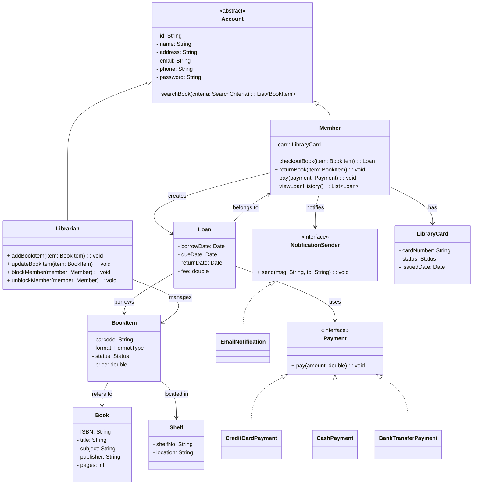

# OOP: Supplement

composed by [_Bimo Ade Budiman Fikri_](https://www.linkedin.com/in/bimoadee/)


<!-- [TOC] -->

## **Table of Contents**

<!-- - [Overview](#overview)
- [Graphical User Interface (GUI)](#graphical-user-interface-gui)
- [Java Database Connectivity (JDBC)](#java-database-connectivity-jdbc)
- [Membangun Aplikasi GUI di Swing](#membangun-aplikasi-gui-di-swing)
  - [Step 1: Buat Frame](#step-1-buat-frame)
  - [Step 2: Tambahkan Control](#step-2-tambahkan-control)
  - [Step 3: Tentukan Layout](#step-3-tentukan-layout)
  - [Step 4: Pasang Event Handling](#step-4-pasang-event-handling)
  - [Step 5: Buat Class Mahasiswa](#step-5-buat-class-mahasiswa)
  - [Step 6: Pasang Event Handling pada Form](#step-6-pasang-event-handling)
  - [Step 7: Jalankan di EDT](#step-7-jalankan-di-edt)
- [Membangun Koneksi ke Database](#membangun-koneksi-ke-database)
  - [Apa itu JDBC?](#apa-itu-jdbc)
  - [Komponen Utama JDBC](#komponen-utama-jdbc)
  - [Alur Kerja JDBC](#alur-kerja-jdbc)
  - [Step-by-Step Koneksi dan Menyimpan Data Mahasiswa](#step-by-step-koneksi-dan-menyimpan-data-mahasiswa)
    - [Step 1: Persiapkan Database](#step-1-persiapkan-database)
    - [Step 2: Tambahkan JDBC Driver ke Project](#step-2-tambahkan-jdbc-driver-ke-project)
    - [Step 3: Buat Kelas Koneksi Database](#step-3-buat-kelas-koneksi-database)
    - [Step 4: Modifikasi Form Mahasiswa untuk Simpan ke Database](#step-4-modifikasi-form-mahasiswa-untuk-simpan-ke-database)
    - [Step 5: Jalankan Program](#step-5-jalankan-program) -->

---



---

# The End

```
Have a nice day 👋
```
