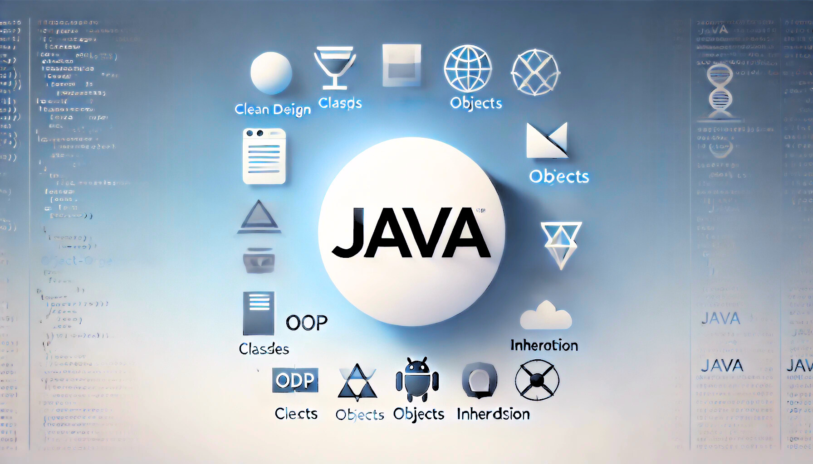

# OOP Chapter 1: Java & OOP

composed by [_Bimo Ade Budiman Fikri_](https://www.linkedin.com/in/bimoadee/)



## **Table of Contents**

- [Java at First Glance!👋](#java-at-first-glance)
  - [Java Architecture](#java-architecture)
  - [How _Java_ Works?](#how-java-works)
- [Getting Started](#getting-started)
  - [Langkah 1: Instalasi](#langkah-1-instalasi)
  - [Langkah 2: Membuat Project Baru di IntelliJ](#langkah-2-membuat-project-baru-di-intellij)
  - [Langkah 3: Memahami Struktur Project Java](#langkah-3-memahami-struktur-project-java)
- [Fundamental OOP](#fundamental-oop)
  - [Class vs Object](#class-vs-object)
  - [Attribute & Method](#attribute--method)
  - [Method vs Constructor](#method-vs-constructor)
  - [Studi Kasus: Pabrik Mobil](#studi-kasus-pabrik-mobil)
  - [Tipe Data Primitif vs Referensi](#tipe-data-primitif-vs-referensi)
  - [Scope of Variables](#scope-of-variables)
  - [Garbage Collection (GC)](#garbage-collection-gc)
- [Four Pillars of OOP](#four-pillars-of-oop)
  - [Encapsulation: Membatasi Akses Objek](#encapsulation-membatasi-akses-objek)

---

<br>

## Java at First Glance!👋


_Java_ merupakan bahasa pemrograman tingkat tinggi yang berorientasi objek dan cukup populer di perusahaan besar dunia. Diciptakan pertama kali oleh James Gosling di bawah naungan Sun Microsystems (kini diakuisisi oleh Oracle) pada tahun 1995 dengan filosofi keandalan dan keamanan.

Kini, Java menjadi bahasa pilar untuk membangun berbagai sistem skala besar, mulai dari aplikasi desktop, backend website, perangkat IoT, hingga aplikasi mobile.

Java terkenal dengan prinsip **"_Write Once, Run Anywhere_ (WORA)"**, yang berarti kode yang ditulis denganku dapat berjalan di berbagai sistem operasi tanpa perlu diubah. Itu semua berkat adanya teknologi **Java Virtual Machine (JVM)** yang menerjemahkan instruksiku agar bisa dijalankan di berbagai perangkat.

### Java Architecture


**JDK (Java Development Kit)** – Perangkat lunak utama bagi programmer. Di dalamnya terdapat kompiler (`javac`), JRE, dan _tools_ yang dibutuhkan untuk menulis dan merakit aplikasi Java dari nol.

**JRE (Java Runtime Environment)** – Lingkungan eksekusi. Menyediakan _library_ dasar agar sebuah program Java bisa dijalankan oleh pengguna akhir.

**JVM (Java Virtual Machine)** – Mesin virtual yang bertugas membaca _Bytecode_ (kode hasil kompilasi) dan menerjemahkannya ke dalam bahasa instruksi mesin spesifik sesuai dengan sistem operasi yang sedang digunakan secara _real-time_.

<br>

#### Analogi Arsitektur Java 🎭

> Bayangkan kamu adalah seorang **sutradara film** yang ingin membuat dan menayangkan film di berbagai bioskop. Dalam dunia Java, **JDK (Java Development Kit)** adalah seperti **studio film** yang menyediakan semua alat produksi, seperti kamera, editor, dan efek khusus, agar kamu bisa membuat film dengan sempurna.
>
> Setelah film selesai, kamu memerlukan **JRE (Java Runtime Environment)**, yang bisa diibaratkan sebagai **bioskop** tempat film bisa diputar—bioskop ini sudah memiliki layar, proyektor, dan kursi penonton agar pengalaman menonton menjadi nyaman.
>
> _Tapi_, agar film bisa benar-benar diproyeksikan ke layar, bioskop membutuhkan seorang **operator proyektor** yang mengerti cara menampilkan film dalam format yang sesuai. Di sinilah **JVM (Java Virtual Machine)** berperan—sebagai **operator proyektor** yang menerjemahkan format film (_bytecode Java_) menjadi tampilan yang bisa dinikmati di berbagai layar (_sistem operasi_).
>
> Dengan kombinasi ini, film yang dibuat di satu studio bisa diputar di banyak bioskop tanpa perlu diubah formatnya, seperti halnya kode Java yang bisa berjalan di berbagai perangkat berkat konsep **_Write Once, Run Anywhere_ (WORA).** <br> <br>

<br>

### How _Java_ Works?

Gambar berikut menjelaskan bagaimana **_Java_** bekerja, dari proses menulis kode hingga menjalankan program di sistem operasi. Berikut adalah tahapan-tahapan utama dalam proses tersebut:


- **Langkah 1-3: Fase Menulis Kode (Source Code)**
  (1) Developer (kamu)
  (2) Developer menulis instruksi dengan sintaks Java
  (3) Developer lalu menyimpannya di sebuah file bernama `HelloWorld.java`
  File ini masih berbentuk teks biasa yang bisa dibaca oleh manusia

- **Langkah 4-7: Fase Penerjemahan (Kompilasi)**
  (4) Karena komputer tidak paham bahasa Inggris, file `HelloWorld.java` tadi dikompilasi oleh _Java Compiler_ (`javac`)
  (5) _Compiler_ (javac)
  (6) _Compiler_ menerjemahkan file `HelloWorld.java` menjadi sebuah file baru bernama `HelloWorld.class`
  (7) File `HelloWorld.class` berisi instruksi mesin (010101...) yang disebut _bytecode_ yang sudah tidak bisa dibaca manusia

- **Langkah 8-11: Fase Pemutaran (Eksekusi)**
  (8) _Bytecode_ rahasia tersebut kemudian dieksekusi oleh JVM
  (9) JVM
  (10-11) JVM menerjemahkannya agar bisa berjalan di sebuah Sistem Operasi apapun (Windows, Mac, Linux), hingga akhirnya menampilkan hasil tulisan "Hello World" di layar komputermu!

---

<br>

## Getting Started

Sebelum bisa menulis kode, kita harus menyiapkan lingkungan kerja (_Environment_) di komputer kita.

### Langkah 1: Instalasi

**Instal JDK:** Kamu bisa mengunduh JDK (misal versi 17 atau 21) dari website [Oracle](https://www.oracle.com/java/technologies/downloads/). Instal seperti menginstal aplikasi biasa.

**Instalasi IDE**: Unduh _IntelliJ IDEA versi Community_ dari _JetBrains_. IDE akan menjadi "meja kerja" yang sudah dilengkapi teks editor canggih, kompiler otomatis, dan alat pendeteksi error. (Tips: IntelliJ modern bahkan bisa otomatis mengunduhkan JDK untukmu saat kamu membuat project baru)

### Langkah 2: Membuat Project Baru di IntelliJ

1. Buka _IntelliJ IDEA_, klik tombol _New Project_.
2. Beri nama project (misal: BelajarOOP).
3. Pilih Language: _Java_, Build system: _IntelliJ_.
4. Pastikan JDK sudah terpilih di dropdown (jika kosong, pilih opsi Download JDK).
5. Klik _Create_ dan mulai koding.

### Langkah 3: Memahami Struktur Project Java

Saat project berhasil dibuat, perhatikan panel navigasi di sebelah kiri layarmu. Itu adalah struktur file dan folder project-mu.

- `src/`: Ini adalah folder paling penting! Di sinilah kamu akan menyimpan semua file kode Java (`.java`) yang kamu ketik.

- `out/`: Folder ini akan otomatis muncul saat program dijalankan. Tempat IntelliJ menyimpan file `.class` (_Bytecode_) hasil kompilasi. Kamu tidak perlu mengedit apa pun di sini.

- `.idea/` & `*.iml`: File konfigurasi internal milik _IntelliJ_. Hiraukan saja.

#### Mengatur Kode di dalam `src/` dengan `Package` & `Import`

Saat kodemu mulai banyak, menumpuk semuanya di dalam folder `src` akan membuatnya sangat berantakan. Di sinilah kita butuh `Package`.

- `Package`: Ini pada dasarnya adalah Folder/Direktori di dalam `src` untuk mengelompokkan class-class yang sejenis (contoh penulisan kodenya: package `com.kampus.app;`). Ini berfungsi untuk mencegah bentrokan nama file. Kita bisa memiliki dua file yang sama-sama bernama `User.java`, asalkan mereka diletakkan di package (folder) yang berbeda.

- `Import`: Perintah di baris teratas kode untuk "memanggil" class dari package (folder) lain agar bisa dikenali dan digunakan. Misalkan, package adalah laci-laci di mejamu, maka import adalah tindakan mengambil obeng dari laci lain untuk dipakai di mejamu sekarang.

#### Contoh Visualisasi Struktur File Ideal:

```
BelajarOOP/
├── .idea/                 <-- (Konfigurasi IDE)
├── out/                   <-- (Tempat Bytecode hasil kompilasi)
└── src/                   <-- (Tempat kita ngoding)
    └── com/
        └── kampus/
            ├── Main.java  <-- (File ini berada di package com.kampus)
            └── Mobil.java <-- (File ini berada di package com.kampus)
```

#### Contoh Kode Basic Java

```java
public class HelloWorld {
    public static void main(String[] args) {
        System.out.println("Hello World!");
    }
}
```

---

<br>

## Fundamental OOP

Pemrograman Berorientasi Objek (_Object-Oriented Programming_ atau OOP) adalah paradigma pemrograman yang memetakan seluruh perilaku/komponen program sebagai sebuah _object_. Dalam OOP, program dibangun dengan menulis cetakan objek yang akan disebut sebagai _Class_ dan _object_ riil-nya .

Saat kalian belajar Algoritma dan Pemrograman, kalian sebenarnya sedang menggunakan paradigma Pemrograman Prosedural (fokus pada penulisan fungsi/prosedur yang memanipulasi data).


Perhatikan Tabel berikut untuk melihat perbedaannya dengan OOP.

| Fitur             | Pemrograman Prosedural (Alpro)                                                        | Pemrograman Berorientasi Objek                                                           |
| ----------------- | ------------------------------------------------------------------------------------- | ---------------------------------------------------------------------------------------- |
| **Fokus Utama**   | Memecah program menjadi fungsi/prosedur (langkah demi langkah).                       | Memecah program menjadi objek (meniru entitas dunia nyata).                              |
| **Data & Fungsi** | Terpisah. Data bisa diubah oleh fungsi mana saja secara bebas sehingga rentan error.  | Bersatu. Data dan fungsi dibungkus di dalam sebuah objek yang melindunginya.             |
| **Skala Program** | Cocok untuk program algoritma sederhana. Rentan menjadi spaghetti code jika membesar. | Sangat terstruktur. Cocok untuk program besar yang dikerjakan oleh puluhan orang di tim. |
| **Analogi**       | Membaca resep masakan (Langkah 1: potong bawang, Langkah 2: panaskan wajan...).       | Mempekerjakan koki (Koki sudah punya data bumbu sendiri, dan punya fungsi memasak).      |

Terlihat bahwa OOP merupakan paradigma pemrograman yang **meniru cara dunia nyata bekerja**. Program dipecah menjadi "objek-objek" yang saling berinteraksi sehingga struktur program menjadi lebih jelas.

Pemecahan tersebut secara tidak langsung mengimplementasikan Prinsip DRY (_Don't Repeat Yourself_) untuk mencegah penulisan kode berulang. Kode yang sama cukup diekstrak ke dalam satu tempat (Class), lalu di-_reuse_ berkali-kali.

**Contoh Perbandingan Kode**

Perhatikan kode Prosedural (Tanpa OOP) berikut, variabel (data) dan fungsi saling terpisah. Fungsi harus menerima data secara manual setiap kali dipanggil.

```java
public class ProceduralMobil {
    public static void main(String[] args) {
        String merkMobil1 = "Toyota";
        int kecepatanMobil1 = 0;

        String merkMobil2 = "Honda";
        int kecepatanMobil2 = 0;

        kecepatanMobil1 = gas(merkMobil1, kecepatanMobil1, 10);
        kecepatanMobil2 = gas(merkMobil2, kecepatanMobil2, 20);
    }

    public static int gas(String merk, int kecepatanSaatIni, int tambah) {
        int kecepatanBaru = kecepatanSaatIni + tambah;
        System.out.println("Mobil " + merk + " melaju " + kecepatanBaru + " km/jam");
        return kecepatanBaru;
    }
}
```

🚨 **Masalahnya:** Bayangkan jika kita memiliki 100 mobil. Kita harus mendeklarasikan 200 variabel terpisah secara manual (`merkMobil3`, `kecepatanMobil3`, dst) dan mengoper datanya satu per satu ke dalam fungsi `gas()`. Kode akan menjadi sangat panjang, berantakan, dan sulit dikelola (sangat melanggar prinsip DRY).

Lalu, perhatikan kode OOP berikut, kita menyatukan data dan fungsi ke dalam sebuah "cetakan" bernama Class.

```java
class MobilOOP {
    String merk;
    int kecepatan;

    public MobilOOP(String merk) {
        this.merk = merk;
        this.kecepatan = 0;
    }

    public void gas(int tambah) {
        this.kecepatan += tambah;
        System.out.println("Mobil " + this.merk + " melaju " + this.kecepatan + " km/jam");
    }
}

public class MainOOP {
    public static void main(String[] args) {
        MobilOOP mobil1 = new MobilOOP("Toyota");
        MobilOOP mobil2 = new MobilOOP("Honda");

        mobil1.gas(10);
        mobil2.gas(20);
    }
}
```

✅ **Solusinya:** Data (`merk`, `kecepatan`) dan perilaku (`gas`) sudah dibungkus rapi di dalam Class `MobilOOP`. Jika kita butuh 100 mobil, kita tidak perlu membuat variabel terpisah satu-satu. Kita cukup mencetaknya dengan memanggil perintah `new MobilOOP(...)` sebanyak 100 kali. Tidak ada lagi variabel dan fungsi yang berserakan. Kodenya menjadi jauh lebih ringkas, terstruktur, dan elegan!

Pendekatan ini membuat aplikasi lebih cepat dibangun, sangat mudah dimodifikasi, dan gampang di-_debug_. Dalam konsep OOP terdapat beberapa komponen yang perlu diketahui: _Class_, 8, _Attribute_, _Method_, dan _Constructor_.

Untuk mempermudah, mari kita gunakan contoh Pabrik Mobil sebagai studi kasus utama kita. **Analogi Utama: Pabrik Mobil** 🚗

<br>

### Class vs Object

Bayangkan kamu datang ke pabrik mobil.


- **Class** adalah **Gambar Rancangan (_Blueprint_)** di kertas. Di kertas itu tertulis: "_Mobil ini punya 4 roda, warna bisa diubah, punya mesin_". Kertas ini bukan mobil, tidak bisa dikendarai.
  > _INGAT!_ class ditulis Menggunakan PascalCase (Contoh: `DataMahasiswa`, `MobilBalap`).
- **Object** adalah **Mobil Asli** yang sudah dirakit di pabrik berdasarkan rancangan tadi. Mobil ini bisa dipegang dan dikendarai.

| Konsep | Analogi                        | Di Java               |
| ------ | ------------------------------ | --------------------- |
| Class  | Kertas Rancangan (Blueprint)   | `class Mobil { ... }` |
| Object | Mobil Fisik (Avanza B 1234 CD) | `new Mobil()`         |

<br>

### Attribute & Method

Sebuah objek nyata tentu memiliki karakteristik dan tingkah laku.

- **Atribut (State)**
  Sifat, data, atau karakteristik yang dimiliki oleh suatu objek (Contoh: merk, warna, kecepatan). Di dalam kode Java, atribut direpresentasikan sebagai sebuah variabel.

- **Method (Behavior)**
  Aksi atau tingkah laku yang bisa dilakukan oleh objek tersebut setelah diciptakan. (Contoh: `gas()`, `rem()`, `nyalakanKlakson()`).

Di Java, _method_ biasanya menggunakan kata kerja dan ditulis menggunakan camelCase (Contoh: `hitungTotal()`, `kecepatanMaksimal()`).

<br>

### Method vs Constructor

Jika _method_ adalah aksi biasa yang bisa dipanggil kapan saja, maka ada satu _method_ yang sangat spesial, yaitu _Constructor_.

Misalkan, saat kamu memesan mobil di pabrik, kamu pasti mengisi formulir spesifikasi dasar: "Saya mau warna Putih, harga 250 juta". Nah, proses merakit awal dan memberi nilai spesifikasi pertama kali saat objek "lahir" ini dilakukan oleh _Constructor_.

**Ciri-ciri Constructor:**

1. Namanya **SAMA PERSIS** dengan nama Class.
2. Tidak punya return type (tidak ada `void`, `int`, dll).
3. Dipanggil otomatis saat ada kata kunci `new`.

<br>

**Perbandingan Constructor & Method**

| **Fitur**                         | **Constructor**                              | **Method**                                                    |
| --------------------------------- | -------------------------------------------- | ------------------------------------------------------------- |
| **Kapan dipanggil?**              | Saat objek dibuat                            | Bisa dipanggil kapan saja setelah objek dibuat                |
| **Tujuan**                        | Menginisialisasi nilai awal suatu objek      | Melakukan aksi pada objek (misalnya, menjalankan fitur mobil) |
| **Bisa dipanggil ulang?**         | ❌ Tidak                                     | ✅ Bisa                                                       |
| **Nama harus sama dengan class?** | ✅ Ya                                        | ❌ Tidak harus sama dengan class                              |
| **Digunakan untuk apa?**          | Menentukan bagaimana objek dibuat            | Menentukan apa yang bisa dilakukan oleh objek                 |
| **Contoh di dunia nyata**         | Menentukan spesifikasi mobil sebelum membeli | Menghidupkan mesin, membunyikan klakson                       |

<br>

### Studi Kasus: Pabrik Mobil

Perhatikan kode berikut. Di bawah ini, kita membuat sebuah file `Mobil.java` sebagai sebuah cetakan untuk Mobil dengan atributnya: `model`, `price`, `color`, dan `buildYear`

```java
// 1. CLASS (Cetak biru desain mobil)
// -> Perhatikan penamaan Class menggunakan PascalCase
public class Mobil {

    // 2. ATRIBUT (Karakteristik mobil)
    // -> Perhatikan penamaan atribut menggunakan camelCase
    String model;
    double price;
    String color;
    int buildYear;

    // 3. CONSTRUCTOR (Proses perakitan awal)
    // Aturan: Namanya WAJIB sama persis dengan nama Class, tanpa return type!
    public Mobil(String model, double price, String color, int buildYear) {
        // Keyword 'this' digunakan untuk merujuk ke atribut milik class ini (bukan parameter)
        this.model = model;
        this.price = price;
        this.color = color;
        this.buildYear = buildYear;
    }

    // 4. METHOD (Tindakan yang bisa dilakukan mobil)
    // -> Perhatikan penamaan method menggunakan camelCase
    public void gas() {
        System.out.println("Mobil " + this.color + " " + this.model + " keluaran tahun " + this.buildYear + " sedang melaju kencang!");
    }
}

```

<br>

Kemudian, di file `Main.java` kita akan melakukan instansiasi yaitu proses menciptakan wujud nyata dari sebuah class ke dalam memori komputer dengan menggunakan keyword `new`.

```java
public class Main {
    // Metode utama tempat program pertama kali berjalan
    public static void main(String[] args) {

        // PROSES INSTANSIASI
        // Memanggil Constructor untuk menciptakan objek nyata
        Mobil sedan = new Mobil("Civic", 350000000.0, "Hitam", 2023);
        Mobil sport = new Mobil("Ferrari 488", 5000000000.0, "Merah", 2022);

        // 'sedan' dan 'sport' adalah dua Object (Instance) yang berbeda secara fisik
        sedan.gas(); // Output: Mobil Hitam Civic keluaran tahun 2023 sedang melaju kencang!
        sport.gas(); // Output: Mobil Merah Ferrari 488 keluaran tahun 2022 sedang melaju kencang!
    }
}
```

<br>

### Tipe Data Primitif vs Referensi

Jika kalian perhatikan di kode sebelumnya, tipe data untuk atribut `price`, adalah double (huruf awalnya kecil). Tapi saat kita bikin objek Mobil, tipe datanya adalah Mobil (huruf kapital).

Di Java, huruf besar atau kecil di awal tipe data menandakan 'kasta' bagaimana memori menyimpan data tersebut. Yang satu menyimpan nilai secara langsung (Tipe Primitif), yang satu lagi hanya menyimpan 'alamat' menuju lokasi datanya (Tipe Referensi/_Object_).

Perbedaannya secara lengkap bisa dilihat pada Tabel berikut.

| Fitur              | Tipe Primitif                                  | Tipe Referensi / Object                                                     |
| ------------------ | ---------------------------------------------- | --------------------------------------------------------------------------- |
| **Contoh**         | `int`, `double`, `boolean`, `char`             | `String`, `Mobil`, `Scanner`, `Integer`                                     |
| **Ciri Penulisan** | Diawali huruf kecil                            | Diawali huruf kapital                                                       |
| **Cara Kerja**     | Variabel menyimpan nilai data secara langsung. | Variabel menyimpan alamat memori (referensi) yang menunjuk ke lokasi objek. |
| **Nilai Default**  | 0, 0.0, false                                  | null (Kosong / Tidak menunjuk ke mana-mana)                                 |

Perhatikan dua skenario di bawah ini untuk melihat bagaimana Tipe Primitif dan Referensi berperilaku secara berbeda saat disalin (di-copy).

**Skenario 1: Tipe Primitif (Aman saat disalin)**

```java
// Variabel primitif menyimpan nilainya secara langsung (seperti uang tunai di saku)
int angka1 = 10;
int angka2 = angka1; // angka2 men-copy NILAI dari angka1

// Mari kita ubah angka2
angka2 = 50;

// Hasilnya:
System.out.println(angka1); // Output: 10 (Tetap aman, tidak terpengaruh!)
System.out.println(angka2); // Output: 50
```

**Skenario 2: Tipe Referensi (Jebakan _Copy_ Objek!)**

```java
// Variabel referensi hanya menyimpan "alamat/kunci" menuju objek di memori
Mobil mobilA = new Mobil("Toyota", 150000, "Putih", 2020);

// mobilB TIDAK membuat mobil baru! Ia hanya menerima copy "kunci" yang sama dengan mobilA
Mobil mobilB = mobilA;

// Mari kita ubah properti menggunakan mobilB
mobilB.color = "Merah";

// Hasilnya:
System.out.println(mobilA.color); // Output: Merah (Mobil A IKUT BERUBAH warnanya!)
System.out.println(mobilB.color); // Output: Merah
```

Terlihat bahwa jika kamu menyalin data angka biasa (`int b = a`), nilainya aman. TAPI, kalau kamu menyalin variabel Objek seperti `Mobil mobilB = mobilA`, lalu kamu mengecat `mobilB` jadi merah, maka warna `mobilA` ikut-ikutan berubah jadi merah.

Kenapa? Karena `mobilA` dan `mobilB` memegang "kunci" yang membuka "garasi" mobil yang sama!

<br>

### Scope of Variables

_Scope_ menentukan di mana sebuah variabel dapat diakses dan seberapa lama variabel tersebut hidup di dalam memori.Seperti C/C++, di Java, semua scope variabel memiliki dapat ditentukan pada waktu kompilasi dan independen dari tumpukan panggilan fungsi.

Di Java, ada 5 kategori Scope:

- **Static Variables (Class Scope)**
  Dideklarasikan menggunakan kata kunci `static` di dalam Class. Variabel ini milik Class (Pabrik), bukan milik objek. Nilainya dibagikan (shared) ke semua objek yang dibuat. Ia hidup paling lama, yaitu sejak program dijalankan hingga program dimatikan.

- **Instance Variables (Object Scope)**
  Dideklarasikan di dalam Class, namun tanpa `static`. Variabel ini menempel pada masing-masing objek. Hidup terus selama objek fisiknya masih ada di memori.

- **Local Variables (Method Scope)**
  Dideklarasikan di dalam sebuah method. Variabel ini bersifat sangat sementara dan langsung hancur dari memori begitu proses eksekusi method tersebut selesai.

- **Parameter Scope**
  Variabel yang dilempar sebagai argumen ke dalam method atau constructor (variabel di dalam kurung lengkung `( )`). Umurnya sama seperti Local Variable, yakni hidup selama method itu sedang dijalankan.

- **Block Scope**
  Dideklarasikan di dalam kurung kurawal spesifik `{ }` seperti di dalam `if`, `for`, atau `while`. Variabel ini hanya hidup di dalam blok tersebut dan langsung hancur saat blok berakhir.

**Contoh Kode 5 Level Scope**

```java
public class DealerMobil {

    // 1. STATIC VARIABLE (Class Scope)
    // Berlaku secara global untuk SEMUA cabang DealerMobil.
    static int totalMobilTerjual = 0;

    // 2. INSTANCE VARIABLE (Object Scope)
    // Berlaku khusus untuk satu objek DealerMobil spesifik.
    String namaCabang;
    Mobil mobilPajangan;

    // 'namaCabang' di dalam kurung adalah PARAMETER SCOPE (Nomor 4)
    public DealerMobil(String namaCabang) {
        // Aturan: Gunakan 'this' untuk mengatasi nama variabel lokal yang sama dengan milik class
        this.namaCabang = namaCabang;
        this.mobilPajangan = new Mobil("Civic", 350000000.0, "Hitam", 2023);
    }

    public void prosesPembelian(String namaKlien, double uangBayar) {

        // 3. LOCAL VARIABLE
        // Variabel 'hargaMobil' hanya bisa diakses di dalam method ini
        double hargaMobil = mobilPajangan.price;

        if (uangBayar >= hargaMobil) {

            // 5. BLOCK SCOPE
            // Variabel 'kembalian' HANYA hidup di dalam blok 'if' ini!
            double kembalian = uangBayar - hargaMobil;

            totalMobilTerjual++; // Mengubah Static Variable
            System.out.println(namaKlien + " beli mobil. Kembalian: Rp" + kembalian);

        } // <--- Blok 'if' selesai. Variabel 'kembalian' langsung hancur di sini!

        // System.out.println(kembalian); // INI AKAN ERROR! karena 'kembalian' sudah mati/out of scope.

        // ATURAN LOOPING: Jika ingin membaca data setelah loop, deklarasikan variabel SEBELUM loop!
        int totalBonusKaryawan = 0; // Deklarasi di luar loop

        for (int i = 1; i <= 3; i++) { // Variabel 'i' adalah Block Scope
            totalBonusKaryawan += 50000;
        } // Variabel 'i' hancur di sini

        System.out.println("Total bonus untuk sales: Rp" + totalBonusKaryawan); // Aman, tidak error!

    } // <--- Method selesai. Variabel lokal ('hargaMobil') & parameter hancur di sini!
}
```

<br>

### Garbage Collection (GC)

Di Java, programmer tidak perlu pusing untuk menghapus objek yang sudah tidak terpakai dari memori secara manual. Mekanisme ini telah otomatis ditangani oleh Garbage Collector (GC).

Konsepnya, setiap objek yang kita buat menggunakan keyword `new` akan diletakkan di area memori khusus yang disebut _Heap_. GC akan berpatroli di area _Heap_ ini. Jika GC menemukan objek yang berstatus _Unreachable_ (sudah tidak memiliki referensi/variabel yang menunjuknya), maka objek tersebut akan dihapus untuk menghemat memori.

_Kapan sebuah Objek menjadi *Unreachable*?_

Ada 3 skenario utama yang membuat sebuah objek memenuhi syarat untuk dihapus:

- **Out of Scope**: Objek dibuat di dalam sebuah method. Saat method selesai dieksekusi, variabel lokalnya hancur, sehingga objek tersebut tidak punya penunjuk lagi.

- **Re-assigning (Ditimpa)**: Variabel yang menunjuk ke objek tersebut dialihkan untuk menunjuk ke objek lain.

- **Nullifying (Dikosongkan)**: Variabel dengan sengaja diberi nilai null (kosong).

**Contoh Skenario Target GC:**

```java
Mobil m1 = new Mobil("Avanza", 200000000.0, "Putih", 2020); // Objek A di memori
Mobil m2 = new Mobil("Ertiga", 180000000.0, "Silver", 2021); // Objek B di memori

// 1. Re-assigning
m1 = m2;
// Referensi m1 sekarang menunjuk ke Objek B (Ertiga).
// Objek A (Avanza) kini Unreachable dan SIAP DIHAPUS oleh GC!

// 2. Nullifying
m2 = null;
// Variabel m2 sekarang kosong.
// Objek B (Ertiga) masih aman, karena masih ditunjuk oleh m1.

// Meminta Eksekusi GC (Opsional)
// GC berjalan otomatis sesuai kehendak JVM, kita tidak bisa menebak waktunya.
// Namun kita bisa me-request JVM untuk menjalankannya sekarang menggunakan:
System.gc();
```

---

<br>

## Four Pillars of OOP

Konsep dari OOP ditopang oleh 4 ide utama:


- **Encapsulation**: Menyembunyikan dan membatasi akses ke data internal objek.
- **Inheritance**: Menurunkan atribut dan method dari Class induk ke Class anak. (Meet 2)
- **Polymorphism**: Kemampuan satu entitas untuk memiliki banyak bentuk tindakan. (Meet 2)
- **Abstraction**: Menyembunyikan kompleksitas sistem di balik antarmuka yang sederhana. (Meet 2)

<br>

### Encapsulation: Membatasi Akses Objek

Encapsulation adalah konsep OOP untuk menyembunyikan atribut dari akses langsung dan hanya dapat diakses melalui method khusus (_getter_ dan _setter_). Dengan konsep ini, kita bisa mengontrol bagaimana data suatu objek bisa diakses dan diubah.

Bayangkan sebuah mobil yang memiliki berbagai komponen, seperti mesin, rem, dan roda. Sebagai pengemudi, kita tidak bisa langsung mengakses mesin secara langsung saat berkendara. Kita hanya bisa mengontrol mobil melalui pedal gas, rem, dan setir tanpa perlu mengatur bagaimana mesin bekerja secara internal.

Hal tersebut menunjukkan terdapat fitur-fitur dari mobil yang disembunyikan dari pengemudi. Apabila kita ingin mengubah pengaturan mesin maka kita perlu montir (_getter_ dan _setter_). Ide tersebut memastikan bahwa mobil tetap aman dan tidak rusak karena salah penggunaan.

<br>

**❌ Contoh Tanpa Encapsulation (Data Tidak Aman)**

Jika kita membiarkan atribut terbuka secara publik, ini yang akan terjadi:

```java
class Mobil {
    public String merk;
    public int kecepatan;
}

public class Main {
    public static void main(String[] args) {
        Mobil mobilSaya = new Mobil();
        mobilSaya.merk = "Toyota";

        // ❌ ERROR LOGIKA: Kecepatan tidak boleh negatif!
        mobilSaya.kecepatan = -50;

        System.out.println("Mobil: " + mobilSaya.merk);
        System.out.println("Kecepatan: " + mobilSaya.kecepatan + " km/jam");
    }
}
```

**📌 Masalahnya:**

- Atribut bisa diakses dan diubah secara langsung dari mana saja, yang bisa menyebabkan kesalahan logika fatal (contoh: kecepatan negatif).
- Tidak ada perlindungan terhadap nilai yang tidak valid.

<br>

#### Access Modifier: Kunci Keamanan OOP

Untuk mengatasi masalah di atas, kita butuh sebuah "gembok" yang kita sebut sebagai _access modifier_. Di Java, terdapat 4 jenis kata kunci _access modifier_:

| Modifier              | Akses di Class Sendiri | Akses di Package Sama | Akses Subclass | Akses Global (Bebas) |
| --------------------- | ---------------------- | --------------------- | -------------- | -------------------- |
| `public`              | ✅                     | ✅                    | ✅             | ✅                   |
| `protected`           | ✅                     | ✅                    | ✅             | ❌                   |
| (default/no modifier) | ✅                     | ✅                    | ❌             | ❌                   |
| `private`             | ✅                     | ❌                    | ❌             | ❌                   |

Nah, pada pilar Encapsulation ini, kita wajib memanfaatkan _access modifier_ `private` untuk mengamankan atribut-atribut pada suatu class agar tidak bisa ditembus langsung dari luar.

**✅ Dengan Encapsulation (Data Aman)**

Sekarang, kita terapkan `private` ke class `Mobil` kita.

```java
class Mobil {
    private String merk;
    private int kecepatan;

    // Constructor untuk menginisialisasi mobil
    public Mobil(String merk) {
        this.merk = merk;
        this.kecepatan = 0; // Mobil diam saat dibuat
    }
}
```

**_Lalu, bagaimana dong cara kita mengubah nilai kecepatan jika sudah di-private?_**

Di sinilah kita perlu membuat "Jalur Resmi" berupa method _getter_ dan _setter_.

- _getter_ yaitu method yang digunakan untuk menampilkan nilai dari atribut private tanpa mengubahnya.

- _setter_ yaitu method yang digunakan untuk mengubah ulang nilai dari atribut private (biasanya diiringi dengan logika validasi).

Berikut kita lengkapi class `Mobil` dengan menambahkan _getter_, dan method aksi lain (`tambahKecepatan` dan `kurangiKecepatan` sebagai pengganti _setter_ biasa) untuk mengelola perubahan nilai dengan aman.

```java
class Mobil {
    private String merk;
    private int kecepatan;

    // Constructor
    public Mobil(String merk) {
        this.merk = merk;
        this.kecepatan = 0;
    }

    // 1. Getter untuk membaca merk mobil
    public String getMerk() {
        return merk;
    }

    // 2. Getter untuk membaca kecepatan
    public int getKecepatan() {
        return kecepatan;
    }

    // 3. Method untuk menambah kecepatan dengan batasan (Fungsi Mutator/Setter)
    public void tambahKecepatan(int jumlah) {
        if (jumlah > 0) {
            kecepatan += jumlah;
            System.out.println("Mobil " + merk + " bertambah kecepatan menjadi " + kecepatan + " km/jam.");
        } else {
            System.out.println("Error: Kecepatan harus bertambah positif!");
        }
    }

    // 4. Method untuk mengurangi kecepatan dengan batasan (Fungsi Mutator/Setter)
    public void kurangiKecepatan(int jumlah) {
        if (jumlah > 0 && kecepatan - jumlah >= 0) {
            kecepatan -= jumlah;
            System.out.println("Mobil " + merk + " berkurang kecepatan menjadi " + kecepatan + " km/jam.");
        } else {
            System.out.println("Error: Kecepatan tidak boleh negatif!");
        }
    }
}
```

<br>

Apabila dicoba diakses di `Main.java`, akan seperti berikut:

```java
public class Main {
    public static void main(String[] args) {
        Mobil mobilSaya = new Mobil("Toyota");

        // Mengakses data dengan getter
        System.out.println("Mobil: " + mobilSaya.getMerk());
        System.out.println("Kecepatan Awal: " + mobilSaya.getKecepatan() + " km/jam");

        // Menambah dan mengurangi kecepatan dengan kontrol yang AMAN
        mobilSaya.tambahKecepatan(50);
        mobilSaya.kurangiKecepatan(20);

        // ❌ Mencoba memasukkan nilai tidak wajar
        mobilSaya.kurangiKecepatan(100); // Sistem Menolak: Kecepatan tidak boleh negatif!
    }
}
```

<br>

#### Kesimpulan

Dengan menerapkan encapsulation, maka:

- Kecepatan mobil tidak bisa diubah secara langsung dari luar kelas.
- `Mobil` tidak bisa memiliki kecepatan negatif karena dihalangi oleh logika validasi.
- Data hanya bisa diakses melalui method yang aman.
- Jika ada perubahan aturan kecepatan, hanya method terkait di dalam Class `Mobil` yang perlu diperbarui.

> **_Aturan Emas:_** Jadi, mulai sekarang ketika Anda membuat class, jadikan kebiasaan untuk selalu mengatur atribut menjadi `private` serta membuat _getter_ dan _setter_ sebagai jalur interaksinya.

<br>

# The End

```
Have a nice day 👋
```
