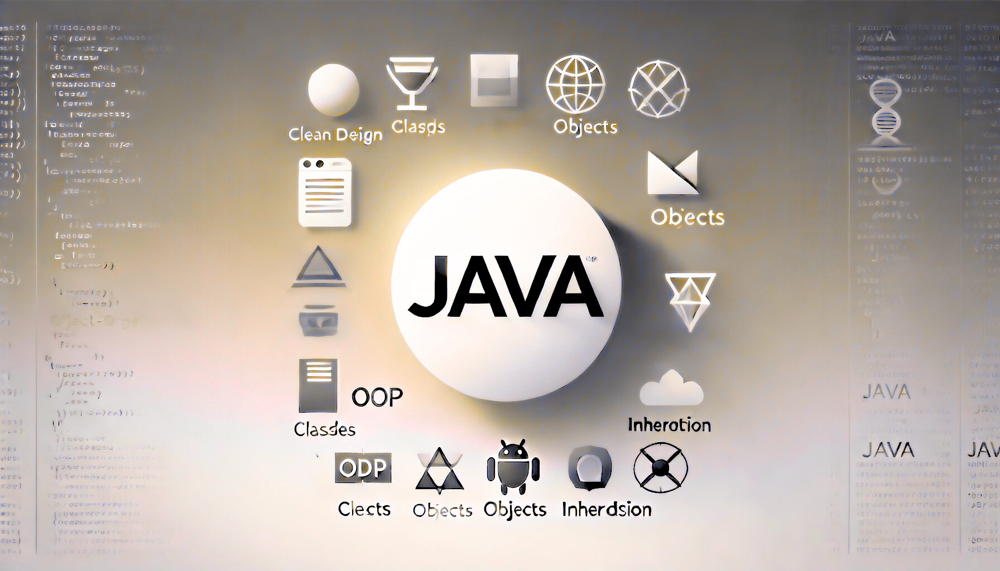
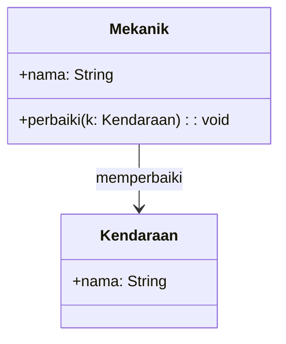
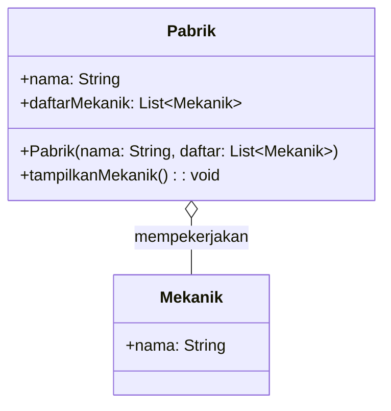
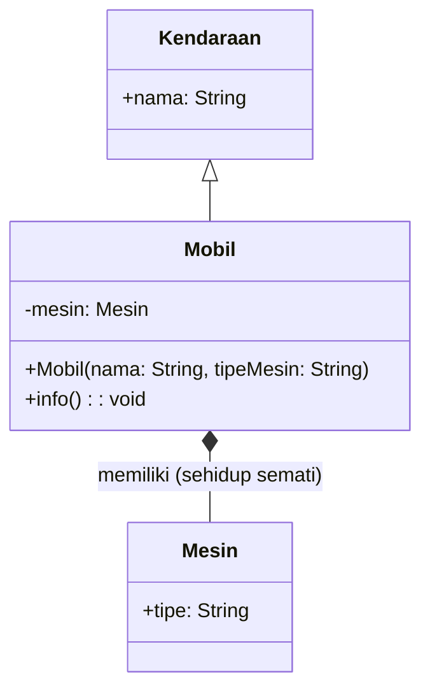
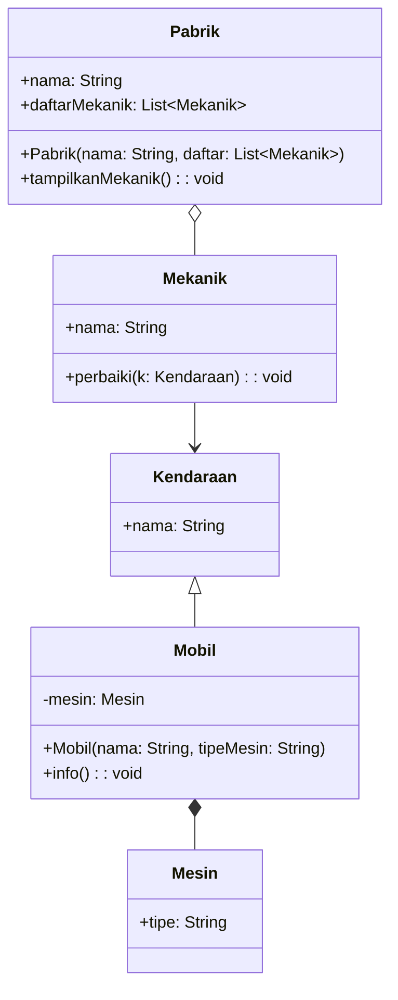

# OOP: Chapter 2

composed by [_Bimo Ade Budiman Fikri_](https://www.linkedin.com/in/bimoadee/)



<!-- [TOC] -->

## **Table of Contents**

## **Table of Contents**

- [Review Pertemuan Sebelumnya 🔄](#review-pertemuan-sebelumnya-)
- [Four Pillars of OOP (Continue)](#four-pillars-of-oop-continue)
  - [Skenario “Perusahaan Transportasi”](#skenario-perusahaan-transportasi)
  - [Inheritance: Mewarisi Sifat Induk](#inheritance-mewarisi-sifat-induk)
  - [Polymorphism: "Satu Perintah, Banyak Perilaku"](#polymorphism-satu-perintah-banyak-perilaku)
  - [Abstraction: Menyembunyikan Detail Rumit](#abstraction-menyembunyikan-detail-rumit)
- [Class Diagram](#class-diagram)
  - [Anatomi Class Diagram](#anatomi-class-diagram)
  - [Simbol Access Modifier](#simbol-access-modifier)
  - [Format Penulisan](#format-penulisan)
  - [Hubungan Antar Objek (Relasi)](#hubungan-antar-objek-relasi)
    - [1. Association - "Hubungan Interaksi Bebas"](#1-association---hubungan-interaksi-bebas)
    - [2. Aggregation - "Hubungan Kepemilikan / Longgar"](#2-aggregation---hubungan-kepemilikan--longgar)
    - [3. Composition - "Hubungan Sehidup Semati / Kuat"](#3-composition---hubungan-sehidup-semati--kuat)
- [Exception Handling: Sabuk Pengaman Program](#exception-handling-sabuk-pengaman-program)
  - [Struktur Exception Handling](#struktur-exception-handling)
  - [Contoh Kasus: Menghitung Efisiensi Bahan Bakar](#contoh-kasus-menghitung-efisiensi-bahan-bakar)
  - [Throwing Exception](#throwing-exception)
- [Generic Type](#generic-type)
  - [Tanpa Generic Type](#tanpa-generic-type)
  - [Dengan Generic Type](#dengan-generic-type)
  - [Multiple Type Parameter](#multiple-type-parameter)
  - [Generic Method](#generic-method)
  - [Type Parameter Conventions](#type-parameter-conventions)

---

# Review Pertemuan Sebelumnya 🔄

Halo lagi! Di [pertemuan pertama](https://github.com/kkokonatsu/OOP-Java/blob/main/v1/oop-meet-1.md#four-pillars-of-oop), kita sudah membahas bagaimana Java bekerja dan konsep dasar OOP (Class & Object). Kita juga sudah mempelajari pilar OOP yang pertama, yaitu Encapsulation, di mana kita belajar mengunci data menggunakan private dan membuat jalur aman menggunakan _getter_ dan _setter_.

Sekarang, kita akan mempelajari tiga pilar OOP lainnya: _Inheritance_, _Polymorphism_, dan _Abstraction_, serta ditutup dengan bagaimana cara menangani error agar program kita tidak mudah _crash_ menggunakan _Exception Handling_.

---

# Four Pillars of OOP (Continue)

## Skenario “Perusahaan Transportasi”

Pada materi ini, kita akan meningkatkan analogi sebelumnya menjadi **Perusahaan Transportasi** 🚗⚡

Bayangkan kita sedang membangun sistem perangkat lunak untuk sebuah perusahaan transportasi raksasa. Di dalam sistem ini, kita akan mengelola berbagai macam aset, seperti:

- Mobil
- Motor
- Truk
- Bus

Semua entitas di atas pada dasarnya adalah sebuah **Kendaraan**. Mari kita lihat bagaimana OOP merapikan sistem ini level demi level.

<br>

## Inheritance: Mewarisi Sifat Induk

Kita mulai dari **Level 1: Merapikan struktur**.

**💥 Masalah Tanpa Inheritance**

Bayangkan Anda membuat class untuk masing-masing kendaraan: Mobil, Motor, Truk, dan Bus. Dan masing-masing class punya:

- Atribut: `merk`, `warna`, `jumlahRoda`
- Method: `nyalakanMesin()`, `rem()`

Semua baris kode tersebut ditulis ulang dari nol di setiap class.

**_Lalu, bagaimana kalau tiba-tiba aturan standar dari pemerintah mengenai sistem `rem()` berubah?_**

Anda harus mengedit 4 file class yang berbeda. Kalau perusahaan punya 20 jenis kendaraan? Anda harus mengedit 20 file!

❌ Sangat capek.
❌ Rawan inkonsisten (ada file yang terlewat diedit).
❌ Tidak scalable (sulit dikembangkan).

**💡 Solusi: Inheritance (Pewarisan)**

Kita buat satu class induk yang menampung semua kesamaan tersebut:

```java
// CLASS INDUK (Superclass)
class Kendaraan {
    String merk;
    String warna;

    void rem() {
        System.out.println("Kendaraan mengerem perlahan...");
    }
}
```

Lalu, class yang lain tinggal "meminta warisan" menggunakan kata kunci `extends` dengan membuat file terpisah: `Mobil.java`, `Motor.java`, dan `Truk.java`

Class `Mobil.java`

```java
// CLASS ANAK (Subclass)
class Mobil extends Kendaraan {
    // Kosong pun tidak apa-apa, Mobil sudah otomatis punya merk, warna, dan bisa direm!
}
```

Class `Motor.java`

```java
class Motor extends Kendaraan {
    // Bisa ditambah sifat khusus motor, misalnya:
    boolean adaKopling;
}
```

Class `Truk.java`

```java
class Truk extends Kendaraan {
    // Bisa ditambah sifat khusus Truk, misalnya:
    Double kapasitasBak;
}
```

Cara Menjalankannya di `Main.java`:

```java
public class Main {
    public static void main(String[] args) {
        Mobil mobilSaya = new Mobil();
        mobilSaya.merk = "Toyota"; // Bisa akses atribut turunan
        System.out.println("Merk Mobil: " + mobilSaya.merk);
        mobilSaya.rem(); // Bisa memanggil method turunan

        Motor motorBapak = new Motor();
        motorBapak.adaKopling = true; // Atribut khusus motor
        motorBapak.rem(); // Tetap bisa mengerem!
    }
}
```

Dari sini terlihat bahwa, _inheritance_ adalah konsep dalam OOP yang memungkinkan sebuah class **mewarisi** atribut dan metode dari kelas lain (parent) serupa dengan konsep pewarisan karakteristik (atribut/method) dari induk ke anak.

- **Superclass (Kelas Induk)** → Kelas utama yang mendefinisikan atribut dan metode dasar.
- **Subclass (Kelas Anak)** → Kelas yang mewarisi dari superclass dan bisa menambahkan atau mengubah perila

_Inheritance_ memungkinkan kode menjadi lebih efisien dan terstruktur, karena subclass tidak perlu mendefinisikan ulang fitur yang sudah ada di superclass.

<br>

## Polymorphism: "Satu Perintah, Banyak Perilaku"

Sekarang kita masuk **Level 2: Merapikan perilaku**. Kita sudah punya `Mobil`, `Motor`, dan `Truk` yang semuanya merupakan turunan dari `Kendaraan`.

**💥 Masalah Tanpa Polymorphism**

Tanpa konsep polymorphism, programmer mungkin akan mengakali perbedaan cara menyalakan kendaraan dengan membuat nama fungsi yang beda-beda di setiap class, seperti:

```java
nyalakanMesinMobil()
nyalakanMesinMotor()
nyalakanMesinTruk()
```

Akibatnya, otak programmer dan sistem akan penuh sesak hanya untuk menghafalkan nama fungsi yang sebenarnya tujuannya sama-sama "menyalakan mesin".

**💡 Solusi: Polymorphism (Banyak Bentuk)**

Mari kita buka kembali dan modifikasi file class yang sudah kita buat pada tahap Inheritance sebelumnya. Pertama, kita sepakati semua kendaraan cukup punya satu method standar yang sama persis namanya di dalam induk:

Class `Kendaraan.java`

```java
class Kendaraan {
    String merk;
    String warna;

    void rem() {
        System.out.println("Kendaraan mengerem perlahan...");
    }

    // TAMBAHKAN method baru ini
    void nyalakanMesin() {
        System.out.println("Mesin kendaraan menyala...");
    }
}

```

Lalu, kita terapkan 2 jenis Polymorphism: _Overriding_ (menimpa fungsi induk) dan _Overloading_ (membuat fungsi bernama sama tapi parameter beda).

Class `Mobil.java`

```java
class Mobil extends Kendaraan {

    // 1. OVERRIDING: Menimpa method dari induk untuk memberikan suara khas mobil
    @Override
    void nyalakanMesin() {
        System.out.println("Mobil menyala dengan starter elektrik yang halus: Vroom!");
    }

    // 2. OVERLOADING: Membuat 2 method bernama sama, tapi isian kurungnya berbeda
    void gas() {
        System.out.println("Mobil melaju dengan kecepatan standar.");
    }

    void gas(int kecepatanLaju) {
        System.out.println("Mobil melaju kencang pada kecepatan " + kecepatanLaju + " km/jam!");
    }
}
```

Class `Motor.java`

```java
class Motor extends Kendaraan {
    boolean adaKopling;

    // OVERRIDING: Menimpa method induk agar sesuai dengan suara motor
    @Override
    void nyalakanMesin() {
        System.out.println("Motor menyala dengan kick starter: Tretek-tek-tek!");
    }
}
```

Berkat Polymorphism, di sistem utama kita cukup melakukan perintah seragam seperti ini:

Class `Main.java`

```java
public class Main {
    public static void main(String[] args) {

        System.out.println("--- TES OVERRIDING ---");
        // Tipe datanya Kendaraan, tapi wujud aslinya Mobil dan Motor
        Kendaraan k1 = new Mobil();
        Kendaraan k2 = new Motor();

        // Kita panggil nama method yang persis sama, tapi outputnya menyesuaikan wujudnya!
        k1.nyalakanMesin(); // Output: Mobil menyala... Vroom!
        k2.nyalakanMesin(); // Output: Motor menyala... Tretek!

        System.out.println("\n--- TES OVERLOADING ---");
        Mobil mobilCepat = new Mobil();
        mobilCepat.gas();       // Memanggil gas() yang kosong
        mobilCepat.gas(120);    // Memanggil gas() yang butuh angka kecepatan
    }
}
```

Dari sini terlihat bahwa, polymorphism (polimorfisme) adalah konsep dalam OOP yang berarti "banyak bentuk". Konsep ini memungkinkan satu antarmuka atau nama method digunakan untuk mengeksekusi berbagai perilaku yang berbeda.

Terdapat dua jenis utama polymorphism di Java:

- **Overriding (Run-time Polymorphism)** → Subclass menimpa dan menyediakan implementasi spesifik dari method yang sudah didefinisikan di superclass (nama dan parameternya sama persis, ditandai dengan anotasi `@Override`).

- **Overloading (Compile-time Polymorphism)** → Pembuatan beberapa method dalam satu class dengan nama yang sama, tetapi memiliki parameter (jumlah atau tipe datanya) yang berbeda.

Intinya, "_Perlakukan semua sebagai Kendaraan, tapi biarkan mereka bertingkah sesuai jenis aslinya_".

<br>

## Abstraction: Menyembunyikan Detail Rumit

Sekarang kita naik ke **Level 3: Merapikan cara pakai**.

Bayangkan Anda sedang menyetir mobil di dunia nyata. Apakah Anda perlu tahu:

- _Bagaimana cara kerja pergerakan piston?_
- _Bagaimana reaksi kimia pembakaran bensin terjadi?_
- _Bagaimana struktur kelistrikan ECU?_

Tentu TIDAK. Anda cuma perlu tahu:

- Tekan pedal gas
- Tekan pedal rem
- Putar setir

**💡 💡 Solusi: Abstract Class**

Sama seperti menyetir, di Java kita bisa menyembunyikan detail kerumitan dengan membuat cetakan induk yang "abstrak" (setengah jadi). Kita ubah class `Kendaraan` menjadi _Abstract Class_.

Buka kembali dan ubah isi file `Kendaraan.java`, tambahkan keyword `abstract` di depan keyword `class` dan di depan method `nyalakanMesin()`.

```java
// Tambahkan kata kunci 'abstract' pada class
abstract class Kendaraan {
    String merk;
    String warna;

    void rem() {
        System.out.println("Kendaraan mengerem perlahan...");
    }

    // Method ABSTRAK
    // Tanpa isi! Mewajibkan anak untuk membuat isinya masing-masing
    abstract void nyalakanMesin();
}
```

Pada konsep _abstraction_, kita masih menggunakan keyword `extends` pada konsep _inheritance_ untuk memberikan hubungan ke subclass. Hanya saja saat ini class induknya berbentuk `abstract class`.

Artinya:

- _Inheritance_ adalah mekanisme pewarisannya (cara teknisnya).
- _Abstraction_ adalah tujuan desainnya (menyembunyikan detail dan memaksa kontrak).

Jadi ini bukan memilih salah satu. _Abstraction_ justru memanfaatkan _inheritance_ untuk membuat aturan yang lebih tegas.

_Lanjut ke kode_, karena `Kendaraan` sekarang berbentuk abstrak (konsep mentah), kita tidak bisa lagi melakukan instansiasi langsung (misal: `new Kendaraan()`). Class anaknya (seperti `Mobil` atau `Motor`) kini memikul beban kewajiban: mereka WAJIB memberikan isi/implementasi pada method `nyalakanMesin()`.

**🚨 PERHATIAN: Error Berantai!**

Perubahan pada class `Kendaraan` akan menimbulkan error pada file `Truk.java` karena Java memaksa class `Truk` untuk mengimplementasikan method `nyalakanMesin()`.

Mari tunaikan kewajiban tersebut dengan memodifikasi `Truk.java`:

```java
class Truk extends Kendaraan {
    Double kapasitasBak;

    // Memberikan implementasi (isi) untuk method abstrak dari induk
    @Override
    void nyalakanMesin() {
        System.out.println("Truk memanaskan glow plug lalu menyala: BRUMM BESAR!");
    }
}
```

**Note:**

> Karena method `rem()` tidak dilabeli `abstract` maka class anak TIDAK wajib meng-_override_ method tersebut.

Harusnya sekarang sudah tidak _error_ ☺️. Dengan desain ini, kita memastikan bahwa:

- Semua kendaraan pasti bisa menyalakan mesin
- Tetapi setiap jenis kendaraan menentukan sendiri bagaimana caranya

Dan di situlah abstraction bekerja. Kita menetapkan aturan umum tanpa memaksakan detail implementasinya.

<br>

**💥 Masalah Baru: Keterbatasan Single Inheritance**

Selanjutnya, bagaimana jika perusahaan transportasi kita berinovasi membuat Mobil Terbang? Secara nalar, Mobil Terbang adalah sebuah `Kendaraan` (di darat) yang memiliki sifat seperti `Pesawat` (di udara).

Misal, kita membuat class `Pesawat`

```java
abstract class Pesawat {
    abstract void terbang();
}
```

Lalu, kita buat class `MobilTerbang` sebagai anak class.

```java
class MobilTerbang extends Kendaraan, Pesawat {
    // ...
}
```

Seharusnya layar akan menampilkan ERROR! karena **Java TIDAK MENGIZINKAN Multiple Inheritance antar class**.

Mengapa? Karena jika `Kendaraan` dan `Pesawat` kebetulan memiliki method dengan nama yang sama, Java akan bingung harus memakai versi yang mana. Masalah ini sering disebut sebagai _Diamond Problem_.


Untuk menjaga desain tetap sederhana dan tidak ambigu, Java membatasi:

> 1 class hanya boleh punya 1 induk class

<br>

**💡 Solusi Pamungkas: Interface (Kontrak Murni)**

Untuk mengatasi keterbatasan pewarisan ganda tersebut, Java menyediakan _Interface_.

_Interface_ bukanlah class biasa, melainkan sebuah "Buku Kontrak" yang berisi daftar kemampuan (method tanpa isi). Ia tidak mewakili “identitas”, melainkan “kemampuan”.

**Aturan emasnya:**

Satu class hanya boleh meneteskan darah dari 1 induk (`extends`), tapi boleh menandatangani BANYAK kontrak kemampuan (`implements`)!

_Lanjut ke kode_, buat file BARU bernama BisaTerbang.java (_Interface_):

```java
interface BisaTerbang {
    // Semua method di sini otomatis 'public abstract'
    void lepasLandas();
    void terbang();
}
```

Modifikasi file `MobilTerbang.java`

```java
// Punya 1 Induk (Kendaraan), tapi tanda tangan 1 Kontrak kemampuan baru (BisaTerbang)!
class MobilTerbang extends Kendaraan implements BisaTerbang {

    // 1. WAJIB melengkapi hutang method abstrak dari induk (Kendaraan)
    @Override
    void nyalakanMesin() {
        System.out.println("Mesin jet hybrid menyala...");
    }

    // 2. WAJIB melengkapi hutang method dari kontrak (BisaTerbang)
    @Override
    public void lepasLandas() {
        System.out.println("Sayap terbuka, bersiap naik...");
    }

    @Override
    public void terbang() {
        System.out.println("Terbang membelah awan!");
    }
}
```

Perhatikan perbedaannya:

- `extends` → menunjukkan hubungan **“adalah sebuah” (IS-A)**

  > `MobilTerbang` adalah sebuah Kendaraan.

- `implements` → menunjukkan hubungan **“memiliki kemampuan” (CAN-DO)**
  > `MobilTerbang` bisa terbang.

Cara Menjalankannya di `Main.java`

```java
public class Main {
    public static void main(String[] args) {

        // ❌ Kendaraan kError = new Kendaraan(); // ERROR! Abstract Class tidak bisa di-new()

        System.out.println("--- TES ABSTRACTION ---");

        // Tipe data abstrak, wujud asli Mobil
        Kendaraan k1 = new Mobil();
        k1.nyalakanMesin();

        // Tipe data abstrak, wujud asli Truk (Sekarang sudah tidak error!)
        Kendaraan k2 = new Truk();
        k2.nyalakanMesin();

        // Tipe data Kontrak (Interface), wujud asli MobilTerbang
        System.out.println("\n--- TES INTERFACE ---");
        BisaTerbang jet = new MobilTerbang();
        jet.lepasLandas();
        jet.terbang();
        // jet.nyalakanMesin(); // ERROR! Karena "BisaTerbang" tidak mencatat tombol ini.

        // Jika MobilTerbang dipanggil sebagai Kendaraan biasa
        Kendaraan k3 = new MobilTerbang();
        k3.nyalakanMesin();
    }
}
```

Dari sini terlihat bahwa, _abstraction_ (abstraksi) berfokus pada menyembunyikan detail implementasi internal dan hanya menampilkan fungsionalitas utama sesuai “peran” yang sedang digunakan.

Ketika objek dipandang sebagai:

- `Kendaraan` → yang terlihat hanya perilaku kendaraan
- `BisaTerbang` → yang terlihat hanya kemampuan terbang

Objek yang sama bisa tampil berbeda tergantung “kacamata” tipe datanya.

Di Java, abstraksi dapat dicapai melalui dua cara:

- **Interface** → Sebuah "kontrak" murni di mana semua method di dalamnya secara bawaan adalah abstrak (hanya deklarasi tanpa isi fungsi). Class yang menggunakan kontrak ini memakai kata kunci `implements`.

- **Abstract Class** → Kelas "setengah jadi" yang tidak dapat diinstansiasi (di-`new`) secara langsung. Kelas ini bisa memiliki method abstrak (tanpa isi) maupun method biasa yang sudah ada logikanya. Class turunannya memakai kata kunci `extends`.

**Ringkasan Komparasi `abstract` vs `interface`**

|     **Poin**      | **Abstract**                                                 | **Interface**                                                                                                                                                         |
| :---------------: | ------------------------------------------------------------ | --------------------------------------------------------------------------------------------------------------------------------------------------------------------- |
| **Tipe _method_** | Bisa memiliki _abstrak method_ dan _concrete method_         | Hanya dapat memiliki metode abstrak (hingga Java 7), dan mulai Java 8, dapat memiliki metode default dan `static`, dan mulai Java 9, dapat memiliki metode `private`. |
|    **Atribut**    | Bisa punya atribut final, non-final, static, dan non-static. | Hanya atribut `static` dan `final`                                                                                                                                    |
|  **Inheritance**  | Hanya bisa meng-_extend_ 1 class saja                        | Mendukung _multiple inheritance_                                                                                                                                      |
|  **Constructor**  | Punya constructor                                            | Tidak punya constructor                                                                                                                                               |

<br>

Intinya, _abstraction_ itu:
**_"sederhanakan dunia. Tampilkan yang penting-penting saja."_**

_Abstraction_ membantu kita menyembunyikan kompleksitas dan membuat sistem menjadi lebih jelas, terstruktur, dan mudah digunakan.

---

# Class Diagram

**💡 Mengapa Kita Butuh Class Diagram?**

Dalam proyek nyata, sebuah sistem perusahaan transportasi dikerjakan oleh puluhan programmer. Jika mereka langsung mengetik kode tanpa perencanaan, programmer A mungkin membuat class `Mobil` dengan atribut bernama `harga`, sedangkan programmer B membuat `Truk` dengan atribut bernama `price`. Kode menjadi berantakan, tidak standar, dan sulit disatukan!

**✅ Solusinya adalah UML (Unified Modeling Language)**

Kita butuh bahasa visual yang universal sebelum mulai mengetik kode. Salah satu wujudnya adalah **Class Diagram**.

Dengan diagram ini, seluruh tim programmer akan mematuhi satu gambar yang sama: mereka akan tahu persis apa nama class-nya, apa saja atributnya, dan apa saja method-nya tanpa perlu melihat kode satu baris pun.

## Anatomi Class Diagram

Dalam Class Diagram, sebuah class digambarkan sebagai sebuah kotak tegak yang dipotong menjadi 3 baris utama:

1. Baris Atas → Tempat menuliskan Nama Class.
2. Baris Tengah → Tempat mendaftar Atribut (Variabel / State).
3. Baris Bawah → Tempat mendaftar Method (Fungsi / Behavior).

```
+-----------------------------------+
|            Nama Class             |  <-- Baris atas
+-----------------------------------+
| > atribut                         |  <-- Baris tengah
+-----------------------------------+
| > method                          |  <-- Baris bawah
+-----------------------------------+
```

Class Diagram memiliki gaya penulisan yang sedikit terbalik dari kode Java, terutama pada penulisan tipe data. UML juga menggunakan simbol matematika sederhana sebagai ganti kata kunci.

## Simbol Access Modifier

- `-` berarti `Public` (Bisa diakses siapa saja secara bebas)
- `*` berarti `Private` (Hanya untuk class itu sendiri)
- `#` berarti `Protected` (Khusus untuk keluarga/class dan turunannya)

Kalo lupa bisa baca lagi di [pertemuan 1](https://github.com/kkokonatsu/OOP-Java/blob/main/v2/oop-meet-1.md#access-modifier-kunci-keamanan-oop).

## Format Penulisan

Jika di Java kita menulis tipe data dulu baru namanya (contoh: `String merk`), maka di UML namanya dulu baru tipe datanya.

- **Format Atribut:**
  `simbol_akses namaAtribut : TipeData`
  _contoh_:

```
- merk : String
+ harga : double
# kapasitasMesin : int
~ tipeBahanBakar : String
```

- **Format Method:**
  `simbol_akses namaMethod(parameter) : TipeKembalian`
  _contoh_:

```
+ gas(int) : void
+ hitungTotal() : double
```

### Penulisan Nama Class

Aturan:

- Menggunakan huruf kapital di awal (PascalCase)
- Jika lebih dari satu kata, setiap kata diawali huruf kapital

Contoh:

```
Mobil, BankAccount, PelangganVIP
```

### Penulisan Nama Method

Aturan:

- Menggunakan huruf kecil di awal (camelCase)
- Kata berikutnya huruf kapital
- Harus berupa kata kerja (karena method adalah aksi)
- Untuk boolean method, diawali dengan is, has, atau can

Contoh:

```
getNama()
hitungTotalHarga()
tampilkanInfo()

// boolean method
isAktif()
hasDiskon()
canWithdraw()
```

### Penulisan Parameter (Arg List) di UML

Aturan Penting:

- Dalam UML, parameter hanya mencantumkan tipe data
- Tidak perlu menuliskan nama variabel parameter
- Dalam Java tetap menggunakan camelCase

```
+ tambahKecepatan(int) : void
```

### Method yang Tidak Mengembalikan Nilai

Gunakan `void` sebagai tipe kembalian. Biasanya digunakan untuk menjalankan aksi tanpa mengembalikan nilai.

```
+ tampilkanInfo() : void
```

### Static Field dan Static Method

Dalam UML:

- Field atau method static digarisbawahi (<u>underline</u>)
- Beberapa tools menampilkannya dalam bentuk _italic_

### Final Field (Konstanta)

Aturan:

- Ditulis dalam HURUF_KAPITAL
- Gunakan _underscore_ \_ untuk pemisah kata

Jika `static final`, maka nilainya konstan untuk seluruh objek

```
- pajak : double
- PAJAK_MAKSIMUM : double
```

<br>

Mari kita terjemahkan wujud Class `Mobil` ke dalam bentuk kotak UML:

```
+-----------------------------------+
|               Mobil               |  <-- NAMA CLASS
+-----------------------------------+
| - merk: String                    |  <-- ATRIBUT (Artinya di Java: private String merk;)
| - kecepatan: int                  |  <-- ATRIBUT (Artinya di Java: private int kecepatan;)
+-----------------------------------+
| + Mobil()                         |  <-- CONSTRUCTOR
| + gas(tambah: int): void          |  <-- METHOD (Artinya: public void gas(int tambah))
| + getKecepatan(): int             |  <-- METHOD (Artinya: public int getKecepatan())
+-----------------------------------+
```

<br>

## Hubungan Antar Objek (Relasi)

Di dunia nyata, tidak semua orang adalah bapak dan anak, _kan_? Ada teman, bos dan karyawan, ada juga manusia dan jantungnya.

Nah, di Java, tidak selamanya hubungan antar objek itu berupa 'Induk dan Anak' (_Inheritance / IS-A_). Seringkali objek yang berbeda jenis hanya saling berinteraksi (_USES-A_) atau saling memiliki (_HAS-A_).

Mari kita bedah 3 level kedekatan hubungan objek ini.

### 1. Association - "Hubungan Interaksi Bebas"

Hubungan yang setara, paling dasar, dan sangat longgar. Objek A memanggil atau memakai Objek B, tapi mereka berdua punya siklus hidup masing-masing yang sangat mandiri.

- _Analogi Transportasi_: `Sopir` dan `Mobil`. Seorang sopir bisa mengendarai mobil yang berbeda setiap hari. Jika mobilnya rusak dan dihancurkan, sang sopir tetap hidup dan bisa mengendarai mobil lain.
- _Analogi Medis_: `Dokter` dan `Pasien`. Dokter menangani banyak pasien, pasien bisa punya lebih dari satu dokter.
- _Analogi Kampus_: `Dosen` dan `Mahasiswa`.

**Contoh Class Diagram (Association):**
(Garis lurus dengan panah terbuka, menandakan interaksi biasa)



**Contoh Kode:**

`Mekanik` ↔ `Kendaraan`

`Mekanik` bisa memperbaiki `kendaraan` tapi `Kendaraan` tetap ada tanpa `mekanik` tertentu.

`Mekanik` tetap ada tanpa `kendaraan` tertentu

Kita buat class `Mekanik` yang memiliki method `perbaiki()` dengan meminta parameter berupa class `Kendaraan`.

```java
class Mekanik {
    String nama;

    Mekanik(String nama) {
        this.nama = nama;
    }

    void perbaiki(Kendaraan kendaraan) {
        System.out.println(nama + " memperbaiki " + kendaraan.nama);
    }
}
```

👉 Relasi hanya lewat parameter method
👉 Tidak ada kepemilikan

<br>

### 2. Aggregation - "Hubungan Kepemilikan / Longgar"

Hubungan _Part-Whole_ (Bagian dari keseluruhan). Ada sebuah objek yang berperan sebagai "wadah", dan ada objek lain yang menjadi "isinya".

Kuncinya yaitu objek yang menjadi bagian kecil tetap bisa hidup secara logis meskipun wadah utamanya dihancurkan.

- _Analogi Transportasi_: `Garasi` dan `Mobil`. Garasi punya (menampung) mobil. Tapi jika bangunan garasi itu digusur atau runtuh, objek Mobil di dalamnya bisa dikeluarkan dan tetap utuh.
- _Analogi Sehari-hari_: `Perpustakaan` dan `Buku`. Jika perpustakaan ditutup selamanya, buku-bukunya masih ada dan bisa disumbangkan ke tempat lain.
- _Analogi Kampus_: `Universitas` dan `Mahasiswa`.

<br>

**Contoh Class Diagram (Aggregation):**
(Garis dengan belah ketupat kosong / _Hollow Diamond_ di sisi wadah)



<br>

**Contoh Kode:**

`Pabrik` memiliki `Mekanik`.

`Mekanik` bisa bekerja di `Pabrik` tapi kalau `Pabrik` tutup maka `Mekanik` tetap ada (bisa pindah kerja).

Object `Mekanik` dibuat di luar dan dikirim ke `Pabrik`.

```java
import java.util.List;

class Pabrik {
    String nama;
    List<Mekanik> daftarMekanik;

    Pabrik(String nama, List<Mekanik> daftarMekanik) {
        this.nama = nama;
        this.daftarMekanik = daftarMekanik;
    }

    void tampilkanMekanik() {
        System.out.println("Mekanik di pabrik " + nama + ":");
        for (Mekanik m : daftarMekanik) {
            System.out.println("- " + m.nama);
        }
    }
}
```

👉 Pabrik tidak membuat Mekanik
👉 Mekanik dikirim dari luar

Itu ciri **aggregation**.

<br>

### 3. Composition - "Hubungan Sehidup Semati / Kuat"

Hubungan _Part-Whole_ yang sangat ketat, absolut, dan mengikat. Objek bagian yang kecil tidak akan pernah bisa eksis/hidup di dunia tanpa objek utamanya. Jika objek utamanya mati atau dihancurkan, objek di dalamnya otomatis ikut musnah.

- _Analogi Biologi_: `Manusia` dan `Jantung`. Jantung tidak bisa hidup mandiri berjalan-jalan di luar tubuh manusia.
- _Analogi Bangunan_: `Rumah` dan `Kamar`. Jika rumah dirobohkan dengan alat berat, ruangan kamarnya otomatis ikut hilang.
- _Analogi Transportasi_: `Mobil` dan `Mesin` Bawaan Pabrik.

<br>

**Contoh Class Diagram (Composition):**
(Garis dengan belah ketupat terisi / _Solid Diamond_ di sisi wadah utama)



<br>

**Contoh Kode:**

`Kendaraan` memiliki `Mesin`. `Mesin` tidak ada tanpa `Kendaraan`.

Kalau `Kendaraan` dihancurkan → `Mesin` ikut hilang.

Misal, kita buat class `Mesin`

```java
class Mesin {
    String tipe;

    Mesin(String tipe) {
        this.tipe = tipe;
    }
}
```

Kemudian, class `Mobil` akan menginisialisasi objek `Mesin` di dalam _constructor_ `Mobil` (di-`new`-kan) sehingga muncul hubungan yang sangat erat (_composition_).

```java
class Mobil extends Kendaraan {
    private Mesin mesin;

    Mobil(String nama, String tipeMesin) {
        super(nama);
        this.mesin = new Mesin(tipeMesin); // dibuat di dalam
    }

    void info() {
        System.out.println("Mobil: " + nama);
        System.out.println("Mesin: " + mesin.tipe);
    }

    // kode sisanya
}
```

👉 Mesin tidak dikirim dari luar
👉 Dibuat langsung di dalam constructor

Itu ciri **composition**.

<br>

### Contoh Gabungan:

**Contoh Class Diagram**



<br>

**Contoh Kode**

```java
import java.util.*;

public class Main {
    public static void main(String[] args) {

        // ======================
        // COMPOSITION
        // ======================
        Mobil mobil1 = new Mobil("Avanza", "1500cc");
        mobil1.info();

        System.out.println();

        // ======================
        // ASSOCIATION
        // ======================
        Mekanik mekanik1 = new Mekanik("Budi");
        mekanik1.perbaiki(mobil1);

        System.out.println();

        // ======================
        // AGGREGATION
        // ======================
        Mekanik mekanik2 = new Mekanik("Andi");

        List<Mekanik> daftar = new ArrayList<>();
        daftar.add(mekanik1);
        daftar.add(mekanik2);

        Pabrik pabrik = new Pabrik("Pabrik Nusantara", daftar);
        pabrik.tampilkanMekanik();
    }
}
```

Ringkasan:

| Relasi              | Kenapa Termasuk?                           |
| ------------------- | ------------------------------------------ |
| Mekanik → Kendaraan | Hanya menggunakan object lain              |
| Pabrik → Mekanik    | Pabrik tidak menciptakan mekanik           |
| Kendaraan → Mesin   | Kendaraan menciptakan dan mengontrol mesin |

---

# Exception Handling: Sabuk Pengaman Program

**💥 Mimpi Buruk Programmer**

Bayangkan sistem manajemen transportasi kita sedang berjalan lancar di komputer server. Tiba-tiba, ada seorang admin yang sedang mengantuk dan tidak sengaja mengetik huruf "A" di kolom input jumlah liter bensin. Atau, sistem mencoba menghitung efisiensi bahan bakar dengan pembagi angka 0.

Apa yang terjadi? BAMM! Seluruh aplikasi crash (berhenti paksa) saat itu juga, dan baris kode selanjutnya tidak akan pernah dieksekusi. Hanya karena satu kesalahan kecil dari user, sistem perusahaan lumpuh total!

**💡 Solusi: Exception Handling**

Dalam dunia pemrograman, kesalahan atau anomali tak terduga yang terjadi saat aplikasi sedang berjalan disebut _Exception_.

_Exception_ Handling adalah cara memasang "sabuk pengaman" atau "sistem darurat" pada kode kita. Dengan teknik ini, kita bisa menangani kesalahan secara terstruktur sehingga program tetap berjalan dengan lancar, atau setidaknya memberikan pesan error yang jelas dan elegan kepada user tanpa harus mati mendadak.

Ada dua jenis utama _Exception_:

- **_Checked Exceptions_**: Kesalahan yang **dapat diprediksi** dan harus ditangani oleh programmer. Misalnya, jika Anda membuka file, Anda harus memeriksa apakah file tersebut ada terlebih dahulu. Dalam Java, checked exception biasanya ditandai dengan kelas turunan dari `Exception`.
  | **Exception** | **Keterangan** |
  | :---------------------------------: | --------------------------------------------------------------------------|
  | `ClassNotFoundException` | Kelas tidak ditemukan. |
  | `CloneNotSupportedException` | Mencoba untuk mengkloning objek yang tidak mengimplementasikan antarmuka `Cloneable`. |
  | `IllegalAccessException` | Akses ke kelas ditolak. |
  | `InstantiationException` | Mencoba membuat objek dari kelas abstrak atau antarmuka. |
  | `InterruptedException` | Satu thread telah dihentikan oleh thread lain. |
  | `NoSuchFieldException` | Field yang diminta tidak ada. |
  | `NoSuchMethodException` | Metode yang diminta tidak ada. |

- **_Unchecked Exceptions_**: Kesalahan yang **tidak terprediksi** dan bisa terjadi selama eksekusi program, seperti membagi angka dengan nol. Dalam Java, unchecked exception adalah turunan dari class `RuntimeException`.
  | **Exception** | **Arti** |
  |:----------------------------------------:|--------------------------------------------------------------------------|
  | `ArithmeticException` | Kesalahan aritmatika, seperti pembagian dengan nol. |
  | `ArrayIndexOutOfBoundsException` | Indeks array di luar batas. |
  | `ArrayStoreException` | Penugasan elemen array dengan tipe yang tidak kompatibel. |
  | `ClassCastException` | Cast yang tidak valid. |
  | `IllegalArgumentException` | Argumen ilegal yang digunakan untuk memanggil metode. |
  | `IllegalMonitorStateException` | Operasi monitor ilegal, seperti menunggu pada thread yang tidak terkunci.|
  | `IllegalStateException` | Lingkungan atau aplikasi dalam keadaan yang salah. |
  | `IllegalThreadStateException` | Operasi yang diminta tidak kompatibel dengan keadaan thread saat ini. |
  | `IndexOutOfBoundsException` | Beberapa jenis indeks berada di luar batas. |
  | `NegativeArraySizeException` | Array dibuat dengan ukuran negatif. |
  | `NullPointerException` | Penggunaan referensi null yang tidak valid. |
  | `NumberFormatException` | Konversi string ke format numerik yang tidak valid. |
  | `SecurityException` | Percobaan untuk melanggar keamanan. |
  | `StringIndexOutOfBoundsException` | Percobaan untuk mengindeks di luar batas string. |
  | `UnsupportedOperationException` | Operasi yang tidak didukung ditemukan. |

## Struktur Exception Handling

Java menyediakan struktur khusus untuk menangani exception dengan menggunakan blok kode berikut:

- `try`: Tempat di mana kode yang berpotensi menyebabkan _exception_ ditempatkan.
- `catch`: Menangkap dan menangani _exception_ yang terjadi dalam blok try.
- `finally`: (Opsional) Kode yang pasti dieksekusi pada akhirnya, entah itu terjadi error ataupun sukses berjalan lancar.

Contoh struktur dasar:

```java
try {
    // kode yang mungkin menyebabkan exception
} catch (ExceptionType e) {
    // menangani exception
} finally {
    // kode yang selalu dijalankan
}
```

## Contoh Kasus: Menghitung Efisiensi Bahan Bakar

Mari kita terapkan pada sistem Transportasi kita. Kita ingin menghitung efisiensi (Jarak dibagi Bensin). Jika bensin yang diinput adalah 0, ini ibarat mobil mogok mendadak dan akan memunculkan ArithmeticException.

```java
import java.util.Scanner;

public class SistemTransportasi {
    public static void main(String[] args) {
        Scanner scanner = new Scanner(System.in);

        try {
            // Kode yang berisiko ditaruh di dalam 'try'
            System.out.print("Masukkan Jarak Tempuh (km): ");
            int jarak = scanner.nextInt();

            System.out.print("Masukkan Bensin yang terpakai (liter): ");
            int bensin = scanner.nextInt();

            // Mencoba membagi angka
            int efisiensi = jarak / bensin;
            System.out.println("Efisiensi Kendaraan: " + efisiensi + " km/liter");

        } catch (ArithmeticException e) {
            // Tangkap jika terjadi pembagian dengan nol (0)
            System.out.println("Kesalahan Sistem: Bensin tidak boleh 0 (Nol) liter!");

        } catch (Exception e) {
            // Tangkap jika terjadi error aneh lainnya (misal: user ketik huruf "A")
            System.out.println("Terjadi kesalahan input yang tidak terduga: " + e.getMessage());

        } finally {
            // Blok ini pasti dipanggil di akhir perjalanan
            System.out.println("Pengecekan efisiensi selesai.");
            scanner.close();
        }
    }
}
```

<br>

## Throwing Exception

Kadang-kadang, error tidak datang dari sistem Java, melainkan kita sendiri yang ingin melempar exception secara sengaja jika ada aturan bisnis yang dilanggar.

### `throw` – Melempar Exception secara Eksplisit

`throw` digunakan untuk melempar _exception_ secara eksplisit dalam kode. Ini berarti bahwa kita dapat membuat kondisi tertentu di mana _exception_ akan dilemparkan, misalnya jika data yang dimasukkan tidak sesuai dengan kriteria.

**Contoh Kasus:** Kita membuat aturan bahwa saat isi tangki, bensin tidak boleh diisi dengan angka negatif (< 0).

```java
public class TangkiBensin {
    public static void main(String[] args) {
        try {
            isiBensin(-10);  // Mencoba memasukkan bensin minus
        } catch (IllegalArgumentException e) {
            System.out.println("Alarm Berbunyi: " + e.getMessage());
        }
    }

    public static void isiBensin(int liter) {
        if (liter < 0) {
            // MELEMPAR ERROR SECARA SENGAJA (Memicu Alarm)
            throw new IllegalArgumentException("Jumlah liter bensin tidak boleh negatif!");
        }
        System.out.println("Bensin berhasil diisi sebanyak: " + liter + " liter");
    }
}
```

**Penjelasan Kode:**

- `try`: Di sinilah kita meletakkan kode normal yang kita harapkan berjalan dengan baik. Operasi pembagian matematika yang rentan error (jarak / bensin) diisolasi di blok ini.

- `catch (ArithmeticException e)`: Ini adalah penangkap spesifik. Jika di dalam `try` terjadi pembagian dengan nol (yang dilarang dalam matematika), blok ini akan "menangkap" error tersebut. Alih-alih program crash, ia akan mencetak pesan yang ramah pengguna: "Bensin tidak boleh 0".

- `catch (Exception e)`: Ini adalah penangkap "sapu jagat". Jika user malah mengetik huruf (misal "sepuluh") alih-alih angka pada Scanner, program akan melempar error yang ditangkap oleh blok ini.

- `finally`: Blok ini seperti petugas kebersihan. Ia selalu dieksekusi pada akhirnya, entah skenario `try` berhasil ataupun gagal masuk ke `catch`. Blok ini sangat berguna untuk membebaskan memori (seperti menutup `scanner.close();`) agar sumber daya komputer tidak bocor.

<br>

### `throws` – Menyatakan bahwa Metode Bisa Melemparkan Exception

`throws` ditempatkan pada deklarasi method untuk memberitahu bahwa method tersebut berpotensi menghasilkan ledakan/error, tapi method itu tidak mau mengurusinya sendiri. Ia melempar tanggung jawab itu ke pemanggilnya.

**Contoh Kasus:** Membaca file _data log_ kendaraan dari harddisk. Ini sangat berisiko gagal (file hilang/rusak).

```java
import java.io.*;

public class SistemLog {
    public static void main(String[] args) {
        // Karena kita memanggil method yang ada 'rambu bahaya', kita WAJIB pakai try-catch
        try {
            bacaLogKendaraan("log_perjalanan.txt");
        } catch (IOException e) {
            System.out.println("Gagal membaca sistem: " + e.getMessage());
        }
    }

    // Keyword 'throws' dipasang di sini sebagai Rambu Peringatan
    public static void bacaLogKendaraan(String filename) throws IOException {
        FileReader file = new FileReader(filename);
        BufferedReader reader = new BufferedReader(file);

        String line;
        while ((line = reader.readLine()) != null) {
            System.out.println(line);
        }
        reader.close();
    }
}
```

**Penjelasan Kode:**

- Saat method `isiBensin(-10)` dipanggil dari dalam main, ia akan masuk ke pemeriksaan `if (liter < 0)`.

- Karena -10 kurang dari 0, maka perintah `throw new IllegalArgumentException(...)` akan dieksekusi. Ini ibarat kita menekan tombol alarm kebakaran secara manual karena ada aturan logika bisnis yang dilanggar.

- Eksekusi method `isiBensin` akan langsung terhenti di baris tersebut (teks "Bensin berhasil diisi" tidak akan pernah tercetak), dan status _error_-nya "dilempar" kembali ke pemanggilnya (di dalam main).

- Blok `catch` di main kemudian dengan sigap meredam alarm tersebut dan menampilkannya sebagai pesan biasa.

---

# Generic Type

_Generic Type_ adalah salah satu fitur di Java yang memungkinkan Anda untuk mendefinisikan _class_ atau _method_ yang dapat bekerja dengan berbagai tipe data secara fleksibel dan aman tanpa harus menggunakan _casting_ serta tidak perlu menulis kode yang berulang.

Generic memungkinkan penulisan kode yang lebih umum sehingga Anda bisa mendefinisikan struktur data atau fungsi yang dapat beroperasi dengan tipe data apapun yang ditentukan saat pemanggilan objek.

> <br> Bayangkan Anda bekerja di sebuah toko hadiah. Toko ini memiliki kotak hadiah khusus yang dirancang untuk membungkus berbagai jenis hadiah seperti buku, boneka, atau peralatan elektronik. Namun, kotak hadiah ini hanya bisa menampung satu jenis hadiah. Jika Anda ingin memberikan boneka atau peralatan elektronik, Anda harus mencari kotak hadiah yang lain yang sesuai dengan jenis hadiah tersebut <br>.
> **Masalah:**
>
> - Anda harus selalu mencari kotak hadiah yang sesuai dengan jenis barang yang akan dibungkus.
> - Jika ada banyak jenis barang yang berbeda, Anda akan memiliki banyak kotak dengan ukuran dan desain yang berbeda yang membuat pengelolaannya menjadi sulit dan tidak efisien.
> - Jika Anda mencoba menggunakan kotak hadiah yang salah (misalnya kotak buku untuk boneka), Anda akan menghadapi masalah besar, seperti boneka yang tidak muat atau kotak yang rusak. <br><br>

Masalah di atas bisa terselesaikan jika toko hadiah tersebut memiliki **kotak hadiah universal** yang dapat disesuaikan untuk berbagai jenis hadiah. Kotak ini memiliki mekanisme yang memungkinkan Anda untuk memilih ukuran dan bentuknya saat Anda ingin menggunakannya.

## Tanpa Generic Type

Pertama, kita akan mencoba tanpa menggunakan _Generic Type_ dan kita akan melihat apa masalah yang ditimbulkan. Java mengakomodasi pengelolaan class tanpa tipe data spesifik dengan memanfaatkan **_Mega-Superclass Object_** seperti berikut.

```java
// Kelas Kotak Hadiah tanpa menggunakan Generic (menggunakan Object)
class GiftBox {
    private Object gift;  // Menggunakan Object sebagai tipe umum untuk hadiah

    // Metode untuk menambahkan hadiah ke dalam kotak
    public void setGift(Object gift) {
        this.gift = gift;
    }

    // Metode untuk mengambil hadiah dari kotak
    public Object getGift() {
        return gift;
    }

    // Metode untuk menampilkan informasi hadiah
    public void displayGiftInfo() {
        System.out.println("Hadiah yang ada di dalam kotak: " + gift.toString());
    }
}
```

**Penjelasan:**

- `class GiftBox` menggunakan `Object` untuk menyimpan hadiah. Dengan cara ini, kotak hadiah dapat menyimpan berbagai jenis tipe data.
- Method `setGift(Object gift)` digunakan untuk menambahkan hadiah apapun ke dalam kotak.
- Method `getGift()` mengembalikan tipe `Object` yang berarti kita harus melakukan `casting` secara manual ke tipe yang benar saat mengambil hadiah.

Kemudian, kita akan mencoba menggunakan _class_ tersebut di `Main.java` berikut.

```java
public class Main {
    public static void main(String[] args) {

        GiftBox box = new GiftBox();

        // Menambahkan hadiah berupa String (misalnya buku)
        box.setGift("Buku Harry Potter and The Prisoner of Azkaban");
        box.displayGiftInfo();
        // Output:
        // Hadiah yang ada di dalam kotak: Buku Harry Potter and The Prisoner of Azkaban


        // Menambahkan hadiah berupa Double (misalnya uang/THR)
        box.setGift(50000.0);
        box.displayGiftInfo();
        // Output:
        // Hadiah yang ada di dalam kotak: 50000


        // Mengambil hadiah dan melakukan casting ke tipe yang sesuai
        String gift1 = (String) box.getGift();  // Harus melakukan casting
        System.out.println("Hadiah pertama adalah: " + gift1);

        // Output: (gagal -> jika casting salah)
        // Exception in thread "main" java.lang.ClassCastException: ...

        // Output: (berhasil  -> jika casting benar)
        // Hadiah pertama adalah: 5
    }
}
```

**Penjelasan:**

- Kita memasukkan berbagai jenis hadiah (seperti `String` atau `Double`) ke dalam kotak hadiah yang sama. Hal ini dimungkinkan karena kita menggunakan tipe Object.
- Namun, ketika kita mengambil hadiah dari kotak, kita harus melakukan _casting_ ke tipe yang sesuai, yang berisiko menyebabkan kesalahan _runtime_ jika _casting_ dilakukan dengan salah.
- Pada contoh ini, kita mencoba mengambil hadiah dan melakukan _casting_ yang benar dan salah. ClassCastException akan terjadi ketika kita mencoba _casting_ String menjadi Integer.

_Java_ sebenarnya sudah mendukung untuk membuat class yang umum (tanpa definisi tipe data)menggunakan tipe Object sebagai tipe umum. Namun, hal tersebut memiliki beberapa kelemahan, terutama terkait dengan keamanan tipe dan perlunya melakukan _casting_ secara eksplisit ketika mengambil nilai yang rawan akan kesalahan.

## Dengan Generic Type

Dengan menggunakan Generic Type (seperti yang telah dijelaskan sebelumnya), kita dapat mendefinisikan tipe yang lebih spesifik, yang memungkinkan kita untuk menghindari kesalahan _casting_ dan meningkatkan keamanan. Dengan Generic Type:

- Tidak perlu melakukan _casting_ secara manual.
- Semua pengecekan tipe dilakukan pada saat kompilasi, sehingga kesalahan tipe dapat dideteksi lebih awal.
- Lebih fleksibel, aman, dan efisien.

Kita dapat membuat Generic class dengan menggunakan sintaks `<>` sebagai parameter formal, berikut contoh class `GiftBox` menggunakan Generic Type.

```java
// Kelas Generic untuk Kotak Hadiah
class GiftBox<T> {
    private T gift;

    // Metode untuk menempatkan hadiah di dalam kotak
    public void setGift(T gift) {
        this.gift = gift;
    }

    // Metode untuk mengambil hadiah dari kotak
    public T getGift() {
        return gift;
    }

    // Menampilkan informasi hadiah yang ada dalam kotak
    public void displayGiftInfo() {
        System.out.println("Hadiah di dalam kotak: " + gift.toString());
    }
}
```

Jika kita eksperimen di `Main.java` akan seperti berikut.

```java
public class Main {
    public static void main(String[] args) {

        // Menggunakan GiftBox untuk Buku (tipe String)
        GiftBox<String> bookBox = new GiftBox<>();
        bookBox.setGift("Buku Harry Potter and The Prisoner of Azkaban");
        bookBox.displayGiftInfo();
        // Output:
        // Hadiah di dalam kotak: Buku Harry Potter and The Prisoner of Azkaban


        // Menggunakan GiftBox untuk Boneka (tipe Integer, sebagai contoh)
        GiftBox<Double> amplopTHR = new GiftBox<>();
        amplopTHR.setGift(50000.0);
        amplopTHR.displayGiftInfo();
        // Output:
        // Hadiah di dalam kotak: 50000
    }
}
```

## Multiple Type Parameter

Selain itu, _Java_ mendukung definisi 2 jenis Type Parameter. Misalkan, kita akan membuat class `GiftBox` yang memiliki dua parameter tipe, yaitu `T` untuk jenis hadiah dan `U` untuk ukuran kotak hadiah.

```java
class GiftBox<T, U> {
    private T gift; // Tipe hadiah
    private U size; // Tipe ukuran kotak

    // Konstruktor untuk menginisialisasi hadiah dan ukuran kotak
    public GiftBox(T gift, U size) {
        this.gift = gift;
        this.size = size;
    }

    // Metode untuk menampilkan informasi hadiah dan ukuran kotak
    public void displayGiftInfo() {
        System.out.println("Hadiah: " + gift.toString() + ", Ukuran Kotak: " + size.toString());
    }
}
```

Jika kita eksperimen di `Main.java` akan seperti berikut.

```java
// Kelas utama untuk menguji kotak hadiah dengan dua parameter tipe
public class Main {
    public static void main(String[] args) {

        GiftBox<String, Integer> bookBox = new GiftBox<>("Buku Harry Potter", 10);
        bookBox.displayGiftInfo();
        // Output:
        // Hadiah: Buku Harry Potter, Ukuran Kotak: 10
    }
}
```

Dengan menggunakan _Multiple Type Parameter_, kita dapat mengkombinasikan berbagai jenis data dalam satu kelas atau metode. Hal ini memungkinkan kita untuk menulis kode yang lebih fleksibel dan dapat digunakan dengan banyak tipe data yang berbeda.

<br>

## Generic Method

Sekarang, kita akan membuat _generic method_ yang dapat bekerja dengan berbagai jenis tipe data tanpa harus mendefinisikan tipe data sebelumnya. Misalkan kita membuat class `GiftUtility` seperti berikut.

```java
public class GiftUtility {

    // Metode generic untuk menampilkan hadiah yang ada dalam kotak
    public static <T> void displayGiftInfo(T gift) {
        System.out.println("Hadiah yang ada di dalam kotak: " + gift.toString());
    }

    // Metode generic untuk menambahkan dua hadiah dan menampilkan hasilnya
    public static <T> void addAndDisplayGift(T gift1, T gift2) {
        System.out.println("Hadiah pertama: " + gift1.toString());
        System.out.println("Hadiah kedua: " + gift2.toString());
    }
}
```

Penggunaan Metode Generic di `Main.java`.

```java
// Kelas utama untuk menguji metode generic
public class Main {
    public static void main(String[] args) {

        GiftUtility.displayGiftInfo("Harry Potter Book");
        // Output:
        // Hadiah yang ada di dalam kotak: Harry Potter Book

        GiftUtility.displayGiftInfo(499.99);
        // Output:
        // Hadiah yang ada di dalam kotak: 499.99

        GiftUtility.displayGiftInfo(true);
        // Output:
        // Hadiah yang ada di dalam kotak: true

        // Menggunakan metode addAndDisplayGift untuk menambahkan dua hadiah
        GiftUtility.addAndDisplayGift("Buku Fiksi", "Buku Non-Fiksi");
        // Output:
        // Hadiah pertama: Buku Fiksi
        // Hadiah kedua: Buku Non-Fiksi

        GiftUtility.addAndDisplayGift(30, 50);
        // Output:
        // Hadiah pertama: 30
        // Hadiah kedua: 50
    }
}
```

Dengan menggunakan _Generic Method_, kita dapat mendefinisikan _method_ yang dapat bekerja dengan tipe data apa pun tanpa perlu mendefinisikan tipe sebelumnya, yang memungkinkan kita untuk menulis kode yang lebih efisien dan dapat dipakai ulang (_reusable_).

## Type Parameter Conventions

Dalam pemrograman _Java_, penamaan type parameter pada _generic_ penting untuk menjaga keterbacaan dan konsistensi kode. Meskipun _Java_ memungkinkan kita menggunakan sembarang nama untuk type parameter, ada konvensi umum yang digunakan oleh banyak pengembang untuk memudahkan pemahaman dan pemeliharaan kode.

| **Type Parameter** |  **Nama Konvensi**  | **Keterangan**                                                       |
| :----------------: | :-----------------: | -------------------------------------------------------------------- |
|        `T`         |     Type (umum)     | Digunakan untuk tipe data umum.                                      |
|        `E`         |       Element       | Umum digunakan dalam koleksi seperti `List<E>`                       |
|        `K`         |         Key         | Digunakan dalam konteks map (key-value pairs)                        |
|        `V`         |        Value        | Digunakan dalam konteks map (key-value pairs)                        |
|        `N`         |       Number        | Digunakan jika tipe terikat pada `Number`                            |
|   `A`, `B`, `C`    | Tipe Parameter Lain | Digunakan untuk parameter ganda atau lebih pada kelas/metode generic |

---

# The End

```
Have a nice day 👋
```
