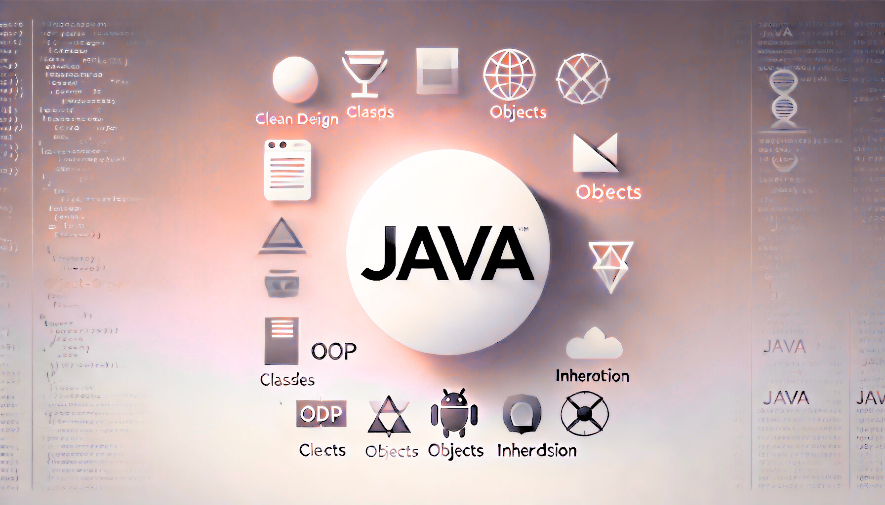
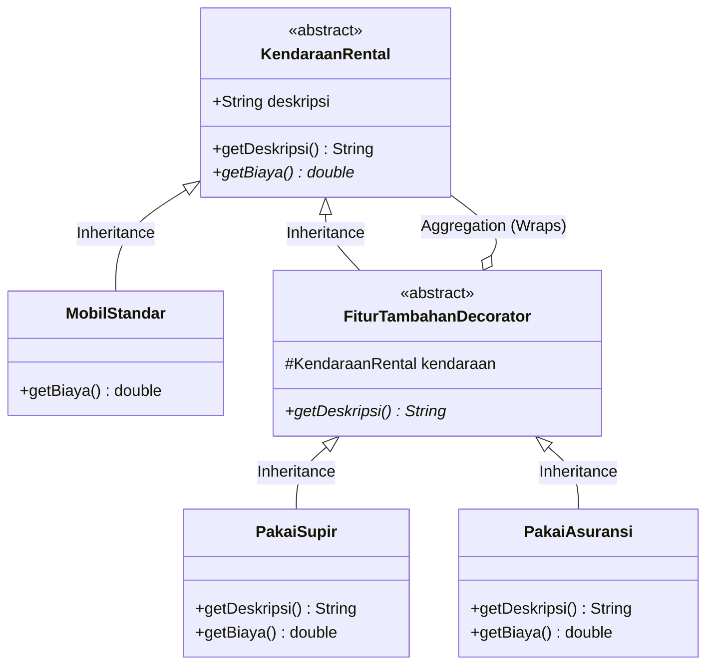

# OOP Chapter 5: Persiapan UTS

Composed by [_Bimo Ade Budiman Fikri_](https://www.linkedin.com/in/bimoadee/)



## Table of Contents

- [BAGIAN I: Pilihan Ganda](#bagian-i-pilihan-ganda)
- [BAGIAN II: Essay](#bagian-ii-essay-uml--implementasi)
- [Kunci Jawaban](#kunci-jawaban--pedoman-penilaian)

---

## LATIHAN SOAL UTS - PEMROGRAMAN BERORIENTASI OBJEK

## BAGIAN I: PILIHAN GANDA

Pilihlah satu jawaban yang paling tepat!

### 1. (Fundamental & Arsitektur)

Dalam arsitektur Java, komponen manakah yang bertanggung jawab langsung untuk membaca file Bytecode (.class) dan menerjemahkannya ke dalam bahasa instruksi mesin secara real-time sesuai dengan sistem operasi yang digunakan?

- A. Java Development Kit (JDK)
- B. Java Compiler (javac)
- **C. Java Virtual Machine (JVM)**
- D. Java Runtime Environment (JRE)
- E. Garbage Collector (GC)

### 2. (Scope & Garbage Collection)

Perhatikan potongan kode berikut:

```java
Mobil m1 = new Mobil("Toyota");
Mobil m2 = new Mobil("Honda");
Mobil m3 = m1;
m1 = m2;
m3 = null;
```

Setelah baris kode terakhir dieksekusi, objek manakah di dalam Heap Memory yang saat ini memenuhi syarat (eligible) untuk dibersihkan oleh Garbage Collector?

- **A. Objek "Toyota"**
- B. Objek "Honda"
- C. Kedua objek "Toyota" dan "Honda"
- D. Tidak ada objek yang dibersihkan
- E. Objek m3

### 3. (Encapsulation)

Seorang programmer mendeklarasikan seluruh atribut di dalam class RekeningBank dengan access modifier private, lalu menyediakan method `public void setorUang(double jumlah)` dan `public double cekSaldo()`. Pendekatan ini merupakan manifestasi dari konsep...

- A. Polymorphism
- **B. Data Hiding (Encapsulation)**
- C. Liskov Substitution Principle
- D. Inheritance
- E. Method Overloading

### 4. (Inheritance & Polymorphism)

Perhatikan kode berikut:

```java
class Kendaraan {
    void gas() { System.out.println("Kendaraan melaju"); }
}
class Motor extends Kendaraan {
    void gas() { System.out.println("Motor ngenggg!"); }
    void wheelie() { System.out.println("Angkat ban depan!"); }
}
public class Main {
    public static void main(String[] args) {
        Kendaraan k = new Motor();
        k.gas();
        // k.wheelie(); // Baris X
    }
}
```

Jika kode di atas dijalankan (mengabaikan komentar di Baris X), apa output yang dihasilkan dan apa jenis polymorphism yang terjadi?

- A. Kendaraan melaju (Overloading)
- **B. Motor ngenggg! (Overriding - Dynamic Binding)**
- C. Kendaraan melaju (Overriding - Static Binding)
- D. Motor ngenggg! (Overloading)
- E. Terjadi Compile Error

### 5. (Abstraction)

Manakah pernyataan berikut yang SALAH mengenai interface dan abstract class di Java?

- A. abstract class dapat memiliki method yang memiliki isi (implementasi), sedangkan interface (secara tradisional) murni hanya deklarasi method.
- B. Sebuah class dapat mengimplementasikan (implements) banyak interface sekaligus.
- **C. Sebuah class dapat mewarisi (extends) banyak abstract class sekaligus.**
- D. Keduanya tidak dapat diinstansiasi secara langsung menggunakan keyword new.
- E. Variabel di dalam interface secara implisit bersifat public static final.

### 6. (Relasi Antar Objek)

Perhatikan kode berikut:

```java
class Mesin { ... }

class Mobil {
    private Mesin mesinMobil;
    public Mobil() {
        this.mesinMobil = new Mesin();
    }
}
```

Berdasarkan kode di atas, jenis relasi apakah yang tergambar antara Mobil dan Mesin, serta apa konsekuensinya?

- A. Asosiasi; Mesin dapat dipindahkan ke mobil lain.
- B. Agregasi; Mesin tetap ada meski objek Mobil dihapus.
- C. Generalisasi; Mesin adalah parent class dari Mobil.
- **D. Komposisi; Jika objek Mobil dihapus oleh JVM, objek Mesin di dalamnya ikut hancur (sehidup-semati).**
- E. Realisasi; Mobil mengimplementasikan Mesin.

### 7. (SOLID Principles)

Sebuah class bernama SistemLaporan memiliki tiga method utama: `kalkulasiData()`, `cetakPDF()`, dan `simpanKeMySQL()`. Class ini secara nyata melanggar prinsip desain SOLID yang mana?

- A. Open/Closed Principle (OCP)
- **B. Single Responsibility Principle (SRP)**
- C. Interface Segregation Principle (ISP)
- D. Liskov Substitution Principle (LSP)
- E. Dependency Inversion Principle (DIP)

### 8. (Design Patterns)

Dalam sebuah aplikasi berbasis Client-Server, Kantor Pusat ingin agar 100 aplikasi HP Supir Truk mendapatkan notifikasi instan secara otomatis setiap kali ada pesan baru dari pusat, tanpa para Supir harus melakukan refresh ke server setiap menit. Design pattern apakah yang paling tepat untuk masalah ini?

- A. Singleton Pattern
- B. Factory Pattern
- C. Decorator Pattern
- **D. Observer Pattern**
- E. Builder Pattern

### 9. (GUI & Event Handling)

Dalam Java Swing, agar aplikasi memiliki tata letak berupa kotak-kotak tabel yang simetris (baris dan kolom proporsional) yang cocok digunakan untuk membuat form inputan, LayoutManager manakah yang paling efisien untuk digunakan?

- A. BorderLayout
- B. FlowLayout
- **C. GridLayout**
- D. GridBagLayout
- E. BoxLayout

### 10. (JDBC & Exception Handling)

Mengapa kita sangat diwajibkan menggunakan PreparedStatement dibandingkan Statement biasa saat mengeksekusi kueri SQL (seperti INSERT atau SELECT) yang melibatkan data input dari pengguna (user)?

- A. Karena Statement tidak bisa menggunakan fungsi try-catch.
- **B. Karena PreparedStatement mengkompilasi kueri terlebih dahulu dan menggunakan placeholder (?) yang menjadikannya kebal dari serangan SQL Injection.**
- C. Karena PreparedStatement berjalan di memori Heap, sedangkan Statement berjalan di memori Stack.
- D. Karena PreparedStatement tidak membutuhkan objek Connection.
- E. Karena performa Statement biasa menyebabkan kebocoran Garbage Collection.

### 11. (Memory Model & Tipe Data Referensi)

Perhatikan potongan kode berikut:

```java
int[] arrayA = {10, 20, 30};
int[] arrayB = arrayA;
arrayB[0] = 99;

System.out.println(arrayA[0]);
```

Berdasarkan konsep penyimpanan objek di dalam memori Java, output apa yang akan tercetak saat baris terakhir dieksekusi?

- A. 10
- **B. 99**
- C. NullPointerException
- D. Compile Error
- E. Alamat memori dari arrayA (contoh: [I@15db9742)

### 12. (Exception Handling Flow)

Perhatikan kode penanganan error berikut:

```java
public class Ujian {
    public static void main(String[] args) {
        try {
            int hasil = 100 / 0;
            System.out.print("A");
        } catch (ArithmeticException e) {
            System.out.print("B");
        } catch (Exception e) {
            System.out.print("C");
        } finally {
            System.out.print("D");
        }
    }
}
```

Apa hasil output yang dicetak ke layar saat program tersebut dijalankan?

- A. B
- **B. BD**
- C. AD
- D. CD
- E. Program crash tanpa mencetak apapun

### 13. (Method Overloading vs Overriding)

Berikut ini adalah pernyataan yang SALAH terkait aturan dari Method Overloading di dalam Java, yaitu...

- A. Memiliki nama method yang sama persis dalam suatu class.
- B. Boleh memiliki return type (tipe kembalian) yang berbeda asalkan parameter method-nya berbeda.
- C. Memiliki susunan parameter yang berbeda (jumlah parameter atau tipe datanya).
- **D. Mensyaratkan proses inheritance sebelumnya, di mana terdapat nama method yang sama pada child-class dan parent-class.**
- E. Terjadi pada proses Compile-time (Static Polymorphism).

### 14. (SOLID - Interface Segregation Principle)

Sebuah interface bernama MesinKantor memaksa semua class yang mengimplementasikannya untuk memiliki fungsi `print()`, `scan()`, dan `fax()`. Ternyata, class PrinterMurah yang mengimplementasikan interface tersebut terpaksa membiarkan fungsi `fax()` kosong karena secara fisik mesin tersebut tidak memiliki fitur fax. Prinsip SOLID manakah yang jelas-jelas dilanggar pada kasus ini?

- A. Single Responsibility Principle (SRP)
- B. Open/Closed Principle (OCP)
- C. Liskov Substitution Principle (LSP)
- **D. Interface Segregation Principle (ISP)**
- E. Dependency Inversion Principle (DIP)

### 15. (UML Class Diagram)

Dalam pembuatan Class Diagram menggunakan standar UML (Unified Modeling Language), kita akan menggunakan berbagai simbol Access Modifier. Jika sebuah atribut dideklarasikan dengan format `- kecepatan : int`, simbol minus (-) tersebut menandakan bahwa atribut memiliki hak akses...

- A. Public
- B. Protected
- **C. Private**
- D. Default
- E. Static

### 16. (Design Patterns - Creational)

Pola desain (Design Pattern) apa yang digunakan untuk membatasi instansiasi sebuah class secara ketat hanya menjadi satu objek tunggal saja selama aplikasi berjalan, yang sangat sering digunakan untuk membuat objek Database Connection?

- A. Factory Pattern
- B. Observer Pattern
- C. Decorator Pattern
- **D. Singleton Pattern**
- E. Builder Pattern

### 17. (Java Database Connectivity - JDBC)

Dalam proses mengambil data dari database menggunakan JDBC, kita sering melihat baris kode `ResultSet rs = pstmt.executeQuery();`. Apa fungsi spesifik dari objek ResultSet tersebut?

- A. Menutup koneksi (connection) ke database secara permanen setelah kueri selesai.
- **B. Menyimpan kumpulan data (table of data) yang merupakan hasil kembalian dari eksekusi perintah SELECT SQL di memori Java.**
- C. Menerjemahkan bahasa Java ke dalam bahasa SQL agar dimengerti database.
- D. Mencegah serangan SQL Injection ke dalam database dengan mensterilkan input.
- E. Mengirim data baru (berupa perintah INSERT) ke dalam tabel MySQL.

### 18. (Inheritance & Constructor Execution)

Perhatikan hierarki class berikut:

```java
class Kendaraan {
    public Kendaraan() {
        System.out.print("1");
    }
}

class Mobil extends Kendaraan {
    public Mobil() {
        System.out.print("2");
    }
}

public class Main {
    public static void main(String[] args) {
        Mobil m = new Mobil();
    }
}
```

Jika method main dieksekusi, apa output yang akan tercetak?

- A. 1
- B. 2
- **C. 12**
- D. 21
- E. Terjadi Compile Error karena method super() tidak ditulis eksplisit.

### 19. (GUI Event Handling)

Manakah dari potongan kode berikut yang merupakan cara penulisan paling tepat dan modern (menggunakan Lambda Expression) untuk memasang alat pendengar klik (Event Listener) pada sebuah tombol JButton btnSimpan di Java Swing?

- A. `btnSimpan.addEvent(e -> { /* eksekusi kode */ });`
- **B. `btnSimpan.addActionListener(e -> { /* eksekusi kode */ });`**
- C. `btnSimpan.onClick(e -> { /* eksekusi kode */ });`
- D. `btnSimpan.setListener(e -> { /* eksekusi kode */ });`
- E. `btnSimpan.actionPerformed(e -> { /* eksekusi kode */ });`

### 20. (Pengenalan OOP - Instansiasi Kelas)

Dari deklarasi class berikut, manakah deklarasi class di dalam bahasa Java yang TIDAK DAPAT diinstansiasi (di-new secara langsung menjadi objek) di method main?

- A. `public class Pengguna { }`
- **B. `abstract class Pengguna { }`**
- C. `final class Pengguna { }`
- D. `static class Pengguna { }`
- E. `class Pengguna extends Person { }`

### 21. (Polymorphism & Casting Jebakan)

Perhatikan potongan kode berikut:

```java
class Kendaraan {}
class Truk extends Kendaraan {
    void angkutBarang() { System.out.println("Angkut!"); }
}
class Mobil extends Kendaraan {
    void nyalakanAC() { System.out.println("Dingin!"); }
}

public class Main {
    public static void main(String[] args) {
        Kendaraan k = new Truk();
        Mobil m = (Mobil) k;
        m.nyalakanAC();
    }
}
```

Jika kode di atas dijalankan, apa yang akan terjadi?

- A. Mencetak "Dingin!"
- B. Mencetak "Angkut!"
- **C. Terjadi ClassCastException pada saat runtime.**
- D. Terjadi Compile Error pada baris pertama di dalam main.
- E. Objek k otomatis berubah wujud menjadi Mobil secara permanen.

### 22. (Konstruktor Induk / super())

Perhatikan kode berikut:

```java
class Karyawan {
    String nama;
    public Karyawan(String nama) {
        this.nama = nama;
    }
}

class Supir extends Karyawan {
    public Supir() {
        System.out.println("Supir Baru");
    }
}
```

Apa akibat dari penulisan kode di atas jika dikompilasi?

- A. Berhasil dikompilasi, jika diinstansiasi akan mencetak "Supir Baru".
- B. Atribut nama pada Supir akan bernilai null.
- C. Terjadi Compile Error di class Karyawan karena tidak ada method main.
- **D. Terjadi Compile Error di class Supir karena tidak memanggil super(nama) dan induk tidak memiliki konstruktor kosong (default).**
- E. Program akan melempar NullPointerException saat dijalankan.

### 23. (Alur Exception dengan Throw)

Perhatikan kode berikut:

```java
public class SPBU {
    public static void cekBensin(int liter) {
        if (liter < 10) {
            throw new IllegalArgumentException("Bensin mau habis");
        }
        System.out.print("Aman ");
    }

    public static void main(String[] args) {
        try {
            cekBensin(5);
            System.out.print("Jalan ");
        } catch (Exception e) {
            System.out.print("Isi Dulu ");
        }
    }
}
```

Output apa yang akan tercetak di layar?

- A. Aman Jalan
- **B. Isi Dulu**
- C. Aman Isi Dulu
- D. Bensin mau habis Jalan
- E. Program Crash / Force Close

### 24. (Interface Visibility Rule)

Perhatikan kode implementasi interface berikut:

```java
interface Mesin {
    void nyalakan();
}

class MesinDiesel implements Mesin {
    void nyalakan() {
        System.out.println("Brummm!");
    }
}
```

Mengapa kode di atas akan menyebabkan Compile Error di Java?

- A. Karena method di dalam interface Mesin belum diberikan isi/bodi.
- B. Karena MesinDiesel tidak memiliki atribut/variabel.
- C. Karena keyword implements tidak boleh digunakan untuk interface.
- D. Karena Mesin seharusnya ditulis menggunakan keyword abstract class.
- **E. Karena method nyalakan() di MesinDiesel otomatis memiliki visibility default, padahal method bawaan interface selalu public (tidak boleh menurunkan tingkat visibilitas).**

### 25. (Menerjemahkan UML ke Kode Java)

Dalam Class Diagram UML, terdapat sebuah class Garasi dan class Mobil. Relasi antara keduanya digambarkan dengan sebuah garis yang ujungnya memiliki belah ketupat yang diarsir penuh (Solid Diamond) menempel pada sisi Garasi. Manakah dari implementasi kode Java berikut yang paling tepat menerjemahkan diagram tersebut?

- A. ```class Garasi extends Mobil { ... }```
- B. ```class Garasi {
        public void parkir(Mobil m) { ... }
      }```
- **C. ```class Garasi {
              private Mobil mobilMilikGarasi;
              public Garasi() {
                  this.mobilMilikGarasi = new Mobil();
              }
          }```**
- D. ```class Garasi {
              private Mobil mobil;
              public Garasi(Mobil m) {
                  this.mobil = m;
              }
          }```
- E. `class Garasi implements Mobil { ... }`

### 26. (Jebakan JDBC PreparedStatement)

Seorang programmer menuliskan kueri PreparedStatement berikut untuk mencari data supir berdasarkan umur dan kota:

```java
String sql = "SELECT * FROM supir WHERE umur > ? AND kota = ?";
PreparedStatement ps = conn.prepareStatement(sql);

ps.setInt(0, 25);
ps.setString(1, "Jakarta");
```

Apa yang akan terjadi jika baris kode di atas dieksekusi?

- A. Kueri akan mengembalikan data supir yang umurnya di atas 25 dari Jakarta.
- B. Terjadi Compile Error karena PreparedStatement tidak mengenali tipe String.
- **C. Terjadi SQLException: Parameter index out of range karena indeks placeholder (?) di JDBC dimulai dari angka 1, bukan 0.**
- D. Program berjalan, namun mengabaikan kota "Jakarta" karena indeksnya bergeser.
- E. Kueri akan menghasilkan Deadlock pada database MySQL.

### 27. (Jebakan GUI BorderLayout)

Dalam pengembangan GUI dengan Java Swing, kamu menuliskan kode berikut:

```java
JFrame frame = new JFrame();
frame.setLayout(new BorderLayout());

frame.add(new JButton("Kiri"), BorderLayout.CENTER);
frame.add(new JButton("Kanan"), BorderLayout.CENTER);

frame.setSize(300, 300);
frame.setVisible(true);
```

Bagaimana wujud akhir dari tampilan jendela aplikasi tersebut?

- **A. Hanya tombol "Kanan" yang terlihat menutupi seluruh layar tengah.**
- B. Hanya tombol "Kiri" yang terlihat menutupi seluruh layar tengah.
- C. Tombol "Kiri" dan "Kanan" akan dibagi rata ke samping.
- D. Tombol "Kiri" dan "Kanan" akan dibagi rata ke atas dan bawah.
- E. Terjadi Compile Error karena BorderLayout.CENTER hanya bisa dipanggil satu kali.

### 28. (Analisis Design Pattern - Singleton)

Perhatikan potongan class yang berusaha mengimplementasikan Singleton Pattern berikut:

```java
public class DatabaseManager {
    private static DatabaseManager instance;

    public DatabaseManager() {
        System.out.println("Koneksi DB Dibuat!");
    }

    public static DatabaseManager getInstance() {
        if (instance == null) {
            instance = new DatabaseManager();
        }
        return instance;
    }
}
```

Meskipun kelihatannya benar, mengapa kode di atas GAGAL menjadi sebuah struktur Singleton yang sempurna secara arsitektur?

- A. Karena instance tidak diinisialisasi dengan nilai new DatabaseManager() langsung di baris kedua.
- B. Karena method getInstance() tidak mengembalikan nilai String.
- C. Karena tidak ada method closeConnection().
- **D. Karena constructor DatabaseManager() masih bersifat public, sehingga class lain masih bisa melakukan new DatabaseManager() sesuka hati.**
- E. Karena class ini tidak mewarisi dari Singleton.class.

### 29. (Memanggil Method Parent / super)

Perhatikan kode di bawah ini:

```java
class Ayah {
    void sapa() { System.out.print("Halo dari Ayah. "); }
}

class Anak extends Ayah {
    @Override
    void sapa() {
        super.sapa();
        System.out.print("Halo dari Anak.");
    }
}

public class Main {
    public static void main(String[] args) {
        Anak a = new Anak();
        a.sapa();
    }
}
```

Apa output yang akan dihasilkan?

- A. Halo dari Anak.
- **B. Halo dari Ayah. Halo dari Anak.**
- C. Halo dari Ayah.
- D. Halo dari Anak. Halo dari Ayah.
- E. Terjadi Infinite Loop (Perulangan tanpa henti).

### 30. (Null Reference / Array Objek)

Perhatikan potongan kode pembuatan array object berikut:

```java
Mobil[] daftarMobil = new Mobil[5];
daftarMobil[0].merk = "Avanza";

System.out.println(daftarMobil[0].merk);
```

Apa yang akan terjadi ketika program tersebut dijalankan?

- A. Mencetak tulisan "Avanza".
- B. Terjadi Compile Error pada baris kedua.
- C. Mencetak tulisan null.
- D. Mencetak angka 0.
- **E. Terjadi NullPointerException karena elemen array belum diinstansiasi menjadi objek secara individual (masih berisi null).**

### 31. (Analisis Dynamic Dispatch - Polymorphism)

Perhatikan kode berikut:

```java
class Kendaraan {
    void info() {
        jenis();
    }
    void jenis() {
        System.out.print("Kendaraan ");
    }
}

class Mobil extends Kendaraan {
    @Override
    void jenis() {
        System.out.print("Mobil ");
    }
}

public class Main {
    public static void main(String[] args) {
        Kendaraan k = new Mobil();
        k.info();
    }
}
```

Meskipun method info() dipanggil dan letaknya ada di dalam class Kendaraan, method jenis() manakah yang akan dieksekusi dan apa output-nya?

- A. Menghasilkan Compile Error.
- **B. Mencetak Mobil karena pemanggilan method mengikuti wujud asli objek (Dynamic Dispatch).**
- C. Mencetak Kendaraan karena method info() berada di class Kendaraan (induk).
- D. Terjadi StackOverflowError.
- E. Mencetak Kendaraan Mobil.

### 32. (Jebakan Scope Variabel di Lambda GUI)

Seorang programmer mencoba membuat program counter klik tombol pada Java Swing:

```java
int klik = 0;
JButton btn = new JButton("Simpan");
btn.addActionListener(e -> {
    klik++;
    System.out.println("Diklik " + klik + " kali");
});
```

Apa yang akan terjadi saat kode di atas dikompilasi?

- A. Program berjalan normal dan menampilkan jumlah klik saat tombol ditekan.
- B. Program berjalan normal tetapi jumlah klik selalu bernilai 1.
- C. Terjadi NullPointerException saat tombol diklik.
- D. Tombol tidak akan merespons klik sama sekali.
- **E. Terjadi Compile Error dengan pesan "Local variable referenced from a lambda expression must be final or effectively final".**

### 33. (Jebakan Navigasi ResultSet JDBC)

Perhatikan potongan kode JDBC berikut:

```java
String sql = "SELECT merk FROM armada";
PreparedStatement ps = conn.prepareStatement(sql);
ResultSet rs = ps.executeQuery();

System.out.println(rs.getString("merk"));
```

Apa akibat dari baris terakhir pada kode di atas saat dieksekusi?

- A. Mencetak teks "merk" ke konsol.
- **B. Memicu SQLException karena cursor pointer ResultSet belum digeser ke baris pertama menggunakan perintah rs.next().**
- C. Mencetak data pertama pada kolom 'merk' dari tabel database.
- D. Memicu Compile Error karena ResultSet tidak memiliki method getString().
- E. Mengembalikan nilai null ke konsol.

### 34. (Penerjemahan UML - Realization)

Dalam sebuah Class Diagram UML, terdapat garis putus-putus (dashed line) yang berujung pada panah berbentuk segitiga kosong (hollow triangle). Garis ini ditarik dari class Truk dan menunjuk ke KendaraanBerat. Berdasarkan standar notasi UML, bagaimana bentuk implementasi relasi tersebut ke dalam kode Java?

- A. `class Truk extends KendaraanBerat`
- **B. `class Truk implements KendaraanBerat`**
- C. `class Truk { KendaraanBerat kb = new KendaraanBerat(); }`
- D. `class KendaraanBerat extends Truk`
- E. `class KendaraanBerat implements Truk`

### 35. (Urutan Eksekusi Exception Handling)

Perhatikan alur penanganan exception yang sengaja dibuat rumit berikut:

```java
try {
    System.out.print("A");
    int x = 10 / 0;
    System.out.print("B");
} catch (ArithmeticException e) {
    System.out.print("C");
    throw new RuntimeException();
} finally {
    System.out.print("D");
}
System.out.print("E");
```

Manakah urutan karakter yang tepat tercetak di layar sebelum program tersebut akhirnya crash?

- A. ABCDE
- B. AC
- **C. ACD**
- D. ADE
- E. ACE

### 36. (Constructor Chaining - Keyword this)

Perhatikan proses pemanggilan konstruktor bersarang (constructor chaining) di dalam class Truk berikut:

```java
class Truk {
    Truk() {
        System.out.print("A");
    }
    Truk(String merk) {
        this();
        System.out.print("B");
    }
}

public class Main {
    public static void main(String[] args) {
        new Truk("Hino");
    }
}
```

Apa output yang tercetak ke layar saat baris new Truk("Hino") dieksekusi?

- A. B
- **B. AB**
- C. BA
- D. Terjadi Compile Error karena method this() tidak dikenali.
- E. A

### 37. (Instansiasi dengan Abstract Class)

Banyak mahasiswa mengira Abstract Class tidak bisa menjalankan konstruktor. Perhatikan pembuktian kode berikut:

```java
abstract class Mesin {
    Mesin() {
        System.out.print("Mesin Nyala. ");
    }
    abstract void bunyi();
}

class MesinV8 extends Mesin {
    void bunyi() {
        System.out.print("Vroom!");
    }
}

public class Main {
    public static void main(String[] args) {
        Mesin m = new MesinV8();
        m.bunyi();
    }
}
```

Apa yang sebenarnya terjadi pada kode di atas?

- A. Terjadi Compile Error karena Mesin adalah class abstrak dan tidak boleh memiliki konstruktor.
- B. Terjadi Compile Error pada proses new MesinV8().
- **C. Berhasil dieksekusi dan mencetak Mesin Nyala. Vroom! karena konstruktor induk abstrak tetap dipanggil secara implisit oleh class anak.**
- D. Berhasil dieksekusi dan hanya mencetak Vroom!.
- E. Terjadi InstantiationException saat runtime.

### 38. (Penerjemahan UML - Multiplicity)

Dalam merancang struktur data antar class, jika di ujung garis relasi yang menempel pada class Buku terdapat angka 0..\* (banyak/koleksi), sedangkan di ujung yang menempel pada Perpustakaan terdapat angka 1, maka potongan atribut Java yang paling tepat mewakili class Perpustakaan adalah:

- A. `class Perpustakaan { Buku buku = new Buku(); }`
- **B. `class Perpustakaan { List<Buku> koleksiBuku; }`**
- C. `class Buku { Perpustakaan p = new Perpustakaan(); }`
- D. `class Buku { List<Perpustakaan> p; }`
- E. `class Perpustakaan extends Buku { }`

### 39. (Analisis Pattern Design)

Perhatikan potongan kode yang menyembunyikan proses kompleks penggunaan new dari pengguna ini:

```java
class PabrikKendaraan {
    static Kendaraan rakit(String tipe) {
        if (tipe.equals("Roda4")) {
            return new Mobil();
        }
        return new Motor();
    }
}
// Di Main: Kendaraan k = PabrikKendaraan.rakit("Roda4");
```

Potongan kodingan di atas merupakan implementasi praktis dari salah satu kategori Creational Design Pattern standar. Apakah nama pola desain (design pattern) tersebut?

- A. Singleton Pattern
- B. Observer Pattern
- C. Decorator Pattern
- **D. Factory Pattern**
- E. Adapter Pattern

### 40. (Aturan Pemilihan Overloading)

Perhatikan potongan kode yang melakukan trik pemanggilan Overloaded Method berikut:

```java
class Cetak {
    void print(Object o) {
        System.out.print("Object");
    }
    void print(String s) {
        System.out.print("String");
    }
}

public class Main {
    public static void main(String[] args) {
        Cetak c = new Cetak();
        c.print(null);
    }
}
```

Jika kita mengirimkan argumen bernilai null ke dalam fungsi tersebut, method manakah yang akan dieksekusi oleh Java?

- A. Mencetak Object karena null adalah tipe data general.
- **B. Mencetak String karena Java akan selalu memilih resolusi tipe data argumen yang paling spesifik (String adalah subclass/lebih spesifik dari Object).**
- C. Terjadi Compile Error karena ambigu (membingungkan kompiler).
- D. Terjadi NullPointerException.
- E. Menjalankan kedua method secara bergantian.

---

## BAGIAN II: ESSAY

### Soal 1: Pemodelan UML & Design Patterns (Skor: 30)

Perusahaan Transportasi anda memiliki layanan Rental Kendaraan. Saat ini terdapat class dasar bernama KendaraanRental. Pelanggan dapat menyewa kendaraan standar, namun perusahaan juga menawarkan fitur tambahan (add-ons) secara dinamis, seperti:

- **Opsi PakaiSupir** (+ Rp 150.000)
- **Opsi PakaiAsuransi** (+ Rp 50.000)

Diketahui bahwa kombinasi penyewaan bisa sangat banyak (misal: Kendaraan saja, Kendaraan + Supir, Kendaraan + Asuransi, atau Kendaraan + Supir + Asuransi). Untuk menghindari Class Explosion, Anda memutuskan menggunakan **Decorator Pattern**.

#### Tugas Anda:

**a. Buatlah UML Class Diagram untuk struktur Decorator Pattern tersebut!**

Diagram harus mencakup:

- Interface / Abstract Class LayananRental (sebagai komponen utama yang mendefinisikan method `getBiaya()`)
- Class konkrit KendaraanDasar
- Class abstrak RentalDecorator
- Class decorator konkrit PakaiSupir dan PakaiAsuransi

(Sertakan tipe relasi seperti inheritance/realization dan aggregation/composition dalam penjelasan panahnya jika menggunakan teks).

**b. Tuliskan implementasi kode Java singkat untuk class konkrit PakaiSupir!**

Pastikan kode Anda mengimplementasikan struktur pewarisan dan pemanggilan method/komponen induk yang benar.

---

### Soal 2: GUI, JDBC & Exception Handling (Skor: 20)

Sebagai staf IT, Anda diminta membuat potongan kode method event handler untuk sebuah GUI.

**Diberikan variabel GUI berikut yang sudah ada nilainya:**

- `JTextField inputNopol;` (Contoh isi: "B 1234 CD")
- `JTextField inputMerk;` (Contoh isi: "Hino")

**Tugas Anda:**

Tuliskan blok kode di dalam ActionListener pada tombol Simpan, yang mengambil data dari kedua teks area tersebut, lalu meng-INSERT datanya ke dalam tabel MySQL bernama `truk` (kolom: nopol, merk).

**Syarat wajib:**

- Menggunakan Try-with-resources untuk koneksi database.
- Menggunakan PreparedStatement.
- Menangkap dan mencetak SQLException menggunakan JOptionPane.

(Asumsikan `urlDB`, `userDB`, dan `passDB` sudah dideklarasikan).

---

## KUNCI JAWABAN

| No  | Jawaban | Penjelasan                                                         |
| --- | ------- | ------------------------------------------------------------------ |
| 1   | **C**   | JVM membaca Bytecode dan mengeksekusinya secara spesifik per OS    |
| 2   | **A**   | Objek "Toyota" kehilangan referensi saat m1 disuruh menunjuk Honda |
| 3   | **B**   | Data Hiding (Encapsulation)                                        |
| 4   | **B**   | Motor ngenggg! (Overriding - Dynamic Binding)                      |
| 5   | **C**   | Java tidak mendukung Multiple Inheritance untuk Class              |
| 6   | **D**   | Komposisi - siklus hidup Mesin bergantung pada Mobil               |
| 7   | **B**   | Single Responsibility Principle (SRP)                              |
| 8   | **D**   | Observer Pattern (Subscribe-Publish)                               |
| 9   | **C**   | GridLayout                                                         |
| 10  | **B**   | Kebal SQL Injection berkat placeholder ?                           |
| 11  | **B**   | 99 - Array adalah tipe referensi, arrayB hanya menyalin alamat     |
| 12  | **B**   | BD - Masuk try, error, catch B, finally D                          |
| 13  | **D**   | Method Overloading terjadi di satu class, tidak perlu inheritance  |
| 14  | **D**   | Interface Segregation Principle (ISP)                              |
| 15  | **C**   | Private (Dalam UML: + Public, - Private, # Protected)              |
| 16  | **D**   | Singleton Pattern                                                  |
| 17  | **B**   | Menyimpan kumpulan data hasil SELECT                               |
| 18  | **C**   | 12 - Constructor parent dipanggil terlebih dahulu                  |
| 19  | **B**   | btnSimpan.addActionListener(e -> { ... });                         |
| 20  | **B**   | abstract class Pengguna tidak bisa diinstansiasi                   |
| 21  | **C**   | ClassCastException - tidak bisa cast Truk ke Mobil                 |
| 22  | **D**   | Compile Error - Supir harus memanggil super(nama)                  |
| 23  | **B**   | Isi Dulu - error di cekBensin(5) ditangkap                         |
| 24  | **E**   | Visibilitas menurun dari public interface ke default impl          |
| 25  | **C**   | Komposisi (Solid Diamond)                                          |
| 26  | **C**   | SQLException index out of range (JDBC index mulai dari 1)          |
| 27  | **A**   | Hanya tombol "Kanan" yang terlihat (menimpa komponen sebelumnya)   |
| 28  | **D**   | Constructor masih public - harus private untuk Singleton           |
| 29  | **B**   | Halo dari Ayah. Halo dari Anak.                                    |
| 30  | **E**   | NullPointerException - array belum diinstansiasi per elemen        |
| 31  | **B**   | Mencetak Mobil (Dynamic Dispatch)                                  |
| 32  | **E**   | Compile Error - variabel harus final atau effectively final        |
| 33  | **B**   | SQLException - ResultSet cursor belum digeser dengan rs.next()     |
| 34  | **B**   | class Truk implements KendaraanBerat (Realization)                 |
| 35  | **C**   | ACD - A, error, C, finally D, crash (E tidak tercetak)             |
| 36  | **B**   | AB - constructor chaining: Truk("Hino") → this() → A → B           |
| 37  | **C**   | Berhasil - Mesin Nyala. Vroom!                                     |
| 38  | **B**   | List<Buku> koleksiBuku untuk relasi 0..\*                          |
| 39  | **D**   | Factory Pattern                                                    |
| 40  | **B**   | Mencetak String (lebih spesifik daripada Object)                   |

---

### Pedoman Jawaban Essay 1

#### a. UML Class Diagram (Decorator Pattern)

**Diagram Mermaid:**



**Penjelasan Relasi:**

- **Realization (<<):** `KendaraanDasar` dan `RentalDecorator` mengimplementasikan interface `LayananRental`
- **Aggregation (o--):** `RentalDecorator` memiliki referensi ke komponen `LayananRental` yang akan dibungkus (hubungan "has-a")
- **Inheritance (<|-):** `PakaiSupir` dan `PakaiAsuransi` mewarisi `RentalDecorator`

#### b. Kode Java PakaiSupir

**Implementasi Lengkap dengan Penjelasan:**

```java
public class PakaiSupir extends RentalDecorator {
    // Biaya tambahan untuk opsi supir
    private static final double BIAYA_SUPIR = 150000;

    /**
     * Constructor yang menerima komponen LayananRental sebagai parameter
     * Ini adalah pola Decorator: kita membungkus layanan sebelumnya
     *
     * @param layanan Objek LayananRental yang akan dibungkus (bisa KendaraanDasar atau decorator lain)
     */
    public PakaiSupir(LayananRental layanan) {
        super(layanan); // Memanggil constructor dari RentalDecorator untuk menyimpan referensi
    }

    /**
     * Override method getBiaya() untuk menambahkan biaya supir
     *
     * Alur pemanggilan (contoh: Kendaraan + Supir + Asuransi):
     * 1. PakaiAsuransi.getBiaya() → super.getBiaya() + 50000
     * 2. PakaiSupir.getBiaya() → super.getBiaya() + 150000 (memanggil PakaiAsuransi)
     * 3. KendaraanDasar.getBiaya() → 100000 (base price)
     *
     * Total: 100000 + 150000 + 50000 = 300000
     */
    @Override
    public double getBiaya() {
        // Ambil biaya dari komponen yang dibungkus, kemudian tambahkan biaya supir
        return super.getBiaya() + BIAYA_SUPIR;
    }
}
```

**Mengapa Menggunakan Decorator Pattern:**

- ✅ Menghindari "Class Explosion" - tidak perlu buat class `KendaraanDasarSaja`, `KendaraanDasarSupir`, `KendaraanDasarAsuransi`, `KendaraanDasarSupirAsuransi`, dst
- ✅ Fleksibilitas - bisa menggabungkan decorator secara dinamis di runtime
- ✅ Single Responsibility - setiap class bertanggung jawab untuk satu fitur saja
- ✅ Open/Closed Principle - terbuka untuk penambahan decorator baru, tertutup untuk modifikasi

---

### Pedoman Jawaban Essay 2

**Kriteria Penilaian:**

- ✅ Menggunakan `try-with-resources` untuk otomatis menutup koneksi
- ✅ Menggunakan `PreparedStatement` dengan placeholder `?`
- ✅ Menangkap `SQLException` dan menampilkannya dengan `JOptionPane`
- ✅ Mengambil input dari `JTextField` dengan `getText()`

**Implementasi Lengkap dengan Penjelasan:**

```java
simpanButton.addActionListener(e -> {
    // Step 1: Ambil data dari JTextField
    String nopol = inputNopol.getText();      // Contoh: "B 1234 CD"
    String merk = inputMerk.getText();        // Contoh: "Hino"

    // Step 2: Siapkan query SQL dengan placeholder ?
    String sql = "INSERT INTO truk (nopol, merk) VALUES (?, ?)";

    // Step 3: Try-with-resources (Java 7+)
    // Koneksi akan otomatis ditutup di akhir blok try, bahkan jika terjadi exception
    try (Connection conn = DriverManager.getConnection(urlDB, userDB, passDB)) {

        // Step 4: Buat PreparedStatement dari koneksi
        // PreparedStatement lebih aman dari SQL Injection dibanding Statement biasa
        PreparedStatement pstmt = conn.prepareStatement(sql);

        // Step 5: Set parameter dengan tipe data yang sesuai
        // Perhatian: Index di JDBC dimulai dari 1, bukan 0!
        pstmt.setString(1, nopol);   // Parameter pertama (?)
        pstmt.setString(2, merk);    // Parameter kedua (?)

        // Step 6: Eksekusi query INSERT
        // executeUpdate() mengembalikan jumlah baris yang terpengaruh
        int rowsInserted = pstmt.executeUpdate();

        // Step 7: Tampilkan pesan sukses jika data berhasil disimpan
        if (rowsInserted > 0) {
            JOptionPane.showMessageDialog(this,
                "Berhasil menyimpan data truk ke database!",
                "Success",
                JOptionPane.INFORMATION_MESSAGE);
        }

    } catch (SQLException ex) {
        // Step 8: Tangkap exception jika terjadi error (koneksi gagal, query error, dst)
        JOptionPane.showMessageDialog(this,
            "Error Database: " + ex.getMessage(),  // Tampilkan pesan error dari database
            "Error",
            JOptionPane.ERROR_MESSAGE);

        // Opsional: Log error untuk debugging
        ex.printStackTrace();  // Cetak stack trace ke console
    }

    // Catatan: Koneksi sudah otomatis ditutup oleh try-with-resources
    // PreparedStatement juga otomatis ditutup
});
```

**Penjelasan Komponen Penting:**

| Komponen                  | Fungsi                                | Alasan Penting                                 |
| ------------------------- | ------------------------------------- | ---------------------------------------------- |
| `try-with-resources`      | Otomatis menutup resource             | Mencegah memory leak dan connection leak       |
| `PreparedStatement`       | Pre-compile query + parameter binding | Mencegah SQL Injection, lebih efisien          |
| Placeholder `?`           | Temporary value dalam query           | Pisahkan logic dari data, lebih aman           |
| `setString(index, value)` | Set parameter dengan tipe String      | Type-safe, tidak perlu escape karakter         |
| `executeUpdate()`         | Jalankan INSERT/UPDATE/DELETE         | Mengembalikan jumlah baris terpengaruh         |
| `SQLException`            | Tangkap error database                | Handle error gracefully, user tahu ada masalah |
| `JOptionPane`             | Tampilkan dialog GUI                  | User-friendly, bukan error di console          |

**Contoh Skenario Penggunaan:**

```
Input:
- inputNopol: "B 1234 CD"
- inputMerk: "Hino"

Query yang dijalankan:
INSERT INTO truk (nopol, merk) VALUES ('B 1234 CD', 'Hino');

Jika Sukses:
→ Dialog muncul: "Berhasil menyimpan data truk ke database!"

Jika Database Offline:
→ Dialog muncul: "Error Database: Connection refused"

Jika Tabel Tidak Ada:
→ Dialog muncul: "Error Database: Table 'truk' doesn't exist"
```

---

## The End

Have a nice day 👋
